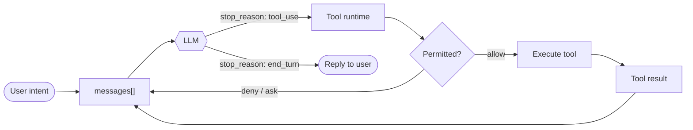

# Awesome Agent Architecture

[](#the-premise)
[](#systems-under-study)
[](LICENSE)

> How modern AI agents are actually built. A side by side teardown of the harness around the model.

Every capable agent shares one anatomy: a small loop, wrapped in a harness of tools, memory, permissions, and interfaces. This repo takes that harness apart and compares how real systems build each piece.

**Contents:** [Premise](#the-premise) · [Systems](#systems-under-study) · [The Loop](#the-agent-loop) · [Anatomy](#anatomy) · [Method](#method) · [Structure](#repository-structure)

---

## The Premise

The capability comes from the **model**. The engineering is the **harness** around it: the loop, tools, memory, permissions, and interfaces that let the model act.

> The model is the engine. The harness is the chassis, steering, and dashboard.

Learn the harness once and you can read any agent. A coding tool, a chat assistant, and an autonomous runner are the same machine with different harness choices. **Claude Code**, for example, is a disciplined coding tool with tight tools, permissions, subagents, and skills.

---

## Systems Under Study

Each system is a worked example for every subsystem below.

| System | Maintainer | License | Models | Surface | Read it for |
|---|---|---|---|---|---|
| **Claude Code** | Anthropic | Proprietary | Claude only | CLI, IDE, web | Permissions, subagents, skills |
| *(more soon)* | | | | | |

> More open source agents will be added (Hermes Agent, OpenClaw, aider, mini-swe-agent, and others). Each fills the same columns.

---

## The Agent Loop

Strip the branding and nearly every agent is the same loop. Everything else is a subsystem hanging off it.



The loop is trivial. The real work is what wraps it: dispatching and gating tools, keeping context from overflowing, persisting state across turns, and making many loops cooperate.

---

## Anatomy

Seven layers, from a bare loop to a self coordinating system. Each row is one self contained writeup.

| # | Subsystem | Key question | Key mechanisms |
|---|---|---|---|
| | **Layer 0 · Foundations** | | |
| 0 | Harness thesis | Where does agency come from? | model vs orchestration; harness = tools + knowledge + observation + actions + permissions |
| | **Layer 1 · Core Loop** | | |
| 1 | [Agent loop](dimensions/01-agent-loop/) | How does an agent keep going? | `messages[]`, `while True`, `stop_reason` |
| 2 | Tool runtime | How are tools called and routed? | dispatch map, schemas, parallel calls, deferred search |
| 3 | Permission & sandbox | How are side effects gated? | approval pipeline, permission modes, sandboxing |
| 4 | Hooks | How to extend without forking the loop? | `PreToolUse`, `PostToolUse`, interception points |
| | **Layer 2 · Complex Work** | | |
| 5 | Planning & todos | How is big work decomposed? | plan mode, todo list, plan then execute |
| 6 | Subagents | How is a sub problem isolated? | fresh `messages[]`, delegation, context isolation |
| 7 | Skills | How are capabilities added on demand? | manifests, on demand injection, autogeneration |
| 8 | Context management | How do long sessions fit the window? | micro / snip / auto compaction, token budgets |
| | **Layer 3 · Knowledge & Resilience** | | |
| 9 | Memory | How does it remember across runs? | selection, extraction, consolidation, recall |
| 10 | System prompt assembly | How is the prompt built each turn? | runtime composition, section concatenation |
| 11 | Error recovery | How does a long task survive failure? | retries, token escalation, model fallback |
| | **Layer 4 · Long Running & Async** | | |
| 12 | Task system | How does work persist beyond a turn? | task records, `blockedBy` deps, disk persistence |
| 13 | Background execution | How does work run off the main loop? | threaded execution, notification queue |
| 14 | Scheduling | How does an agent act on a clock? | cron, wakeups, durable triggers |
| 15 | Worktree isolation | How does parallel work avoid collisions? | worktree records, task directory binding |
| | **Layer 5 · Multi Agent** | | |
| 16 | Coordination | How do many agents talk? | message bus, inbox, permission bubbling |
| 17 | Protocols | How do agents agree and stop cleanly? | plan approval, shutdown handshake |
| 18 | Autonomy | How do agents organize themselves? | idle cycle, auto claim, self organization |
| | **Layer 6 · Extension & Integration** | | |
| 19 | MCP / plugins / channels | How does the harness reach the world? | multi transport, channel routing, tool pool assembly |
| 20 | Observability & evaluation | How do we know it works? | tracing, metrics, eval harnesses, failure modes |

---

## Method

Every subsystem is read the same way:

1. **Problem.** What fails if you leave it out.
2. **Mechanism.** The data structures and control flow, named concretely.
3. **Per system.** How each agent implements it, and the trade-offs.
4. **Failure modes.** What breaks in production.

Analyses favor named, verifiable mechanisms over hand waving, each paired with a diagram or minimal pseudo code.

---

## Repository Structure

> First dimension built: [Agent loop](dimensions/01-agent-loop/). The rest of the layout below is the roadmap.

```
awesome-agent-architecture/
├── README.md                  # the map
├── dimensions/                # one folder per subsystem (rows of the Anatomy table)
│   └── 01-agent-loop/         # writeup + runnable strip-down (first built)
├── systems/                   # per system deep dives (claude-code/, ...)
├── patterns/                  # cross cutting patterns and failure modes
└── references/                # primary sources and prior art
```

Each dimension folder is `NN-name/`, numbered to match its Anatomy row, holding a `README.md` plus a runnable when the mechanism warrants one. New systems and dimensions slot into the same folders.

---

## Contributing

- **Add a system.** Slot a new agent into the existing dimensions.
- **Deepen a dimension.** Add a mechanism, a clearer diagram, or a sharper failure analysis.
- **Correct the record.** These are reconstructions from public docs and behavior. Sourced corrections are welcome.

Open an issue or PR. Favor named, verifiable mechanisms over speculation, and cite sources.

---

## References

| Source | What it offers |
|---|---|
| [claude-code](https://github.com/yasasbanukaofficial/claude-code) | Backup of Claude Code's leaked TypeScript source, the grounding for mechanism names (`QueryEngine.ts`, `query/`, `Tool.ts`) |
| [learn-claude-code](https://github.com/shareAI-lab/learn-claude-code) | 20 lesson code first harness reconstruction, the depth benchmark |

---

## License

[MIT](LICENSE). Analyses are educational reconstructions from public documentation and observed behavior, not official descriptions of any system.
