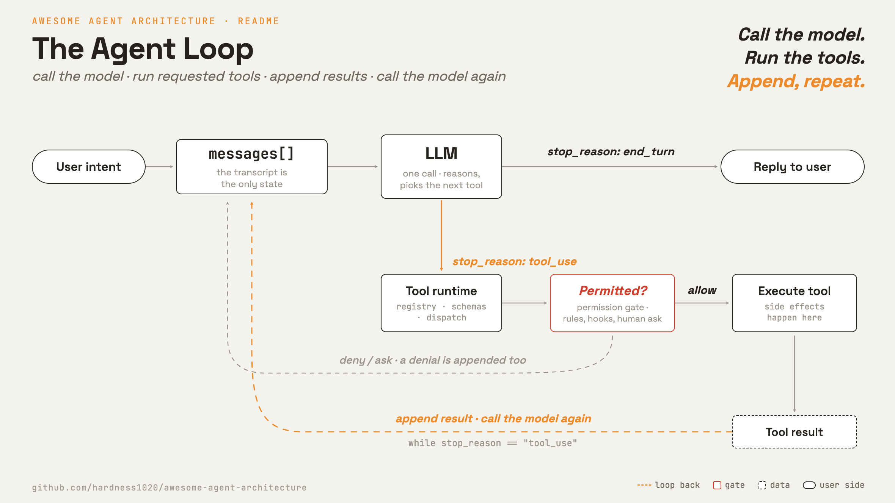
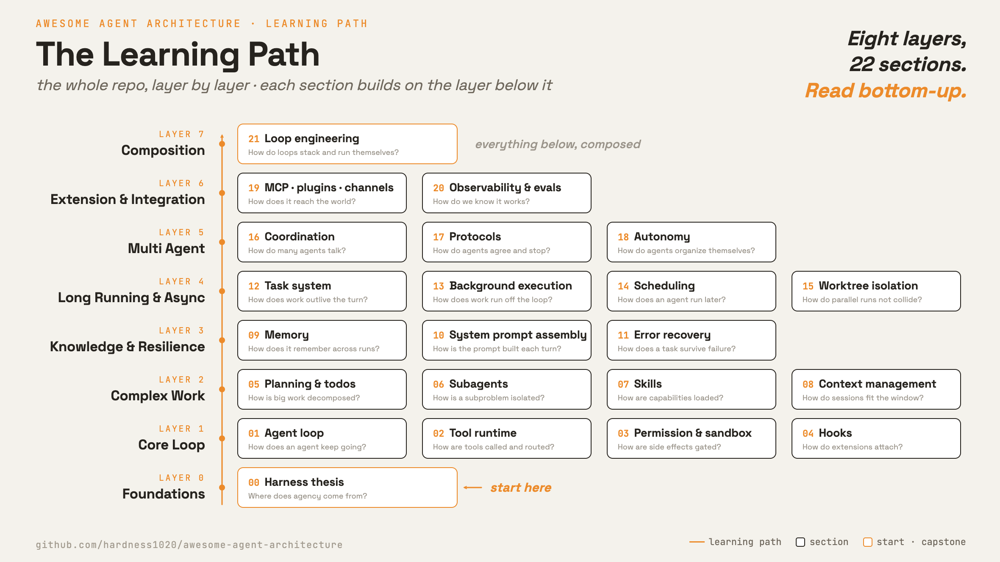

<h1 align="center" style="margin-top: 0;">Awesome Agent Architecture</h1>

<p align="center">
  <strong>了解 AI agent 是如何围绕 LLM 打造出来的</strong><br>
</p>

<p align="center">
  <a href="#研究的系统"></a>
  <a href="#研究的系统"></a>
  <a href="#各章节"></a>
  <a href="LICENSE"></a>
</p>

<p align="center">
  
</p>

<p align="center">
  <a href="README.md">English</a> · <a href="README.zh-TW.md">繁體中文</a> · <strong>简体中文</strong>
</p>

模型负责推理。harness（外层架构）则给它行动、状态和边界：它负责跑工具、在多次调用之间保留状态、管控副作用，还要协调各个 loop，这些都不是单次模型调用能做到的。

这个 repo 一章一章拆解 harness：loop、tool、memory、permission、context、task 和 interface。

学会这一套之后，你就有能力看懂很多种 agent，因为写代码的工具、聊天助手和自动执行器，差别大多只在 harness 的设计选择上。

**目录：** [Agent loop](#agent-loop) · [学习方法](#学习方法) · [研究的系统](#研究的系统) ·
[各章节](#各章节) · [文件结构](#文件结构) · [运行示范](#运行示范)

---

## Agent loop



大多数 agent 都共用同一套控制流程：调用模型、执行它要求的工具、把结果接回去，然后再调用模型。

这个 loop 很小。大部分工程都在它周围：分发工具、管控副作用、管理上下文、保存状态，还有协调其他 loop。

---

## 学习方法

每一章都可独立阅读，都用同一组四个方面来看：

1. **开场：** 这一层要解决什么问题。
2. **机制：** 一般性的设计和控制流程。
3. **各系统做法：** 真实系统是怎么实现的。
4. **哪里会出错：** 常见的出错情况，以及怎么缓解。

怎么从这个 repo 学习：

- **按顺序读各章节。每一章都建立在前一层之上**。
- 遇到可执行的章节，先读 `src/loop.py`，再跑它的 `demo.py`。
- 把某章的 `src/` 跟前一章对比（diff），这个差异就是这一章新增的那个机制。

---

## 研究的系统

每个系统都是下面各章节的实现示例。

| 系统                     | 大家为什么用它                                                        | 值得看的地方                          | 覆盖章节                  | 研究版本  |
| ------------------------ | --------------------------------------------------------------------- | ------------------------------------- | ------------------------- | --------- |
| **Claude Code**    | 目前最强的 coding agent：改文件、跑命令，直接在真实 repo 里完成改动。 | 完整 harness 架构，从这里读起         | 0 到 21（全部）           | v2.1.88   |
| **Hermes Agent**   | 长期助理：记得你、学会你的工作流程，还能跨平台跑任务。                | Memory、skills、always-on channels    | 7、9、14、16、19、21      | v2026.7.1 |
| **mini-swe-agent** | 研究基准：一个 bash 工具，约 150 行。                                 | 最小的完整 loop、budget、eval harness | 0 到 3、8、10、11、20、21 | v2.4.5    |
| *(更多陆续加入)*       |                                                                       |                                       |                           |           |

> 之后可以再加入更多系统，例如 OpenClaw 和 aider。

---

## 各章节

八层，从最基本的 loop 一路到能自己运转的 harness。每一行都链接到一篇可独立阅读的说明。



| #  | 章节                                                                        | 问题                                | 关键机制                                              |
| -- | --------------------------------------------------------------------------- | ----------------------------------- | ----------------------------------------------------- |
|    | **第 0 层 · 基础**                                                   |                                     |                                                       |
| 0  | [Harness thesis](sections/00-harness-thesis/README.zh-CN.md)                 | agency（能动性）从哪里来？          | Model vs harness, actions, observations, permissions  |
|    | **第 1 层 · 核心 loop**                                              |                                     |                                                       |
| 1  | [Agent loop](sections/01-agent-loop/README.zh-CN.md)                         | agent 怎么持续运作？                | `messages[]`, loop, `stop_reason`                 |
| 2  | [Tool runtime](sections/02-tool-runtime/README.zh-CN.md)                     | 工具怎么被调用和路由？              | Registry, schemas, dispatch, deferred search          |
| 3  | [Permission &amp; sandbox](sections/03-permission-sandbox/README.zh-CN.md)   | 副作用怎么被管控？                  | Permission modes, approvals, sandboxing               |
| 4  | [Hooks](sections/04-hooks/README.zh-CN.md)                                   | 扩展功能怎么挂进 loop？             | `PreToolUse`, `PostToolUse`, lifecycle events     |
|    | **第 2 层 · 复杂工作**                                               |                                     |                                                       |
| 5  | [Planning &amp; todos](sections/05-planning-todos/README.zh-CN.md)           | 大工作怎么拆解？                    | Plan mode, todo list, approval before edits           |
| 6  | [Subagents](sections/06-subagents/README.zh-CN.md)                           | 子问题怎么被隔离？                  | Fresh`messages[]`, delegation, child loop           |
| 7  | [Skills](sections/07-skills/README.zh-CN.md)                                 | 能力怎么按需加载？                  | `SKILL.md`, catalog, progressive disclosure         |
| 8  | [Context management](sections/08-context-management/README.zh-CN.md)         | 长对话怎么塞进窗口？                | Budgeting, stubs, compaction, summaries               |
|    | **第 3 层 · 知识与韧性**                                             |                                     |                                                       |
| 9  | [Memory](sections/09-memory/README.zh-CN.md)                                 | 它怎么跨运行记住东西？              | Selection, recall, extraction, consolidation          |
| 10 | [System prompt assembly](sections/10-system-prompt/README.zh-CN.md)          | 每一轮的提示怎么组出来？            | Prompt sections, live state, cache boundaries         |
| 11 | [Error recovery](sections/11-error-recovery/README.zh-CN.md)                 | 长任务怎么在失败中存活？            | Retries, overflow recovery, fallback model            |
|    | **第 4 层 · 长时间运行与异步**                                       |                                     |                                                       |
| 12 | [Task system](sections/12-task-system/README.zh-CN.md)                       | 工作怎么跨越单一轮次持续存在？      | Task records, dependencies, locks                     |
| 13 | [Background execution](sections/13-background-execution/README.zh-CN.md)     | 工作怎么在主 loop 之外执行？        | Handles, task state, notification queue               |
| 14 | [Scheduling](sections/14-scheduling/README.zh-CN.md)                         | agent 怎么在之后才执行？            | Cron, sleep, remote triggers, queues                  |
| 15 | [Worktree isolation](sections/15-worktree-isolation/README.zh-CN.md)         | 并行工作怎么避免冲突？              | Git worktrees, cwd binding, safe cleanup              |
|    | **第 5 层 · 多 Agent**                                               |                                     |                                                       |
| 16 | [Coordination](sections/16-coordination/README.zh-CN.md)                     | 多个 agent 怎么沟通？               | Inboxes, broadcasts, permission bubbling              |
| 17 | [Protocols](sections/17-protocols/README.zh-CN.md)                           | agent 怎么达成共识并干净收尾？      | Plan approval, shutdown handshakes                    |
| 18 | [Autonomy](sections/18-autonomy/README.zh-CN.md)                             | agent 怎么自我组织？                | Idle cycle, task claiming, self organization          |
|    | **第 6 层 · 扩展与集成**                                             |                                     |                                                       |
| 19 | [MCP / plugins / channels](sections/19-mcp-plugins-channels/README.zh-CN.md) | harness 怎么连到外面的世界？        | Transports, channels, tool pool assembly              |
| 20 | [Observability &amp; evaluation](sections/20-observability/README.zh-CN.md)  | 我们怎么知道它有效？                | Tracing, metrics, evals, failure analysis             |
|    | **第 7 层 · 组合**                                                   |                                     |                                                       |
| 21 | [Loop engineering](sections/21-loop-engineering/README.zh-CN.md)             | loop 怎么叠成一个能自己运转的系统？ | Verification loop, triggers, budgets, maturity levels |

---

## 文件结构

22 篇章节说明都已备齐，从 `00-harness-thesis/` 一路到 `21-loop-engineering/`。

```text
awesome-agent-architecture/
├── README.md                  # 最上层地图
├── sections/                  # 每个章节一个文件夹
│   ├── 00-harness-thesis/     # 每章一份 README.md
│   ├── 01-agent-loop/src/     # 可执行的代码链从这里开始
│   ├── ...
│   └── 21-loop-engineering/
└── references/                # 原始出处与前人成果
```

每个章节文件夹都是 `NN-name/` 格式，里面有一份 `README.md`。

第 1 到 21 章还带有可执行的 `src/`。代码一章一章累积上去。
每一章新增一个机制，并让 `loop.py` 演进，所以对比相邻两章的 diff，就能看出改了什么。

---

## 运行示范

第 1 到 21 章都附有可执行的示范。从 repo 根目录配置一次就好：

```bash
uv venv
uv pip install -r requirements.txt
cp .env.example .env        # 接着填入你的 ANTHROPIC_API_KEY
```

固定版本的依赖放在 [`requirements.txt`](requirements.txt)。`.env` 已被 gitignore，内容包含：

- `ANTHROPIC_API_KEY`
- 可选的 `ANTHROPIC_MODEL`
- 可选的 `ANTHROPIC_BASE_URL`

每个可执行的章节都有：

- `test.py`：离线检查，不需要密钥。
- `demo.py`：对 API 的实时示范。

```bash
python sections/01-agent-loop/src/test.py         # 离线
uv run python sections/01-agent-loop/src/demo.py  # 实时
```

---

## 参与贡献

- **新增一个系统。** 把新的 agent 放进同一套章节结构里。
- **深化某一章。** 补上一个机制、更清楚的图，或更精准的出错分析。
- **修正内容。** 这些都是从源码、文档和实际行为重建出来的。欢迎附上出处的修正。

请优先采用有名字、可查证的机制，而不是臆测。记得引用出处。

---

## 参考资料

- [claude-code](https://github.com/yasasbanukaofficial/claude-code): Claude Code 源码备份，用来对照机制名称与实现路径。
- [hermes-agent](https://github.com/NousResearch/hermes-agent): 开源 agent harness（MIT），作为第二个研究系统。
- [mini-swe-agent](https://github.com/swe-agent/mini-swe-agent): 极简 SWE agent（MIT），作为第三个研究系统。
- [learn-claude-code](https://github.com/shareAI-lab/learn-claude-code): 以代码为主的 harness 重建与章节架构。
- [Anthropic Agent Skills 最佳实践](https://platform.claude.com/docs/en/agents-and-tools/agent-skills/best-practices): skills 的渐进式披露层级。
- [Anthropic prompt caching](https://platform.claude.com/docs/en/build-with-claude/prompt-caching): cache 断点、TTL、计价与 token 下限。
- [cobusgreyling/loop-engineering](https://github.com/cobusgreyling/loop-engineering): loop 的组成模块与成熟度分级。
- [LangChain · The art of loop engineering](https://www.langchain.com/blog/the-art-of-loop-engineering): 四层堆叠的 loop。
- [Addy Osmani · Loop engineering](https://addyosmani.com/blog/loop-engineering/): 由模块组合出的 agent loop。
- [MindStudio · What is loop engineering](https://www.mindstudio.ai/blog/what-is-loop-engineering-autonomous-ai-agent-workflows): 自主工作流的目标条件。
- [Lilian Weng · Harness engineering for self-improvement](https://lilianweng.github.io/posts/2026-07-04-harness/): 改进 loop，以及放在 loop 外的把关。
