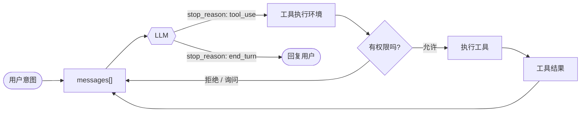

<h1 align="center" style="margin-top: 0;">Awesome Agent Architecture</h1>

<p align="center">
  <strong>了解 AI agent 是如何围绕 LLM 打造出来的</strong><br>
</p>

<p align="center">
  <a href="#研究的系统"></a>
  <a href="#研究的系统"></a>
  <a href="#各章节"></a>
  <a href="LICENSE"></a>
</p>

<p align="center">
  
</p>

<p align="center">
  <a href="README.md">English</a> · <a href="README.zh-TW.md">繁體中文</a> · <strong>简体中文</strong>
</p>

模型负责推理。harness（外层架构）则给它行动、状态和边界：它负责跑工具、在多次调用之间保留状态、管控副作用，还要协调各个循环，这些都不是单次模型调用能做到的。

这个 repo 一章一章拆解 harness：循环、工具、记忆、权限、上下文、任务和界面。学会这一套之后，你就有能力看懂很多种 agent，因为写代码的工具、聊天助手和自动执行器，差别大多只在 harness 的设计选择上。

**目录：** [研究的系统](#研究的系统) · [Agent 循环](#agent-循环) · [方法](#方法) ·
[各章节](#各章节) · [文件结构](#文件结构) · [运行示范](#运行示范)

---

## 研究的系统

每个系统都是下面各章节的实现示例。

| 系统 | 维护者 | 覆盖章节 | 值得看的地方 |
| --- | --- | --- | --- |
| **Claude Code** | Anthropic | 0 到 20（全部） | 完整 harness，从这里读起 |
| **Hermes Agent** | Nous Research | 7、9、14、16、19 | Memory, skill evolution, always-on channels |
| *(更多陆续加入)* | | | |

> 之后可以再加入更多系统，例如 OpenClaw、aider 和 mini-swe-agent。

---

## Agent 循环

大多数 agent 都共用同一套控制流程：调用模型、执行它要求的工具、把结果接回去，然后再调用模型。



这个循环很小。大部分工程都在它周围：分发工具、管控副作用、管理上下文、保存状态，还有协调其他循环。

---

## 方法

每一章都可独立阅读，都用同一组四个方面来看：

1. **开场：** 这一层要解决什么问题。
2. **机制：** 一般性的设计和控制流程。
3. **各系统做法：** 真实系统是怎么实现的。
4. **失效模式：** 什么会出错，以及怎么缓解。

怎么从这个 repo 学习：

- **按顺序读各章节。每一章都建立在前一层之上**。
- 遇到可执行的章节，先读 `src/loop.py`，再跑它的 `test.py` 和 `demo.py`。
- 把某章的 `src/` 跟前一章对比（diff），这个差异就是这一章新增的那个机制。

---

## 各章节

七层，从最基本的循环一路到多 agent 的 harness。每一行都链接到一篇可独立阅读的说明。

| # | 章节 | 问题 | 关键机制 |
| --- | --- | --- | --- |
| | **第 0 层 · 基础** | | |
| 0 | [Harness thesis](sections/00-harness-thesis/) | agency（能动性）从哪里来？ | Model vs harness, actions, observations, permissions |
| | **第 1 层 · 核心循环** | | |
| 1 | [Agent loop](sections/01-agent-loop/) | agent 怎么持续运作？ | `messages[]`, loop, `stop_reason` |
| 2 | [Tool runtime](sections/02-tool-runtime/) | 工具怎么被调用和路由？ | Registry, schemas, dispatch, deferred search |
| 3 | [Permission & sandbox](sections/03-permission-sandbox/) | 副作用怎么被管控？ | Permission modes, approvals, sandboxing |
| 4 | [Hooks](sections/04-hooks/) | 扩展功能怎么挂进循环？ | `PreToolUse`, `PostToolUse`, lifecycle events |
| | **第 2 层 · 复杂工作** | | |
| 5 | [Planning & todos](sections/05-planning-todos/) | 大工作怎么拆解？ | Plan mode, todo list, approval before edits |
| 6 | [Subagents](sections/06-subagents/) | 子问题怎么被隔离？ | Fresh `messages[]`, delegation, child loop |
| 7 | [Skills](sections/07-skills/) | 能力怎么按需加载？ | `SKILL.md`, catalog, progressive disclosure |
| 8 | [Context management](sections/08-context-management/) | 长对话怎么塞进窗口？ | Budgeting, stubs, compaction, summaries |
| | **第 3 层 · 知识与韧性** | | |
| 9 | [Memory](sections/09-memory/) | 它怎么跨运行记住东西？ | Selection, recall, extraction, consolidation |
| 10 | [System prompt assembly](sections/10-system-prompt/) | 每一轮的提示怎么组出来？ | Prompt sections, live state, cache boundaries |
| 11 | [Error recovery](sections/11-error-recovery/) | 长任务怎么在失败中存活？ | Retries, overflow recovery, fallback model |
| | **第 4 层 · 长时间运行与异步** | | |
| 12 | [Task system](sections/12-task-system/) | 工作怎么跨越单一轮次持续存在？ | Task records, dependencies, locks |
| 13 | [Background execution](sections/13-background-execution/) | 工作怎么在主循环之外执行？ | Handles, task state, notification queue |
| 14 | [Scheduling](sections/14-scheduling/) | agent 怎么在之后才执行？ | Cron, sleep, remote triggers, queues |
| 15 | [Worktree isolation](sections/15-worktree-isolation/) | 并行工作怎么避免冲突？ | Git worktrees, cwd binding, safe cleanup |
| | **第 5 层 · 多 Agent** | | |
| 16 | [Coordination](sections/16-coordination/) | 多个 agent 怎么沟通？ | Inboxes, broadcasts, permission bubbling |
| 17 | [Protocols](sections/17-protocols/) | agent 怎么达成共识并干净收尾？ | Plan approval, shutdown handshakes |
| 18 | [Autonomy](sections/18-autonomy/) | agent 怎么自我组织？ | Idle cycle, task claiming, self organization |
| | **第 6 层 · 扩展与集成** | | |
| 19 | [MCP / plugins / channels](sections/19-mcp-plugins-channels/) | harness 怎么连到外面的世界？ | Transports, channels, tool pool assembly |
| 20 | [Observability & evaluation](sections/20-observability/) | 我们怎么知道它有效？ | Tracing, metrics, evals, failure analysis |

---

## 文件结构

21 篇章节说明都已备齐，从 `00-harness-thesis/` 一路到 `20-observability/`。

```text
awesome-agent-architecture/
├── README.md                  # 最上层地图
├── sections/                  # 每个章节一个文件夹
│   ├── 00-harness-thesis/     # 每章一份 README.md
│   ├── 01-agent-loop/src/     # 可执行的代码链从这里开始
│   └── 20-observability/
└── references/                # 原始出处与前人成果
```

每个章节文件夹都是 `NN-name/` 格式，里面有一份 `README.md`。

第 1 到 20 章还带有可执行的 `src/`。代码一章一章累积上去。
每一章新增一个机制，并让 `loop.py` 演进，所以对比相邻两章的 diff，就能看出改了什么。

---

## 运行示范

第 1 到 20 章都附有可执行的示范。从 repo 根目录配置一次就好：

```bash
uv venv
uv pip install -r requirements.txt
cp .env.example .env        # 接着填入你的 ANTHROPIC_API_KEY
```

固定版本的依赖放在 [`requirements.txt`](requirements.txt)。`.env` 已被 gitignore，内容包含：

- `ANTHROPIC_API_KEY`
- 可选的 `ANTHROPIC_MODEL`
- 可选的 `ANTHROPIC_BASE_URL`

每个可执行的章节都有：

- `test.py`：离线检查，不需要密钥。
- `demo.py`：对 API 的实时示范。

```bash
python sections/01-agent-loop/src/test.py         # 离线
uv run python sections/01-agent-loop/src/demo.py  # 实时
```

---

## 参与贡献

- **新增一个系统。** 把新的 agent 放进同一套章节结构里。
- **深化某一章。** 补上一个机制、更清楚的图，或更精准的失效模式。
- **修正内容。** 这些都是从源码、文档和实际行为重建出来的。欢迎附上出处的修正。

请优先采用有名字、可查证的机制，而不是臆测。记得引用出处。

---

## 参考资料

| 出处 | 提供什么 |
| --- | --- |
| [claude-code](https://github.com/yasasbanukaofficial/claude-code) | Claude Code 源码备份，用来对照机制名称与实现路径。 |
| [hermes-agent](https://github.com/NousResearch/hermes-agent) | 开源 agent harness（MIT），作为第二个研究系统。 |
| [learn-claude-code](https://github.com/shareAI-lab/learn-claude-code) | 以代码为主的 harness 重建与章节架构。 |
