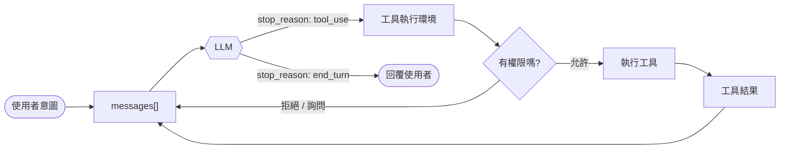

<h1 align="center" style="margin-top: 0;">Awesome Agent Architecture</h1>

<p align="center">
  <strong>了解 AI agent 是如何圍繞 LLM 打造出來的</strong><br>
</p>

<p align="center">
  <a href="#研究的系統"></a>
  <a href="#研究的系統"></a>
  <a href="#各章節"></a>
  <a href="LICENSE"></a>
</p>

<p align="center">
  
</p>

<p align="center">
  <a href="README.md">English</a> · <strong>繁體中文</strong> · <a href="README.zh-CN.md">简体中文</a>
</p>

模型負責推理。harness（外層架構）則給它行動、狀態和界線：它負責跑工具、在多次呼叫之間保留狀態、控管副作用，還要協調各個迴圈，這些都不是單一次模型呼叫做得到的。

這個 repo 一章一章拆解 harness：迴圈、工具、記憶、權限、情境、任務和介面。學會這一套之後，你就有能力看懂很多種 agent，因為寫程式的工具、聊天助理和自動執行器，差別大多只在 harness 的設計選擇上。

**目錄：** [研究的系統](#研究的系統) · [Agent 迴圈](#agent-迴圈) · [方法](#方法) ·
[各章節](#各章節) · [檔案結構](#檔案結構) · [執行示範](#執行示範)

---

## 研究的系統

每個系統都是下面各章節的實作範例。

| 系統                   | 大家為什麼用它                                                        | 值得看的地方                                | 覆蓋章節         | 維護者        |
| ---------------------- | --------------------------------------------------------------------- | ------------------------------------------- | ---------------- | ------------- |
| **Claude Code**  | 目前最強的 coding agent：改檔案、跑指令，直接在真實 repo 裡完成改動。 | 完整 harness 架構，從這裡讀起               | 0 到 21（全部）  | Anthropic     |
| **Hermes Agent** | 長期助理：記得你、學會你的工作流程，還能跨平台跑任務。                | Memory, skill evolution, always-on channels | 7、9、14、16、19、21 | Nous Research |
| *(更多陸續加入)*     |                                                                       |                                             |                  |               |

> 之後可以再加入更多系統，例如 OpenClaw、aider 和 mini-swe-agent。

---

## Agent 迴圈

大多數 agent 都共用同一套控制流程：呼叫模型、執行它要求的工具、把結果接回去，然後再呼叫模型。



這個迴圈很小。大部分的工程都在它周圍：派發工具、控管副作用、管理情境、保存狀態，還有協調其他迴圈。

---

## 方法

每一章都可獨立閱讀，都用同一組四個面向來看：

1. **開場：** 這一層要解決什麼問題。
2. **機制：** 一般性的設計和控制流程。
3. **各系統做法：** 真實系統是怎麼實作的。
4. **失效模式：** 什麼會出錯，以及怎麼緩解。

怎麼從這個 repo 學習：

- **照順序讀各章節。每一章都建立在前一層之上**。
- 遇到可執行的章節，先讀 `src/loop.py`，再跑它的 `test.py` 和 `demo.py`。
- 把某章的 `src/` 跟前一章對比（diff），這個差異就是這一章新增的那個機制。

---

## 各章節

八層，從最基本的迴圈一路到能自己運轉的 harness。每一列都連到一篇可獨立閱讀的說明。

| #  | 章節                                                                      | 問題                           | 關鍵機制                                             |
| -- | ------------------------------------------------------------------------- | ------------------------------ | ---------------------------------------------------- |
|    | **第 0 層 · 基礎**                                                 |                                |                                                      |
| 0  | [Harness thesis](sections/00-harness-thesis/README.zh-TW.md)                 | agency（能動性）從哪裡來？     | Model vs harness, actions, observations, permissions |
|    | **第 1 層 · 核心迴圈**                                             |                                |                                                      |
| 1  | [Agent loop](sections/01-agent-loop/README.zh-TW.md)                         | agent 怎麼持續運作？           | `messages[]`, loop, `stop_reason`                |
| 2  | [Tool runtime](sections/02-tool-runtime/README.zh-TW.md)                     | 工具怎麼被呼叫和路由？         | Registry, schemas, dispatch, deferred search         |
| 3  | [Permission &amp; sandbox](sections/03-permission-sandbox/README.zh-TW.md)   | 副作用怎麼被控管？             | Permission modes, approvals, sandboxing              |
| 4  | [Hooks](sections/04-hooks/README.zh-TW.md)                                   | 擴充功能怎麼掛進迴圈？         | `PreToolUse`, `PostToolUse`, lifecycle events    |
|    | **第 2 層 · 複雜工作**                                             |                                |                                                      |
| 5  | [Planning &amp; todos](sections/05-planning-todos/README.zh-TW.md)           | 大工作怎麼拆解？               | Plan mode, todo list, approval before edits          |
| 6  | [Subagents](sections/06-subagents/README.zh-TW.md)                           | 子問題怎麼被隔離？             | Fresh`messages[]`, delegation, child loop          |
| 7  | [Skills](sections/07-skills/README.zh-TW.md)                                 | 能力怎麼隨需載入？             | `SKILL.md`, catalog, progressive disclosure        |
| 8  | [Context management](sections/08-context-management/README.zh-TW.md)         | 長對話怎麼塞進視窗？           | Budgeting, stubs, compaction, summaries              |
|    | **第 3 層 · 知識與韌性**                                           |                                |                                                      |
| 9  | [Memory](sections/09-memory/README.zh-TW.md)                                 | 它怎麼跨執行記住東西？         | Selection, recall, extraction, consolidation         |
| 10 | [System prompt assembly](sections/10-system-prompt/README.zh-TW.md)          | 每一輪的提示怎麼組出來？       | Prompt sections, live state, cache boundaries        |
| 11 | [Error recovery](sections/11-error-recovery/README.zh-TW.md)                 | 長任務怎麼在失敗中存活？       | Retries, overflow recovery, fallback model           |
|    | **第 4 層 · 長時間執行與非同步**                                   |                                |                                                      |
| 12 | [Task system](sections/12-task-system/README.zh-TW.md)                       | 工作怎麼跨越單一輪次持續存在？ | Task records, dependencies, locks                    |
| 13 | [Background execution](sections/13-background-execution/README.zh-TW.md)     | 工作怎麼在主迴圈之外執行？     | Handles, task state, notification queue              |
| 14 | [Scheduling](sections/14-scheduling/README.zh-TW.md)                         | agent 怎麼在之後才執行？       | Cron, sleep, remote triggers, queues                 |
| 15 | [Worktree isolation](sections/15-worktree-isolation/README.zh-TW.md)         | 平行工作怎麼避免衝突？         | Git worktrees, cwd binding, safe cleanup             |
|    | **第 5 層 · 多 Agent**                                             |                                |                                                      |
| 16 | [Coordination](sections/16-coordination/README.zh-TW.md)                     | 多個 agent 怎麼溝通？          | Inboxes, broadcasts, permission bubbling             |
| 17 | [Protocols](sections/17-protocols/README.zh-TW.md)                           | agent 怎麼達成共識並乾淨收尾？ | Plan approval, shutdown handshakes                   |
| 18 | [Autonomy](sections/18-autonomy/README.zh-TW.md)                             | agent 怎麼自我組織？           | Idle cycle, task claiming, self organization         |
|    | **第 6 層 · 擴充與整合**                                           |                                |                                                      |
| 19 | [MCP / plugins / channels](sections/19-mcp-plugins-channels/README.zh-TW.md) | harness 怎麼連到外面的世界？   | Transports, channels, tool pool assembly             |
| 20 | [Observability &amp; evaluation](sections/20-observability/README.zh-TW.md)  | 我們怎麼知道它有效？           | Tracing, metrics, evals, failure analysis            |
|    | **第 7 層 · 組合**                                                 |                                |                                                      |
| 21 | [Loop engineering](sections/21-loop-engineering/README.zh-TW.md)             | 迴圈怎麼疊成一個能自己運轉的系統？ | Verification loop, triggers, budgets, maturity levels |

---

## 檔案結構

22 篇章節說明都已備齊，從 `00-harness-thesis/` 一路到 `21-loop-engineering/`。

```text
awesome-agent-architecture/
├── README.md                  # 最上層地圖
├── sections/                  # 每個章節一個資料夾
│   ├── 00-harness-thesis/     # 每章一份 README.md
│   ├── 01-agent-loop/src/     # 可執行的程式碼鏈從這裡開始
│   └── 21-loop-engineering/
└── references/                # 原始出處與前人成果
```

每個章節資料夾都是 `NN-name/` 格式，裡面有一份 `README.md`。

第 1 到 21 章還帶有可執行的 `src/`。程式碼一章一章累積上去。
每一章新增一個機制，並讓 `loop.py` 演進，所以對比相鄰兩章的 diff，就能看出改了什麼。

---

## 執行示範

第 1 到 21 章都附有可執行的示範。從 repo 根目錄設定一次就好：

```bash
uv venv
uv pip install -r requirements.txt
cp .env.example .env        # 接著填入你的 ANTHROPIC_API_KEY
```

固定版本的相依套件放在 [`requirements.txt`](requirements.txt)。`.env` 已被 gitignore，內容包含：

- `ANTHROPIC_API_KEY`
- 選填的 `ANTHROPIC_MODEL`
- 選填的 `ANTHROPIC_BASE_URL`

每個可執行的章節都有：

- `test.py`：離線檢查，不需要金鑰。
- `demo.py`：對 API 的即時示範。

```bash
python sections/01-agent-loop/src/test.py         # 離線
uv run python sections/01-agent-loop/src/demo.py  # 即時
```

---

## 參與貢獻

- **新增一個系統。** 把新的 agent 放進同一套章節結構裡。
- **深化某一章。** 補上一個機制、更清楚的圖，或更精準的失效模式。
- **修正內容。** 這些都是從原始碼、文件和實際行為重建出來的。歡迎附上出處的修正。

請優先採用有名字、可查證的機制，而不是臆測。記得引用出處。

---

## 參考資料

| 出處                                                               | 提供什麼                                             |
| ------------------------------------------------------------------ | ---------------------------------------------------- |
| [claude-code](https://github.com/yasasbanukaofficial/claude-code)     | Claude Code 原始碼備份，用來對照機制名稱與實作路徑。 |
| [hermes-agent](https://github.com/NousResearch/hermes-agent)          | 開源 agent harness（MIT），作為第二個研究系統。      |
| [learn-claude-code](https://github.com/shareAI-lab/learn-claude-code) | 以程式碼為主的 harness 重建與章節架構。              |
