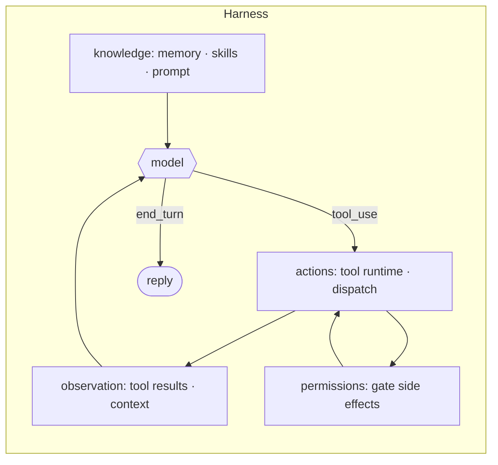

# 0 · Harness thesis

> Agency comes from the model. The harness gives agency a place to land.

This is the premise the whole repo rests on. Capability (reasoning, tool choice, when to stop) lives in the model. Everything else, the loop and the tools and memory and permissions and interfaces around it, is engineering you build. That surrounding engineering is the **harness**, and it is where nearly all the code lives.

---

## Problem

A model on its own is a one-shot text function: messages in, one response out. It can decide to act but has no way to act, no memory between calls, no gate on side effects, no way to reach a file or a shell or another tool. Hand it raw capability and nothing happens.

So something around the model must:

1. Give the action a place to run (tools, dispatch, execution).
2. Give the model something to see (results, knowledge, context).
3. Gate what reaches the world (permissions, sandbox).
4. Persist state so the next call builds on the last.

Leave the harness out and you have a clever chatbot, not an agent. The model can reason about acting but never acts, never observes, never remembers. Agency without a harness has nowhere to land.

---

## Mechanism

The mechanism of this section is not one data structure. It is the **decomposition**: a small model call at the center, wrapped by harness sections that supply its inputs and handle its outputs. The model owns judgment. The harness owns the environment.

Read the loop (section 1) as the spine. Hanging off it: a tool runtime that dispatches actions (2), a permission layer that gates them (3), hooks that intercept (4), context and memory that feed the model (8, 9), the system prompt assembled each turn (10), and the long-running, multi-agent, and extension layers beyond. None of these change the `while`. They feed it, gate it, or persist it.

In Claude Code the split is visible in the tree. The model is reached through one `QueryEngine.ts`. The harness is everything else: `tools/` holds 40 `*Tool` directories (`BashTool`, `FileEditTool`, `AgentTool`, `SkillTool`, `TaskCreateTool`, ...), each conforming to the `Tool.ts` contract (`name`, `inputSchema`, `isEnabled()`, `checkPermissions()`, `prompt()`). Around that sit `hooks/` (interception), `skills/` and `memdir/` (knowledge), `tasks/` and `coordinator/` (long-running and multi-agent), and `plugins/` plus `services/` (extension and integration). One file calls the model; dozens of folders are the chassis.

---

## Per system

What the model decides versus what the surrounding code builds, and how heavy that code is.

| System                | What the model owns                                                              | What the harness owns                                                                                                                                                                       | Harness footprint                                                                                                                                       |
| --------------------- | -------------------------------------------------------------------------------- | ------------------------------------------------------------------------------------------------------------------------------------------------------------------------------------------- | ------------------------------------------------------------------------------------------------------------------------------------------------------- |
| **Claude Code** | Reasoning, tool selection, when to stop (the`tool_use` vs `end_turn` branch) | Loop, dispatch, gating, knowledge, persistence:`QueryEngine.ts` + `query/`, `tools/`, `hooks/`, `skills/`, `memdir/`, `tasks/`, `coordinator/`, `plugins/`, `services/` | `tools/` has 40 `*Tool` dirs · `hooks/` 85 files · `services/` 36 · `utils/` 329 dirs; the model itself is reached through one engine file |
| *(more soon)*       |                                                                                  |                                                                                                                                                                                             |                                                                                                                                                         |

Claude Code is a single binary, and almost none of it is the model. The model is an API call behind `QueryEngine.ts`; the rest of `src/` is harness. The `Tool.ts` interface is the seam: each tool declares its schema, whether it `isEnabled()`, and how it `checkPermissions()`, so the harness can dispatch and gate uniformly while the model only ever sees tool names and results.

> **Trade-off:** Pouring engineering into the harness buys discipline (gated side effects, durable tasks, isolated subagents, on-demand skills) and lets one harness ride model upgrades for free. The cost is surface: a large codebase to maintain, where most bugs and most behavior live in code, not in the model. A thin harness (a one-file bash loop) is trivial to audit but cannot gate, persist, or coordinate.

---

## Failure modes

- **Crediting the model for harness behavior.** When an agent gates a dangerous command or recovers from a failure, that is permission (section 3) or error recovery (11), not model intelligence. Misattributing it leads to "the model should just know better" instead of fixing the harness.
- **Building harness the model could do.** The inverse: hard-coding decision logic the model is better at (rigid planners, scripted tool order) fights the model and rots as models improve. Let the model decide; let the harness execute.
- **Thin harness, capped agency.** A bare loop with no tool runtime (2), permissions (3), or context management (8) caps a strong model at chatbot behavior. Capability exists but has nowhere to land.
- **Harness sprawl.** Every section added is surface to maintain and a place for bugs to hide. With most behavior in code (40 tool dirs, 85 hook files in Claude Code), observability and evaluation (20) become the only way to know the harness still works.
- **Leaky decomposition.** When sections entangle (permission logic baked into tool execution instead of a hook point), you can no longer swap or reason about one piece. The clean seam (a `Tool.ts` contract, a `PreToolUse` hook) is what keeps the parts independent.

---

## Sources

- Claude Code structure: verified in `cc-src/src` · the central engine `QueryEngine.ts` and `query/` (`config.ts`, `deps.ts`, `stopHooks.ts`, `tokenBudget.ts`); the tool contract `Tool.ts`; harness folders `tools/` (40 `*Tool` dirs), `hooks/`, `skills/`, `memdir/`, `tasks/`, `coordinator/`, `plugins/`, `services/`; permission modes in `types/permissions.ts` (`acceptEdits`, `bypassPermissions`, `default`, `dontAsk`, `plan`).
- Framing: learn-claude-code · `s20_comprehensive` ("Many mechanisms, one loop"; the model judges and chooses actions, the harness organizes environment, tools, permissions, memory).

Educational reconstruction from public structure and observed behavior, not an official description of any system.
