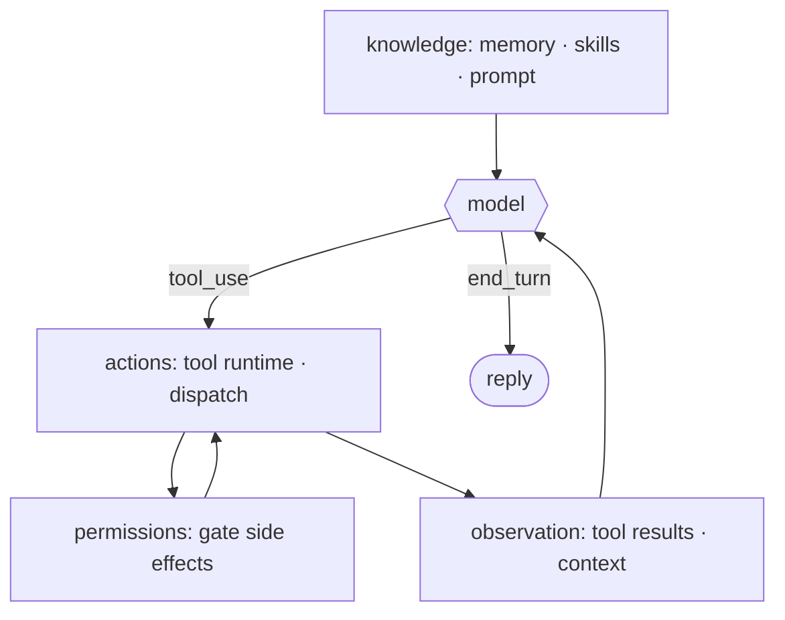

# 0 · Harness thesis

> Agency comes from the model. The harness gives agency a place to land.

Capability (reasoning, tool choice, when to stop) lives in the model; everything else, the loop, tools, memory, permissions, and interfaces around it, is engineering you build. That surrounding engineering is the **harness**, and it is where nearly all the code lives. A model on its own is a one-shot text function: messages in, one response out, able to decide to act but with no way to act, no memory between calls, no gate on side effects, no way to reach a file or a shell. So something around the model must:

1. Give the action a place to run (tools, dispatch, execution).
2. Give the model something to see (results, knowledge, context).
3. Gate what reaches the world (permissions, sandbox).
4. Persist state so the next call builds on the last.

Leave the harness out and you have a clever chatbot, not an agent. The model can reason about acting but never acts, never observes, never remembers. Agency without a harness has nowhere to land.

---

## Mechanism

The mechanism of this section is not one data structure. It is the **decomposition**: a small model call at the center, wrapped by harness sections that supply its inputs and handle its outputs. The model owns judgment. The harness owns the environment.

Read the loop (section 1) as the spine. Hanging off it: a tool runtime that dispatches actions (2), a permission layer that gates them (3), hooks that intercept (4), context and memory that feed the model (8, 9), the system prompt assembled each turn (10), and the long-running, multi-agent, and extension layers beyond. None of these change the `while`. They feed it, gate it, or persist it.

---

## Per system

What the model decides versus what the surrounding code builds, and how heavy that code is.

| System                | What the model owns                                                    | What the harness owns                                                                                                                             | Harness footprint                                                                                          |
| --------------------- | ---------------------------------------------------------------------- | ------------------------------------------------------------------------------------------------------------------------------------------------- | ---------------------------------------------------------------------------------------------------------- |
| **Claude Code** | Reasoning, tool selection, when to stop (`tool_use` vs `end_turn`) | Loop, dispatch, gating, knowledge, persistence:`QueryEngine.ts`, `tools/`, `hooks/`, `skills/`, `memdir/`, `tasks/`, `coordinator/` | 40`*Tool` dirs · 85 hook files · 36 services · 329 `utils/` dirs; one engine file reaches the model |
| *(more soon)*       |                                                                        |                                                                                                                                                   |                                                                                                            |

### Claude Code

- **One binary, almost no model.** The model is reached through one `QueryEngine.ts`; everything else in `src/` is harness, and the split is visible in the tree.
- **The tree is the decomposition.** `tools/` is action, `hooks/` interception, `skills/` and `memdir/` knowledge, `tasks/` and `coordinator/` long-running and multi-agent, `plugins/` and `services/` extension and integration.
- **`Tool.ts` is the seam.** Each of 40 `*Tool` dirs (`BashTool`, `FileEditTool`, `AgentTool`, `SkillTool`, `TaskCreateTool`, ...) declares the same contract (`name`, `inputSchema`, `isEnabled()`, `checkPermissions()`, `prompt()`), so the harness dispatches and gates uniformly.
- **The model sees only names and results.** It never touches dispatch or gating.

> **Trade-off:** Pouring engineering into the harness buys discipline (gated side effects, durable tasks, isolated subagents, on-demand skills) and lets one harness ride model upgrades for free. The cost is surface: a large codebase to maintain, where most bugs and most behavior live in code, not in the model. A thin harness (a one-file bash loop) is trivial to audit but cannot gate, persist, or coordinate.

---

## Failure modes

- **Crediting the model for harness behavior.** Gating a dangerous command or recovering from a failure looks like model intelligence but is harness work. Mitigation: credit permissions (section 3) and error recovery (section 11), then fix the harness, not "the model should know better".
- **Building harness the model could do.** Hard-coding decision logic the model is better at (rigid planners, scripted tool order) fights the model and rots as models improve. Mitigation: let the model decide, let the harness only execute.
- **Thin harness, capped agency.** A bare loop with no tool runtime, permissions, or context management caps a strong model at chatbot behavior. Mitigation: add the missing layers (section 2, section 3, section 8) so capability has somewhere to land.
- **Harness sprawl.** Every section added is surface to maintain and a place for bugs to hide (40 tool dirs, 85 hook files in Claude Code). Mitigation: lean on observability and evaluation (section 20) to know the harness still works.
- **Leaky decomposition.** Entangled sections (permission logic baked into tool execution) cannot be swapped or reasoned about in isolation. Mitigation: keep clean seams, a `Tool.ts` contract and a `PreToolUse` hook (section 4), so parts stay independent.

---

## Sources

- Claude Code source (`cc-src/src`): `QueryEngine.ts`, `query/`, `Tool.ts`, `tools/`, `hooks/`, `types/permissions.ts`.
- learn-claude-code · s20_comprehensive: section framing.
