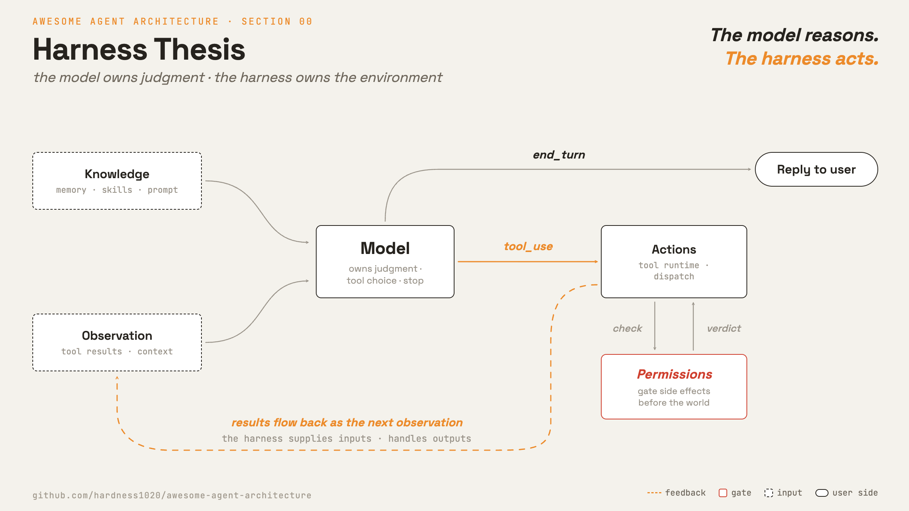

# 0 · Harness thesis

[English](README.md) · [繁體中文](README.zh-TW.md) · **简体中文**

> 模型决定要做什么。harness 提供工具、状态与限制。

模型负责推理、选择工具，以及何时停止。harness（外层架构）则是模型周围的代码：loop、tool、memory、permission 与各种 interface。

单独一次模型调用，只是对单一输入产生一次响应。它可以决定要行动，却无法自行行动。它没有持久状态、没有工具执行器、无法访问文件，也没有权限关卡。

harness 必须：

1. 给行动一个执行的地方。
2. 给模型有用的观察结果。
3. 在副作用抵达真实世界前先加以把关。
4. 保存状态，让后续调用能承接先前的调用。

没有 harness，模型只能回答。它无法执行工具、观察结果，也无法在多次调用之间记住工作进度。

---

## 机制

这一章讲的是分工。中心是一个小小的模型调用，输入由 harness 准备，输出由 harness 接手。

判断归模型，环境归 harness。

第 1 章的 loop 是核心控制流程。其他章节在它周围加上输入、检查或状态：

- 第 2 章加上 tool runtime 与 dispatch。
- 第 3 章加上 permission 与 sandbox。
- 第 4 章加上拦截生命周期事件的 hook。
- 第 8 章与第 9 章加上 context 管理与跨 session memory。
- 第 10 章在每一轮组出 system prompt。
- 后面的章节加上 task、background execution、scheduling 与 isolation。

这些部分不会取代 loop。它们把输入送进 loop、为 loop 把关，或替 loop 保存状态。

### Harness 不是越复杂越好

每一层 harness，都是在补当下模型做不到的事。这让每一层都带着两个成本：

1. 代码变多，要维护的变多，会出 bug 的地方也变多。
2. 设计绑着某一代模型。新模型可能自己就会规划、恢复、验证，这时还硬套旧的补救方式，反而会拉低表现。

所以 harness engineering 不是只有加，也包含删。模型换代时，重新评估每一层：还有帮助的留下，新模型自己就做得到的就删掉。
怎么量测，见第 20、21 章。mini-swe-agent 就是最极端的例子：几乎没有 harness，也就几乎没有东西需要重新评估。

### 延伸阅读

下面两个框架来自 ai-agent-book 对 production agent 的观察。把它们当成可以拿去验的说法，不是这个 repo 自己的结论。

**界线怎么验。**模型和 harness 的界线落在哪，会随着模型变强而移动。有两个说法可以拿来验。

一个任务要多厚的 scaffold，看模型有多强。弱一点的模型需要被逼着先规划，需要重试阶梯，需要写死的检查。
强一点的模型自己就会做这些事，这时同一层只是多烧 token，还把模型原本更好的决定盖掉。
同一套 scaffold 拿到两代模型上跑，分数可能往相反方向走。这件事只有书上一次实验撑着，所以去验方向，不要直接信幅度。

有些行为看起来是 harness 的设置，其实不是。“什么时候不用再读了、可以动手改”就是一个。
这个门槛是模型训练时学来的，换到哪一套 harness 都跟着走。prompt 里写一句话、把步数压小，都只能推它一点，定不了它。

所以每一层都要问：它落在界线的哪一边。模型自己已经会做这个决定的话，这一层就是多的。

**Agent 先在哪里跑得起来。**一个任务现在适不适合交给 agent，看两件事：目标能讲多精确，还有结果机器判不判得出来。

写代码这两项都很高。一张 ticket 或一个失败的测试就把目标讲清楚了，测试、类型、linter 和 git 会说什么时候算做完。
这些基础设施本来是人盖给自己用的，agent 直接拿来当现成的验证 harness。coding agent 最早成熟，原因就在这里。

少掉其中一项，任务会用特定的方式变难。目标清楚、机器验不了，例如把一页文字改得更好读：loop 没有停止条件，没人说不行，它就当作做完了。
机器验得了、目标讲不清楚，例如把一个模块整理干净：loop 会对着检查做，它能证明没有东西坏掉，但这跟做出你要的东西是两回事。
第 21 章补的是缺掉的那个检查。目标讲不清楚，补再多检查也救不回来。

---

## 各系统做法

哪些事让模型决定，哪些事交给周围的代码。

| | Claude Code | mini-swe-agent |
| --- | --- | --- |
| **Pros** | harness 带来安全性、持久化、subagent，以及按需加载的知识。 | 几乎没有 harness 代码，也就没什么要维护的。 |
| **Cons** | 代码大多集中在 harness，要维护的东西多，bug 也大多出在这里。 | 除了执行 bash 之外的每一种能力，都得靠模型自己。 |
| **Why** | 模型调用无法自行行动，所以环境全由 harness 负责。 | 假设一个 bash 工具就够了。hook、skill、memory 与 task 都刻意不存在。 |
| **How: model owns** | 判断、选择工具、决定停止。模型看得到工具名称、schema 与结果。 | 判断、怎么改文件、何时提交。 |
| **How: harness owns** | loop、tool、permission、hook、knowledge、task 与 coordination。 | 一个 loop、一个 bash tool、跑命令前先问过用户，再加上步数与成本上限。 |
| **How: size signal** | 多数代码都落在模型调用之外。 | 整个 agent class 大约 150 行。 |

---

## 哪里会出错

- **把 harness 的行为归功给模型：**权限检查与错误恢复是 harness 的行为。它们出错时要修的是 harness。
- **把该由模型做的决定写死：**僵硬的工具顺序与写死的规划会和模型冲突。需要判断时，就让模型去决定。
- **harness 太少：**一个没有工具、权限或 context 管理的 loop，会把模型停在聊天机器人的层次。补上缺少的那一层。
- **harness 太多：**每加一层就多一份要维护的代码，而且为旧模型设计的那一层，可能反过来拖住新模型。模型换代时重新评估，没有帮助的就删掉。
- **把模型的策略当成 harness 的设置：**什么时候停止收集信息，是模型学来的，不是设置出来的。prompt 规则只能推它一点。这一层要不要留，量过再决定。
- **在机器判不出结果的地方跑 agent：**loop 分不出这是做完了还是做错了。补一个检查器，或是让人留在流程里。
- **职责混在一起：**把权限逻辑塞进工具执行里，会更难测试也更难替换。维持清楚的契约，例如 `Tool.ts` 与 `PreToolUse`。

---

## 出处

- [Claude Code source (`cc-src/src`)](https://github.com/yasasbanukaofficial/claude-code)：`QueryEngine.ts`、`query/`、`Tool.ts`、`tools/`、`hooks/`、`types/permissions.ts`。
- [mini-swe-agent source](https://github.com/swe-agent/mini-swe-agent)：`agents/default.py`、`environments/local.py`、`__init__.py` 里的 protocol。
- [mini-swe-agent README](https://github.com/swe-agent/mini-swe-agent)：模型变强之后，harness 可以更小的理由。
- [learn-claude-code · s20_comprehensive](https://github.com/shareAI-lab/learn-claude-code)：章节框架。
- [ai-agent-book](https://github.com/bojieli/ai-agent-book)：`book/chapter5.md`，以中文原版为准。界线框架与任务象限，两者都只有单一来源。
