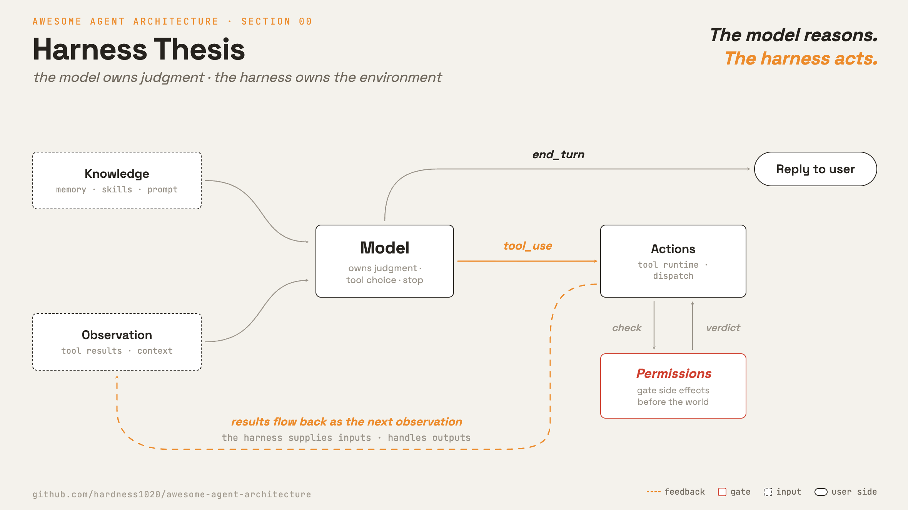

# 0 · Harness thesis

[English](README.md) · **繁體中文** · [简体中文](README.zh-CN.md)

> 模型決定要做什麼。harness 提供工具、狀態與限制。

模型負責推理、選擇工具，以及何時停止。harness（外層架構）則是模型周圍的程式碼：迴圈、工具、memory、權限與各種介面。

單獨一次模型呼叫，只是對單一輸入產生一次回應。它可以決定要行動，卻無法自行行動。它沒有持久狀態、沒有工具執行器、無法存取檔案，也沒有權限關卡。

harness 必須：

1. 給行動一個執行的地方。
2. 給模型有用的觀察結果。
3. 在副作用抵達真實世界前先加以把關。
4. 保存狀態，讓後續呼叫能承接先前的呼叫。

沒有 harness，模型只能回答。它無法執行工具、觀察結果，也無法在多次呼叫之間記住工作進度。

---

## 機制

這一章講的是拆解。一個小小的模型呼叫坐在中心。harness 供給它的輸入，並處理它的輸出。

模型負責判斷。harness 負責環境。

第 1 章的迴圈是核心控制流程。其他章節在它周圍加上輸入、檢查或狀態：

- 第 2 章加上 tool runtime 與 dispatch。
- 第 3 章加上權限與沙箱。
- 第 4 章加上攔截生命週期事件的 hook。
- 第 8 章與第 9 章加上 context 管理與跨 session 記憶。
- 第 10 章在每一輪組出 system prompt。
- 後面的章節加上任務、背景工作、排程與隔離。

這些部分不會取代迴圈。它們供給迴圈、為迴圈把關，或替迴圈保存狀態。

---

## 各系統做法

模型決定的部分，對比周圍程式碼建構的部分。

| System                | 模型負責什麼               | harness 負責什麼                           | 規模訊號                       |
| --------------------- | -------------------------- | ------------------------------------------ | ------------------------------ |
| **Claude Code** | 判斷、選擇工具、決定停止。 | 迴圈、工具、權限、hook、知識、任務與協調。 | 多數程式碼都落在模型呼叫之外。 |

### Claude Code

- 模型透過 `QueryEngine.ts` 觸及。
- `tools/` 定義行動。
- `hooks/` 定義生命週期攔截。
- `skills/` 與 `memdir/` 定義知識載入與回想。
- `tasks/` 與 `coordinator/` 定義較長時間執行與多 agent 的工作。
- `Tool.ts` 給工具一份共通契約：`name`、`inputSchema`、`isEnabled()`、`checkPermissions()` 與 `prompt()`。
- 模型看得到工具名稱、schema 與結果。它不會執行 dispatch 或權限程式碼。

> **取捨：** harness 帶來安全性、持久化、subagent，以及隨需載入的知識。
> 它同時也成為主要的程式碼表面。多數行為與多數 bug 都住在那裡。

---

## 失效模式

- **把 harness 的行為歸功給模型：**權限檢查與錯誤復原是 harness 的行為。它們出錯時要修的是 harness。
- **把該由模型做的決定寫死：**僵硬的工具順序與寫死的規劃會和模型衝突。需要判斷時，就讓模型去決定。
- **harness 太少：**一個沒有工具、權限或 context 管理的迴圈，會把模型停在聊天機器人的層次。補上缺少的那一層。
- **harness 太多：**每加一層就多一份要維護的程式碼。用可觀測性與評估來確認 harness 還能正常運作。
- **職責混在一起：**把權限邏輯塞進工具執行裡，會更難測試也更難替換。維持清楚的契約，例如 `Tool.ts` 與 `PreToolUse`。

---

## 出處

- Claude Code source (`cc-src/src`)：`QueryEngine.ts`、`query/`、`Tool.ts`、`tools/`、`hooks/`、`types/permissions.ts`。
- learn-claude-code · s20_comprehensive：章節框架。
