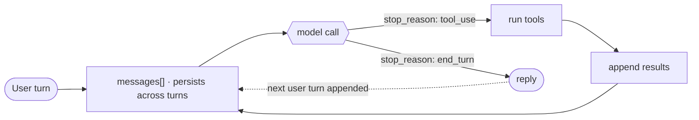

# 1 · Agent Loop

> One loop, and almost nothing else. Everything in this repo hangs off this branch.

The model decides; the loop lets it keep deciding. A raw model call is one-shot: send messages, get one response, it stops. That is a chatbot. An agent has to act, see what happened, and decide again, many times, with no human pressing enter between steps. Strip the branding from any agent and you find the same `while`: call the model, run any tool it asked for, feed the result back, call again, all over one `messages[]` that persists across turns. So something must:

1. Carry the conversation state across turns.
2. Detect when the model wants to act versus when it is done.
3. Run the requested action and feed the outcome back.
4. Re-invoke the model and repeat until it stops.

Leave this out and the model can reason but never acts. Get it wrong and the agent either halts too early (drops the task) or never halts (burns tokens in a tool-call loop).

---

## Mechanism

Two nested loops over one growing `messages[]`. The inner loop is a single turn: call the model, branch on its `stop_reason`, run any tools, and call again until it stops. The outer loop is the conversation: the same `messages[]` persists, and each new user turn is appended before the inner loop runs again, so the model re-reads every prior message.



The inner loop is one turn over a `messages[]` the caller owns:

```python
def run_turn(messages, model, max_steps=10):        # src/loop.py · one turn over the shared messages[]
    for _ in range(max_steps):                       # the inner loop, with a backstop
        response = model(messages)                   # one Anthropic Messages call
        messages.append({"role": "assistant", "content": response.content})

        if response.stop_reason != "tool_use":       # model produced its answer for this turn
            return final_text(response)

        results = []                                 # tool_use: run each, feed back
        for block in response.content:
            if block.type == "tool_use":
                results.append({"type": "tool_result", "tool_use_id": block.id,
                                "content": run_tool(block.name, block.input)})
        messages.append({"role": "user", "content": results})

    raise RuntimeError("hit max_steps without end_turn")
```

- `run_turn()` in [`src/loop.py`](src/loop.py) is the inner loop; `messages` is the running state in the Anthropic Messages format, and the new user message is already its last item when the turn begins.
- `for _ in range(max_steps)` is the `while`, plus the backstop that stops a runaway loop (a failure mode below).
- `run_tool(name, input)` (same file) is dispatch plus execute: look the tool up, run it, return a string that goes back as a `tool_result` so the next model call sees it.
- `model()` in [`src/demo.py`](src/demo.py) is one `client.messages.create` call against the Anthropic API. Swap it for any provider and `run_turn()` is unchanged.

The outer loop is the conversation: the caller appends one user message per turn and never throws the buffer away:

```python
messages = []                                        # src/demo.py · the conversation, owned by the caller
for user_text in turns:                              # the outer loop: one iteration per user turn
    messages.append({"role": "user", "content": user_text})
    reply = run_turn(messages, model)                # appends in place; turn N sees turns 1..N-1
```

- `run_turn` appends in place (assistant replies and tool results included), so turn 2 is sent with the full transcript of turn 1, and the model sees every prior message exactly.
- A one-shot question is just a conversation of length one: seed `messages` with a single user turn and call `run_turn` once.

The loop body never changes as you add capability. Permissions (section 3), subagents (6), memory (9), and hooks (4) bolt onto the four numbered steps; they are not rewrites of the `while`.

Two `stop_reason` values drive everything:

- `tool_use` the model emitted tool calls. Run them, append results, loop.
- `end_turn` the model produced a final answer. Stop. (The loop stops on any `stop_reason` that is not `tool_use`.)

`messages[]` is the entire memory of the conversation, not just one turn. Each appended tool result lets the next model call build on the last action; each retained user turn lets the next answer build on the last reply. That append-and-loop, inner turn and outer conversation, is the agent.

This bare loop has no permission gate. Gating side effects is a separate concern layered on step 3 (see section 3).

---

## Per system

How each agent owns that `while` and decides to stop.

| System | Loop driver | Stop signal | Parallel tools | Streaming |
|---|---|---|---|---|
| **Claude Code** | `QueryEngine.ts` + `query/` (async generator) | `stop_reason: end_turn` | yes | yes |
| *(more soon)* | | | | |

### Claude Code

- **Async generator.** The `query/` module yields each step (model token, tool call, tool result) as it happens, driving the live-updating terminal.
- **Parallel tools.** Tool calls within one model turn run in parallel.
- **Dispatch contract.** Each tool plugs into dispatch through the `Tool.ts` contract.
- **Loop stays trivial.** The branch itself is the same one shown above.

> **Trade-off:** a one-file bash loop (model returns a command, you run it, repeat) is trivial to read and audit, but it cannot gate side effects, run tools in parallel, or stream output. A generator-based loop like Claude Code's buys permissions, parallelism, and live output at the cost of a much larger surface. Choose by whether you need to gate what the model does.

---

## Failure modes

- **No stop condition.** A bug that never yields `end_turn`, or a tool that always provokes another, loops forever. Mitigation: a max-iteration or token ceiling as backstop (`for _ in range(max_steps)`).
- **Context overflow mid-loop.** `messages[]` only grows, so long runs blow the context window. Mitigation: context management (section 8); the loop alone has no answer.
- **Partial tool failure.** A tool throws or times out and the model never learns it failed, so it hangs or repeats. Mitigation: always append the outcome, including failure, as a `tool_result`.
- **Lost results.** Appending the model reply but dropping the tool result (or the reverse) desyncs the conversation. Mitigation: append the assistant reply and tool results together so the next call reasons over no hole.

---

## Runnable

[`src/`](src/) starts the chain with:

- [`loop.py`](src/loop.py): the loop itself, inner turn and outer conversation over one persistent `messages[]`.
- [`demo.py`](src/demo.py): drives a two-turn conversation against the Anthropic API. Turn 1 calls `get_time`; turn 2 ("before or after noon?") only works because it still sees turn 1 in the shared buffer.
- [`test.py`](src/test.py): checks tool dispatch, final-text, and that a second turn sees the first.

Sections 2 to 11 carry this `src/` forward, evolving `loop.py` and adding one file per section.

```bash
python sections/01-agent-loop/src/test.py         # offline checks, no key
uv run python sections/01-agent-loop/src/demo.py  # live demo, needs a key
```

---

## Sources

- [Claude Code source](https://github.com/yasasbanukaofficial/claude-code): `QueryEngine.ts`, `query/`, `Tool.ts`.
- [learn-claude-code · s01 Agent Loop](https://github.com/shareAI-lab/learn-claude-code): section framing.
