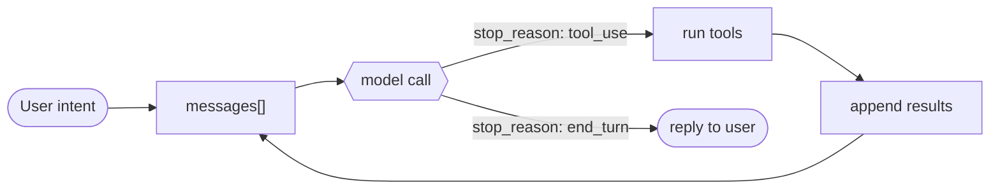

# 1 · Agent Loop

> One loop, and almost nothing else. Everything in this repo hangs off this branch.

The model decides; the loop lets it keep deciding. Strip the branding from any agent and you find the same `while`: call the model, and if it asked for a tool, run it, feed the result back, call again.

---

## Problem

A raw model call is one-shot. You send messages, you get one response, it stops. That is a chatbot, not an agent. An agent has to act, see what happened, and decide again, possibly many times, with no human pressing enter between steps.

So something must:

1. Carry the conversation state across turns.
2. Detect when the model wants to act versus when it is done.
3. Run the requested action and feed the outcome back.
4. Re-invoke the model and repeat until it stops.

Leave this out and the model can reason but never acts. Get it wrong and the agent either halts too early (drops the task) or never halts (burns tokens in a tool-call loop).

---

## Mechanism

Three pieces: a growing `messages[]` list, a `while` loop, and a branch on the model's `stop_reason`.



```python
def run(user_intent, model, max_steps=10):          # src/loop.py
    messages = [{"role": "user", "content": user_intent}]
    for _ in range(max_steps):                       # the loop, with a backstop
        reply = model(messages)                      # one model call
        messages.append({"role": "assistant", **reply})
        if reply["stop_reason"] == "end_turn":       # model is done
            return reply["text"]
        for call in reply["tool_calls"]:             # model wants to act
            messages.append(run_tool(call))          # dispatch + execute, fed back
    raise RuntimeError("hit max_steps without end_turn")
```

- `run()` in [`src/loop.py`](src/loop.py) is the loop above; `messages` is the entire running state.
- `for _ in range(max_steps)` is the `while`, plus the backstop that stops a runaway loop (a failure mode below).
- `run_tool(call)` (same file) is dispatch plus execute: look the tool up, run it, return a `{"role": "tool", ...}` result that is appended back so the next model call sees it.
- The stub `model()` lives in [`src/demo.py`](src/demo.py). Swap it for a real client and `run()` is unchanged.

The loop body never changes as you add capability. Permissions (section 3), subagents (6), memory (9), and hooks (4) bolt onto the four numbered steps; they are not rewrites of the `while`.

Two `stop_reason` values drive everything:

- `tool_use` the model emitted tool calls. Run them, append results, loop.
- `end_turn` the model produced a final answer. Stop.

`messages[]` is the entire memory of the run. Each appended tool result is what lets the next model call build on the last action. That append-and-loop is the agent.

This bare loop has no permission gate. Gating side effects is a separate concern layered on step 3 (see section 3).

---

## Per system

How each agent owns that `while` and decides to stop.

| System | Loop driver | Stop signal | Parallel tools | Streaming |
|---|---|---|---|---|
| **Claude Code** | `QueryEngine.ts` + `query/` (async generator) | `stop_reason: end_turn` | yes | yes |
| *(more soon)* | | | | |

Claude Code runs the loop as an async generator. The `query/` module yields each step (model token, tool call, tool result) as it happens, which is what drives the live-updating terminal. Tool calls within one model turn can run in parallel, and the `Tool.ts` contract is how each tool plugs into dispatch. The loop itself stays the trivial branch above.

> **Trade-off:** a one-file bash loop (model returns a command, you run it, repeat) is trivial to read and audit, but it cannot gate side effects, run tools in parallel, or stream output. A generator-based loop like Claude Code's buys permissions, parallelism, and live output at the cost of a much larger surface. Choose by whether you need to gate what the model does.

---

## Failure modes

- **No stop condition.** A bug that never yields `end_turn`, or a tool that always provokes another tool call, loops forever. Real loops add a max-iteration or token ceiling as a backstop.
- **Context overflow mid-loop.** `messages[]` only grows, so long runs blow the context window. This is why context management (section 8) exists; the loop alone has no answer.
- **Partial tool failure.** A tool throws or times out. If the error is not appended as a result, the model never learns it failed and may hang or repeat. The outcome, including failure, must always go back into `messages[]`.
- **Lost results.** Appending the model reply but forgetting the tool result (or the reverse) desyncs the conversation, and the next call reasons over a hole.

---

## Runnable

[`src/loop.py`](src/loop.py) is the bare loop; [`src/demo.py`](src/demo.py) runs it with a stubbed model (no API key). Sections 2 to 8 carry this `src/` forward, evolving `loop.py` and adding one file per section, so the harness grows in front of you. Swap the stub for a real client and the loop body does not change.

```
python sections/01-agent-loop/src/demo.py
```

---

## Sources

- Claude Code leaked source structure (`QueryEngine.ts`, `query/`, `Tool.ts`): [backup repo](https://github.com/yasasbanukaofficial/claude-code)
- Framing: [learn-claude-code · s01 Agent Loop](https://github.com/shareAI-lab/learn-claude-code)

Educational reconstruction from public structure and observed behavior, not an official description of any system.
