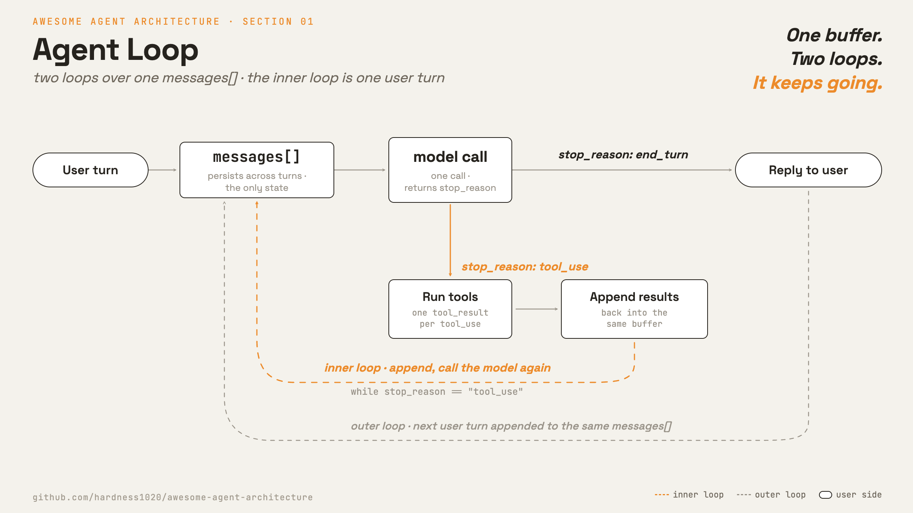

# 1 · Agent Loop

[English](README.md) · **繁體中文** · [简体中文](README.zh-CN.md)

> 一個 loop 不斷呼叫模型，直到它給出答案或要求使用工具。

單純呼叫模型就是一問一答。你把 messages 送過去，它回你一次，就結束了。

agent 需要多一個步驟。它必須執行模型要求的工具、把結果附加回去，再次呼叫模型。同一份 `messages[]` 必須在整輪中持續成長。

這個 loop 必須：

1. 在多次呼叫之間保留對話狀態。
2. 分辨是使用工具，還是最終答案。
3. 執行被要求的工具，並把結果附加回去。
4. 反覆呼叫模型，直到它停下來。

沒有這個 loop，模型能對行動進行推理，卻無法行動。如果 loop 寫錯，它不是太早停止，就是永遠跑下去。

---

## 機制



這裡是兩個 loop 共用同一份 `messages[]`。

拿聊天視窗來想像。你問「台北現在天氣如何？要不要帶傘？」，模型可能先呼叫查天氣的工具，拿到結果後再呼叫查降雨機率的工具，最後才回你答案。
**所以同一個輪次裡，模型往往被呼叫好幾次，中間穿插各種工具呼叫。**
這整段從發問到答完就是**內層 loop**，也就是一個使用者輪次（turn）：它呼叫模型、檢查 `stop_reason`、需要時執行工具、把結果附加回去，然後重複，直到模型給出這一輪的最終答案。

接著你在同一個視窗再問「那明天呢？」，這就是新的一輪。
把一輪又一輪串成整段對話的，就是**外層 loop**。每個新輪次都附加到同一份 `messages[]`，所以模型在回答「明天」時，看得到你前面問過台北的天氣，你不必再說一次。

內層 loop 就是拿著呼叫端手上那份 `messages[]`，把一輪跑完：

```python
def run_turn(messages, model, max_steps=10):        # src/loop.py · one turn over the shared messages[]
    for _ in range(max_steps):                       # the inner loop, with a backstop
        response = model(messages)                   # one Anthropic Messages call
        messages.append({"role": "assistant", "content": response.content})

        if response.stop_reason != "tool_use":       # model produced its answer for this turn
            return final_text(response)

        results = []                                 # tool_use: run each, feed back
        for block in response.content:
            if block.type == "tool_use":
                results.append({"type": "tool_result", "tool_use_id": block.id,
                                "content": run_tool(block.name, block.input)})
        messages.append({"role": "user", "content": results})

    raise RuntimeError("hit max_steps without end_turn")
```

- [`src/loop.py`](src/loop.py) 中的 `run_turn()` 就是內層 loop。
- `messages` 是採用 Anthropic Messages 格式的共享狀態。
- `max_steps` 是防止 loop 失控的安全上限。
- `run_tool(name, input)` 解析出工具、執行它，並回傳供 `tool_result` 使用的文字。
- [`src/demo.py`](src/demo.py) 中的 `model()` 是一次 `client.messages.create` 呼叫。 loop 不綁定單一供應商。

外層 loop 每一輪附加一則使用者訊息，並保留整個緩衝區：

```python
messages = []                                        # src/demo.py · the conversation, owned by the caller
for user_text in turns:                              # the outer loop: one iteration per user turn
    messages.append({"role": "user", "content": user_text})
    reply = run_turn(messages, model)                # appends in place; turn N sees turns 1..N-1
```

有兩個 `stop_reason` 值驅動這個 loop：

- `tool_use`：執行工具、附加結果，再次呼叫模型。
- `end_turn`：回傳最終答案。demo 只要遇到任何不是 `tool_use` 的值就停止。

`messages[]` 是這個 session 的整段對話記憶。工具結果與 assistant 回覆都會放進去。下一次模型呼叫會在這整份狀態上進行推理。

這個最精簡的 loop 沒有權限關卡。第 3 章會在工具執行前加上權限。

---

## 各系統做法

各個 agent 如何擁有這個 loop，以及如何決定何時停止。

| | Claude Code | mini-swe-agent |
| --- | --- | --- |
| **Pros** | 能串流進度、把關副作用，還能平行執行工具。 | loop 很小，容易閱讀與稽核。 |
| **Cons** | loop 包在一個更大的 runtime 裡，不能單獨拿出來用。 | 無法把關副作用、串流進度，或平行執行工具。 |
| **Why** | 核心分支保持不變，功能都加在外圍。 | 小 loop 本身就是目的。偵測任務是否完成的是環境，不是模型。 |
| **How: loop driver** | 一個 async generator。每個工具透過同一份契約接進 dispatch。 | 一個 while loop。每一步跟模型要一道指令，再執行。 |
| **How: stop signal** | `stop_reason: end_turn`。 | 附加一則 `role: "exit"` 訊息。由環境偵測提交標記。沒帶指令的回應只算格式錯誤。 |
| **How: parallel tools** | 有。同一次模型輪次中的工具呼叫可以平行執行。 | 沒有，action 依序執行。 |
| **How: streaming** | 有。模型 token、工具呼叫與工具結果發生的當下就逐一送出。 | 沒有。 |

---

## 哪裡會出錯

- **沒有停止條件：**一個 bug 或工具 loop 可能永遠跑下去。用最大步數或 token 上限。
- **loop 中途 context 溢位：**`messages[]` 只會成長。第 8 章加上 context 管理。
- **部分工具失敗：**失敗的工具仍必須回傳一個 `tool_result`，模型才能復原。
- **結果遺失：**丟掉 assistant 的工具呼叫或工具結果任何一個，都會破壞 transcript。兩者都要附加。

---

## 可執行程式

[`src/`](src/) 從這裡開啟整條鏈：

- [`loop.py`](src/loop.py)：內層 loop 與共享的 `messages[]`。
- [`demo.py`](src/demo.py)：兩輪的即時 demo。第 2 輪仰賴第 1 輪仍留在緩衝區裡。
- [`test.py`](src/test.py)：針對工具 dispatch、最終文字與多輪狀態的離線檢查。

第 2 到 11 章會把這份 `src/` 帶著往前走，持續演進 `loop.py`，並在每一章加上一個檔案。

```bash
python sections/01-agent-loop/src/test.py         # offline checks, no key
uv run python sections/01-agent-loop/src/demo.py  # live demo, needs a key
```

---

## 出處

- [Claude Code source](https://github.com/yasasbanukaofficial/claude-code)：`QueryEngine.ts`、`query/`、`Tool.ts`。
- [mini-swe-agent source](https://github.com/swe-agent/mini-swe-agent)：`agents/default.py`、`exceptions.py`、`environments/local.py`。
- [learn-claude-code · s01 Agent Loop](https://github.com/shareAI-lab/learn-claude-code)：章節框架。
