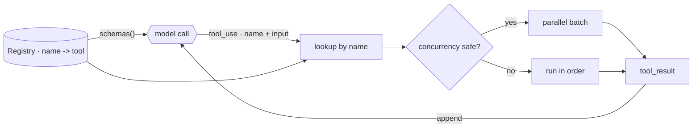

# 2 · Tool runtime

**English** · [繁體中文](README.zh-TW.md) · [简体中文](README.zh-CN.md)

> Adding a capability means registering a tool. The loop stays the same.

The agent loop can only act through tools. The model emits a structured `tool_use` block with a `name` and an `input`.

The harness maps that name to code. It validates the input, runs the handler, and returns a result.

The runtime must:

1. Tell the model which tools exist.
2. Describe each tool's input schema.
3. Route each `tool_use` by name.
4. Run safe calls in parallel when possible.
5. Keep large tool catalogs discoverable.

Without this layer, the model can ask to act but nothing can execute the action.

With only one `bash` tool, every capability becomes string handling. There is no per-tool validation or permission logic.

---

## Mechanism

A tool is a small object with a name, a handler, a schema, and a few predicates. A registry stores tools by name. Dispatch is a lookup.



### New: the tool runtime

```python
@dataclass
class Tool:                                  # src/tools.py
    name: str
    run: Callable[[dict], Any]
    description: str = ""                      # advertised to the model
    input_schema: dict = ...                   # the Anthropic schema it accepts
    is_read_only: bool = False
    is_concurrency_safe: bool = False         # may batch in parallel
    is_edit: bool = False                     # read by the gate (section 3)

class Registry:                              # src/tools.py
    def register(self, tool): self._tools[tool.name] = tool   # add a handler
    def get(self, name):      return self._tools.get(name)    # dispatch = lookup
    def schemas(self):        ...             # the tools list handed to the model
```

- A tool is a dataclass.
- The registry is `name -> tool`.
- Adding a capability means registering one handler.
- `schemas()` returns the tool list advertised to the model.
- `run_concurrently` batches tools marked `is_concurrency_safe`.
- Unsafe calls stay in order, so writes do not race.

### How it integrates

Section 1 used an inline `HANDLERS` dict. Section 2 passes a `registry` into the loop and routes each `tool_use` through `_dispatch`:

```python
def run_turn(messages, model, registry, max_steps=10): # src/loop.py (now takes a registry)
    ...
    results = [_dispatch(b, registry)                   # was: run_tool(call)
               for b in response.content if b.type == "tool_use"]
    messages.append({"role": "user", "content": results})

def _dispatch(block, registry):              # resolve, run, wrap as a tool_result
    tool = registry.get(block.name)           # name -> tool
    content = run_tool(tool, block.input)
    return {"type": "tool_result", "tool_use_id": block.id, "content": content}
```

The loop body is otherwise unchanged. Only the dispatch step now uses the registry.

`_dispatch` is the next extension point. Section 3 adds the permission gate there. Section 4 adds hooks there.

The demo dispatches sequentially for clarity. Real runtimes batch safe calls and load large tool schemas on demand.

---

## Per system

How each agent defines tools, routes calls, handles parallelism, and exposes a large catalog.

| System | Tool definition | Dispatch | Parallel calls | Discovery |
| --- | --- | --- | --- | --- |
| **Claude Code** | Schema, handler, and predicates. | Name lookup with aliases. | Safe calls batch. Unsafe calls are serial. | Names first. Schemas on request. |

### Claude Code

- `buildTool` sets safe defaults. `isConcurrencySafe` and `isReadOnly` default to `false`.
- `getAllBaseTools()` lists built-in tools such as `BashTool`, `FileReadTool`, `FileEditTool`, `GrepTool`, and `AgentTool`.
- `getTools()` and `assembleToolPool()` filter tools by permissions and merge MCP tools.
- `findToolByName` resolves by `name` and `aliases`.
- `partitionToolCalls` groups concurrency-safe calls and runs them through `runToolsConcurrently`.
- Unsafe calls break the batch and run alone.
- Tools marked `shouldDefer` ship as names first. `ToolSearchTool` loads full schemas by exact name or keyword.

> **Trade-off:** A per-tool object model gives validation, permissions, safe parallelism, and lazy discovery.
> It also makes every tool carry a contract.
> A single `bash` tool is smaller, but it cannot validate inputs or gate actions separately.

---

## Failure modes

- **Unknown tool name.** The model names a missing or disabled tool. Return a `tool_result` error instead of crashing the loop.
- **Schema drift.** The schema says one thing and the handler expects another. Validate before dispatch.
- **Unsafe parallelism.** Two writes can corrupt the same file. Default to serial execution unless a tool is known to be safe.
- **Catalog overflow.** Too many tool schemas can crowd the prompt. Defer full schemas until needed.
- **Oversized results.** Large outputs can fill the context window. Cap results, persist the full output, and return a preview plus a path.

---

## Runnable

[`src/`](src/) carries 01 forward and adds:

- [`tools.py`](src/tools.py): `Tool`, `Registry`, and `run_concurrently`.
- [`loop.py`](src/loop.py): dispatches each `tool_use` through the `Registry`.
- [`demo.py`](src/demo.py): registers a `ReadFile` tool and runs the loop against the API.
- [`test.py`](src/test.py): checks dispatch, unknown-tool errors, and parallel batching.

```bash
python sections/02-tool-runtime/src/test.py         # offline checks, no key
uv run python sections/02-tool-runtime/src/demo.py  # live demo, needs a key
```

---

## Sources

- Claude Code source: `Tool.ts`, `tools.ts`, `services/tools/toolOrchestration.ts`, `services/tools/toolExecution.ts`, `tools/ToolSearchTool/ToolSearchTool.ts`.
- learn-claude-code · s02_tool_use: section framing.
