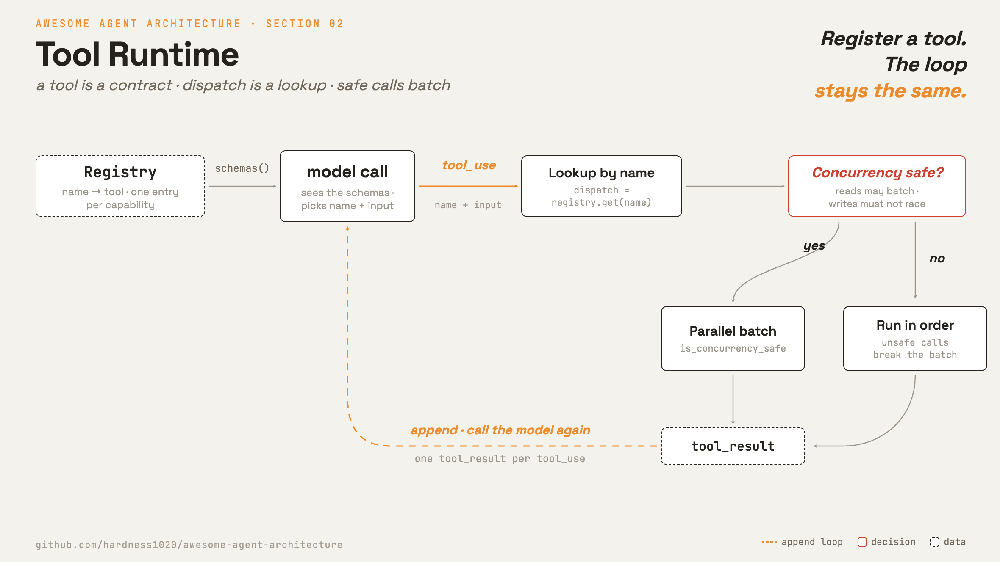

# 2 · Tool runtime

**English** · [繁體中文](README.zh-TW.md) · [简体中文](README.zh-CN.md)

> Adding a capability means registering a tool. The loop stays the same.

The agent loop can only act through tools. The model emits a structured `tool_use` block with a `name` and an `input`.

The harness maps that name to code. It validates the input, runs the handler, and returns a result.

The runtime must:

1. Tell the model which tools exist.
2. Describe each tool's input schema.
3. Route each `tool_use` by name.
4. Run safe calls in parallel when possible.
5. Keep large tool catalogs discoverable.

Without this layer, the model can ask to act but nothing can execute the action.

With only one `bash` tool, every capability becomes string handling. There is no per-tool validation or permission logic.

Two failures start here and get blamed on the model: a wrong tool picked from overlapping descriptions, and an edit that fails because the harness rewrote the input.

---

## Mechanism



A tool is a small object with a name, a handler, a schema, and a few predicates. A registry stores tools by name. Dispatch is a lookup.

### New: the tool runtime

```python
@dataclass
class Tool:                                  # src/tools.py
    name: str
    run: Callable[[dict], Any]
    description: str = ""                      # advertised to the model
    input_schema: dict = ...                   # the Anthropic schema it accepts
    is_read_only: bool = False
    is_concurrency_safe: bool = False         # may batch in parallel
    is_edit: bool = False                     # read by the gate (section 3)

class Registry:                              # src/tools.py
    def register(self, tool): self._tools[tool.name] = tool   # add a handler
    def get(self, name):      return self._tools.get(name)    # dispatch = lookup
    def schemas(self):        ...             # the tools list handed to the model
```

- A tool is a dataclass.
- The registry is `name -> tool`.
- Adding a capability means registering one handler.
- `schemas()` returns the tool list advertised to the model.
- `run_concurrently` batches tools marked `is_concurrency_safe`.
- Unsafe calls stay in order, so writes do not race.

### How it integrates

Section 1 used an inline `HANDLERS` dict. Section 2 passes a `registry` into the loop and routes each `tool_use` through `_dispatch`:

```python
def run_turn(messages, model, registry, max_steps=10): # src/loop.py (now takes a registry)
    ...
    results = [_dispatch(b, registry)                   # was: run_tool(call)
               for b in response.content if b.type == "tool_use"]
    messages.append({"role": "user", "content": results})

def _dispatch(block, registry):              # resolve, run, wrap as a tool_result
    tool = registry.get(block.name)           # name -> tool
    content = run_tool(tool, block.input)
    return {"type": "tool_result", "tool_use_id": block.id, "content": content}
```

The loop body is otherwise unchanged. Only the dispatch step now uses the registry.

`_dispatch` is the next extension point. Section 3 adds the permission gate there. Section 4 adds hooks there.

The demo dispatches sequentially for clarity. Real runtimes batch safe calls and load large tool schemas on demand.
The rest of this section is what a growing catalog adds.

### Grouping and granularity

A flat registry hides the shape of a catalog. Tools group five ways, by the direction a call travels and what it touches: perception (read the outside world),
execution (change it), collaboration (reach another agent), event trigger (let the world wake the agent), and user communication (reach the person).
Sections 6, 12, and 16 build the collaboration group, sections 13 and 14 the event triggers, section 19 the user channel. This section is the plumbing all five run on.

Granularity is the choice inside a group. Merge tools when function and use overlap: one `read_document` with a type parameter beats one reader per file format.
Split them when the parameters diverge, since a union of unrelated fields says nothing about what applies, and an overloaded schema draws wrong-parameter picks.

### Describing a tool

`description` is not documentation. It is the only thing the model reads before choosing. A useful one states when to use the tool, the boundary of what it does not do,
concrete parameter examples, the shape of what comes back, and the cost of calling it. A few real call examples help more than more prose.
The book reports a large gain from adding them, with no citation behind the figure, so take the direction and not the size.

The harness then has to pass the input through unchanged. Normalizing quotes, trimming whitespace, or adding an argument the model never wrote breaks the call invisibly:
it sent the right input, the result says the edit did not match, and nothing in the transcript explains the gap. Validate and reject, never silently rewrite.

Some parameters exist to be ignored. A checklist parameter (`expected_price`, `expected_status`) makes the model state what it believes before the call runs.
The handler never acts on it. It reads stored truth, decides on that, and logs the mismatch, so the last gate stands on data the model cannot forge.
τ-bench grades the same way, reading the final database state rather than what the agent said about it.

### Perception interfaces

Perception tools return more than fits. Search returns a page of candidates plus a cursor. Reads take an offset and a limit. Truncation is labeled, never silent.
Code search is where those rules bite. Four approaches, and no system uses only one:

| Approach | Finds | Cost |
| --- | --- | --- |
| **Glob** | Files by path pattern. | Nothing about content. |
| **Grep** | Exact strings and regexes, with line numbers. | Several calls to narrow a query. Misses synonyms. |
| **Embedding index** | Code by meaning, so a plain-language query lands. | An index to build and keep in sync. Opaque ranking. |
| **LSP symbols** | Definitions, references, and types, exactly. | A language server per language. |

Claude Code ships no index and searches agentically: glob, then grep, then read, narrowing between calls. Cursor pays for the index and gets recall on plain-language queries.

Editing has a matching spread. Five ways to say what changed:

| Scheme | The model emits | Trade-off |
| --- | --- | --- |
| **Diff plus apply model** | A rough skeleton diff, rewritten by a second trained model. | Fast and forgiving. Needs that second model. |
| **Old and new string** | The exact text to find and the text to put in its place. | Unambiguous, and fails loudly. Needs a fresh read first. |
| **Line numbers** | A range and its replacement. | Compact. Stale once an earlier edit shifts the file. |
| **Editor commands** | A small command language, vim style. | Terse. One more syntax to get wrong. |
| **Anchors** | A start marker and an end marker. | Survives shifts. Ambiguous when the marker repeats. |

Claude Code replaces an exact old string and requires a read first, so a mismatch is a visible error instead of a wrong edit.
Cursor emits the skeleton and lets a trained apply model rewrite the file, which beats emitting a precise patch on speed.

### Running calls: early start and shell state

Batching is not the only overlap available. A call can start as soon as its own arguments finish parsing, while the model is still generating the rest of the batch.
That hides latency inside generation, and it needs a failure rule: an error aborts the calls that depended on the failed one, never the independent calls in the
same batch, and never the parent turn. Shell state is the other choice at this layer, and both answers are defensible.

- **Per-call reset.** Claude Code's bash tool does not carry a live shell between calls. Environment variables and shell functions set in one call are gone in the
  next, and the description tells the model to use absolute paths. Every call is reproducible on its own, and nothing leaks between parallel calls.
- **One persistent session.** The book makes a shared terminal the default, so `cd`, exported variables, and an activated virtual environment survive.
  Isolated shells stay available for parallel work. The model repeats fewer setup commands, and the harness gains state to track and reset.

### Discovery at scale

A large catalog cannot ship in full. The registry advertises names first and loads full schemas on request. The request can come from the model, in its own words:
MCP-Zero has the agent declare a capability gap in natural language, matches it server first and then tool, and injects only the matched schema.
The model does not have to know a tool exists to ask for it, which is the part keyword search cannot do.
The injection then has to be cache safe. Append the discovered schema once, at the end of the context, and leave it there. Editing the tool block at the prefix
invalidates the KV cache for every token after it (section 8). Appending keeps the prefix intact, and the schema becomes ordinary history on the next turn.

---

## Per system

How each agent defines tools, routes calls, handles parallelism, and exposes a large catalog.

| | Claude Code | mini-swe-agent |
| --- | --- | --- |
| **Pros** | Per-tool validation, permissions, safe parallelism, and lazy discovery. | One `bash` tool keeps the runtime small. No catalog to manage. |
| **Cons** | Every tool has to carry a contract. | No per-tool validation or permissions. The confirm gate (section 3) sees only a command string. |
| **Why** | Adding a capability should mean registering a tool, with the loop unchanged. | Assumes every action can be a shell command, so one tool is enough. |
| **How: tool definition** | Schema, handler, and predicates. | One hardcoded `bash` schema is the whole catalog: one command field. Any other name is an error. |
| **How: dispatch** | Name lookup with aliases, over a permission-filtered pool with MCP tools. | No registry. Every call is a shell command. |
| **How: parallel calls** | Safe calls batch. Unsafe calls run alone. Safety flags default to off. | No. The legacy text mode requires exactly one action per response. |
| **How: discovery** | Names ship first. Full schemas load on request, by exact name or keyword. | Not needed with one tool. |

---

## Failure modes

- **Unknown tool name.** The model names a missing or disabled tool. Return a `tool_result` error instead of crashing the loop.
- **Schema drift.** The schema says one thing and the handler expects another. Validate before dispatch.
- **Unsafe parallelism.** Two writes can corrupt the same file. Default to serial execution unless a tool is known to be safe.
- **Catalog overflow.** Too many tool schemas can crowd the prompt. Defer full schemas until needed, and append a loaded schema at the end so the cached prefix survives.
- **Oversized results.** Large outputs can fill the context window. Cap results, persist the full output, and return a preview plus a path.
  Label the cut. Silent truncation leaves the model reasoning over a partial file it believes is whole.
- **Wrong tool picked.** Two descriptions overlap, or one tool does two jobs. Merge duplicates, split overloaded schemas, and say what each tool is not for.
- **Silent input drift.** The harness normalizes or adds an argument on the way to the handler. The call fails and the model cannot tell why. Reject bad input with a reason.
- **Batch failure spreads.** One failed call in a parallel batch kills the whole turn. Abort only the calls that depended on it.

---

## Runnable

[`src/`](src/) carries 01 forward and adds:

- [`tools.py`](src/tools.py): `Tool`, `Registry`, and `run_concurrently`.
- [`loop.py`](src/loop.py): dispatches each `tool_use` through the `Registry`.
- [`demo.py`](src/demo.py): registers a `ReadFile` tool and runs the loop against the API.
- [`test.py`](src/test.py): checks dispatch, unknown-tool errors, and parallel batching.

```bash
python sections/02-tool-runtime/src/test.py         # offline checks, no key
uv run python sections/02-tool-runtime/src/demo.py  # live demo, needs a key
```

---

## Sources

- [Claude Code source](https://github.com/yasasbanukaofficial/claude-code):
  `Tool.ts`, `tools.ts`, `services/tools/toolOrchestration.ts`, `services/tools/toolExecution.ts`, `tools/ToolSearchTool/ToolSearchTool.ts`.
- [mini-swe-agent source](https://github.com/swe-agent/mini-swe-agent): `models/utils/actions_toolcall.py`, `models/utils/actions_text.py`, `environments/__init__.py`.
- [learn-claude-code · s02_tool_use](https://github.com/shareAI-lab/learn-claude-code): section framing.
- [ai-agent-book](https://github.com/bojieli/ai-agent-book): `book/chapter4.md`, `book/chapter5.md` (《深入理解 AI Agent》, 李博杰; the Chinese original is canonical):
  the five-tool grouping, granularity, description craft, parameter fidelity, perception interface rules, proactive discovery, cache-safe loading, streaming tool start
  with cascade abort, the persistent shell default, the search and edit comparisons, and checklist parameters.
  Its Claude Code and Cursor readings are the author's own source study of fast-moving implementations, so read them as period evidence.
- [MCP-Zero](https://arxiv.org/abs/2506.01056) (Fei et al.): the agent declares a capability gap, and matching runs server first, then tool.
- [τ-bench](https://arxiv.org/abs/2406.12045) (Sierra): success judged against the final database state, which is what checklist parameters lean on.
