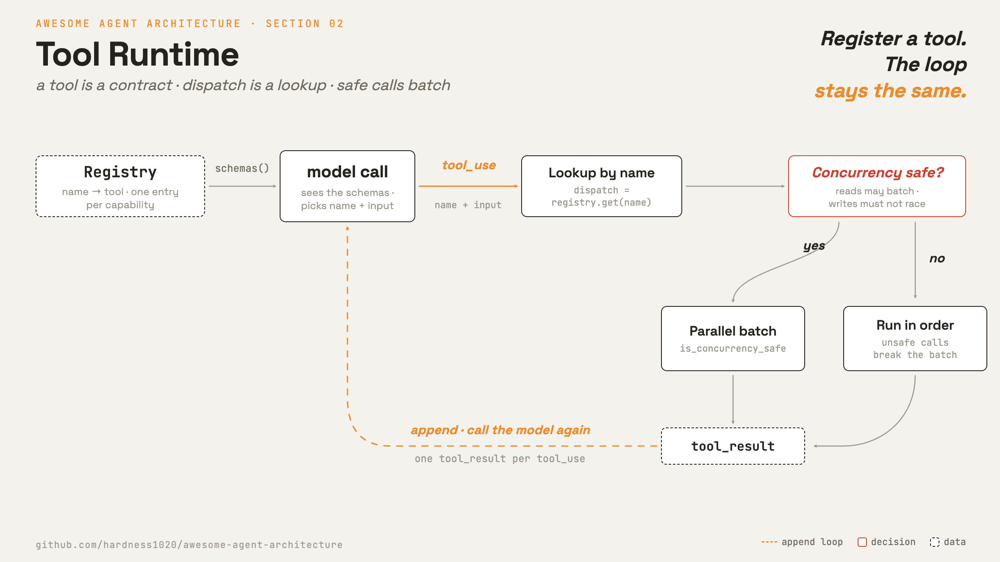

# 2 · Tool runtime

[English](README.md) · [繁體中文](README.zh-TW.md) · **简体中文**

> 新增一项能力，就是注册一个工具。loop 维持不变。

agent loop 只能通过工具来行动。模型会发出一个结构化的 `tool_use` 区块，带有 `name` 与 `input`。

harness 把那个名称对应到代码。它验证输入、执行 handler，并返回结果。

这个 runtime 必须：

1. 告诉模型有哪些工具存在。
2. 描述每个工具的 input schema。
3. 依名称把每个 `tool_use` 路由出去。
4. 在可行时并行执行安全的调用。
5. 让庞大的工具目录仍可被探索。

没有这一层，模型能要求行动，却没有东西能真正执行那个行动。

如果只有一个 `bash` 工具，每一项能力都变成字符串处理。没有各别工具的验证或权限逻辑。

---

## 机制



一个工具是一个小对象，带有名称、handler、schema 与几个判定式。registry 依名称存放工具。dispatch 拿名称去查表，找到就执行。

### New: the tool runtime

```python
@dataclass
class Tool:                                  # src/tools.py
    name: str
    run: Callable[[dict], Any]
    description: str = ""                      # advertised to the model
    input_schema: dict = ...                   # the Anthropic schema it accepts
    is_read_only: bool = False
    is_concurrency_safe: bool = False         # may batch in parallel
    is_edit: bool = False                     # read by the gate (section 3)

class Registry:                              # src/tools.py
    def register(self, tool): self._tools[tool.name] = tool   # add a handler
    def get(self, name):      return self._tools.get(name)    # dispatch = lookup
    def schemas(self):        ...             # the tools list handed to the model
```

- 一个工具是一个 dataclass。
- registry 是 `name -> tool`。
- 新增一项能力，就是注册一个 handler。
- `schemas()` 返回向模型公告的工具清单。
- `run_concurrently` 会把标记为 `is_concurrency_safe` 的工具批量执行。
- 不安全的调用维持顺序执行，所以写入不会相互竞争。

### How it integrates

第 1 章用的是内嵌的 `HANDLERS` dict。第 2 章把一个 `registry` 传进 loop，并把每个 `tool_use` 通过 `_dispatch` 路由：

```python
def run_turn(messages, model, registry, max_steps=10): # src/loop.py (now takes a registry)
    ...
    results = [_dispatch(b, registry)                   # was: run_tool(call)
               for b in response.content if b.type == "tool_use"]
    messages.append({"role": "user", "content": results})

def _dispatch(block, registry):              # resolve, run, wrap as a tool_result
    tool = registry.get(block.name)           # name -> tool
    content = run_tool(tool, block.input)
    return {"type": "tool_result", "tool_use_id": block.id, "content": content}
```

loop 主体其余部分维持不变。只有 dispatch 这一步现在改用 registry。

`_dispatch` 是下一个延伸点。第 3 章在那里加上权限关卡。第 4 章在那里加上 hook。

demo 为了清楚起见采用顺序 dispatch。真实的 runtime 会把安全调用批量化，并按需加载庞大的工具 schema。

---

## 各系统做法

各个 agent 如何定义工具、路由调用、处理并行，以及公开一份庞大目录。

| | Claude Code | mini-swe-agent |
| --- | --- | --- |
| **Pros** | 每个工具各自带验证、权限、安全并行和延迟探索。 | 单一 `bash` 工具小得多，也没有目录要维护。 |
| **Cons** | 每个工具都得背一份契约。 | 验证和权限做不到 per-tool。跑命令前的确认（第 3 章）看到的只有一条命令字符串。 |
| **Why** | 新增一项能力，应该就只是注册一个工具，loop 维持不变。 | 假设每个行动都能写成一条 shell 命令，所以一个工具就够了。 |
| **How: tool definition** | schema、handler 与判定式。 | 一份写死的 `bash` schema 就是整份目录，只有一个命令字段，别的名称一律报错。 |
| **How: dispatch** | 依名称查表，含别名。工具池依权限筛选，并合并 MCP 工具。 | 没有 registry，每次调用都是一条 shell 命令。 |
| **How: parallel calls** | 安全调用批量执行，不安全的单独执行。安全标记默认关闭。 | 没有。旧版文本模式每次响应只允许一个 action。 |
| **How: discovery** | 先给名称。完整 schema 依精确名称或关键字按需加载。 | 只有一个工具，不需要。 |

---

## 哪里会出错

- **未知的工具名称：**模型指名了一个不存在或已停用的工具。返回一个 `tool_result` 错误，而不是让 loop 崩溃。
- **schema 漂移：**schema 说一套，handler 期待另一套。在 dispatch 前先验证。
- **不安全的并行：**两个写入可能损毁同一个文件。默认采用顺序执行，除非确知某工具是安全的。
- **目录溢出：**太多工具 schema 会挤爆 prompt。把完整 schema 延后到需要时再给。
- **结果过大：**庞大的输出可能塞满 context window。限制结果大小、保存完整输出，并返回一段预览加一个路径。

---

## 可执行程序

[`src/`](src/) 承接 01 往前走，并加上：

- [`tools.py`](src/tools.py)：`Tool`、`Registry` 与 `run_concurrently`。
- [`loop.py`](src/loop.py)：把每个 `tool_use` 通过 `Registry` dispatch。
- [`demo.py`](src/demo.py)：注册一个 `ReadFile` 工具，并对着 API 执行 loop。
- [`test.py`](src/test.py)：检查 dispatch、未知工具错误与并行批次。

```bash
python sections/02-tool-runtime/src/test.py         # offline checks, no key
uv run python sections/02-tool-runtime/src/demo.py  # live demo, needs a key
```

---

## 出处

- [Claude Code source](https://github.com/yasasbanukaofficial/claude-code)：`Tool.ts`、`tools.ts`、`services/tools/toolOrchestration.ts`、`services/tools/toolExecution.ts`、`tools/ToolSearchTool/ToolSearchTool.ts`。
- [mini-swe-agent source](https://github.com/swe-agent/mini-swe-agent)：`models/utils/actions_toolcall.py`、`models/utils/actions_text.py`、`environments/__init__.py`。
- [learn-claude-code · s02_tool_use](https://github.com/shareAI-lab/learn-claude-code)：章节框架。
