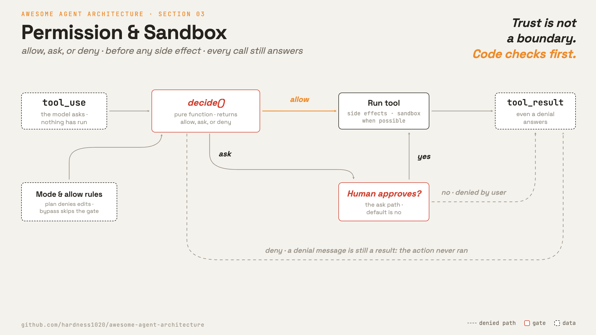

# 3 · Permission & sandbox

**English** · [繁體中文](README.zh-TW.md) · [简体中文](README.zh-CN.md)

> Check each action before it reaches the system.

The model can ask to run any enabled tool. The permission layer decides whether that call may run.

A tool runtime without permissions is close to an unattended remote shell.

A bad tool call can delete files, leak secrets, or push the wrong code. Trusting the model is not a safety boundary. Code must check the request before execution.

The permission layer must:

1. Inspect each tool call before it runs.
2. Decide `allow`, `ask`, or `deny`.
3. Ask a human when a risky call is not pre-approved.
4. Limit damage when a call does run.

Without this layer, one bad tool call can cause an irreversible side effect.

---

## Mechanism



A pure function makes the permission decision. It reads the tool, the current mode, and any allow rules. It returns one of three values:

- `allow`: run the tool.
- `ask`: pause and ask a human.
- `deny`: do not run the tool.

The mode changes the default behavior. For example, plan mode allows read-only tools but denies edits until the plan is approved.

### New: the gate

`decide()` is the whole permission decision:

```python
def decide(tool, mode, allow_rules) -> str:      # src/permissions.py (new)
    if mode == BYPASS:                            # operator opted out
        return "allow"
    if mode == PLAN:                              # exploring, not acting yet
        if tool.is_read_only:           return "allow"
        if tool.name == "ExitPlanMode": return "ask"     # approval handshake (section 5)
        return "deny"                             # no side effects until approved
    if tool.is_read_only or tool.name in allow_rules:
        return "allow"
    if mode == ACCEPT_EDITS and tool.is_edit:
        return "allow"                            # a class of work pre-approved
    return "ask"                                  # default: when unsure, ask
```

The function has no I/O. That makes it easy to test mode by mode.

### How it integrates

The gate runs inside `_dispatch`, just before `run_tool`:

```python
def _dispatch(block, registry, mode, allow_rules, approver):   # src/loop.py
    ...                                                  # resolve tool (section 2)
    decision = decide(tool, mode, allow_rules)           # 3 · the gate, the new line
    if decision == "deny":
        return res(f"{name} not allowed in {mode} mode")
    if decision == "ask" and not approver(name, block.input):
        return res(f"{name} denied by user")
    return res(run_tool(tool, block.input))              # only now does it run
```

- The loop body is unchanged from sections 1 and 2.
- Only `_dispatch` gains the gate.
- `deny` and unapproved `ask` never reach `run_tool`.
- The denial still returns as a `tool_result`, so the model sees what happened and can adapt.
- `approver` defaults to `False`, so `ask` means no unless the human approves.

The key invariant stays intact: every tool call produces a result message, even when the real action did not run.

Real systems add rule priority, remembered approvals, and sandboxed execution. Those are extensions of the same gate.

---

## Per system

How each agent gates side effects, changes modes, and remembers decisions.

| System | Gate point | Permission modes | Sandbox | Rule persistence |
| --- | --- | --- | --- | --- |
| **Claude Code** | Before each tool runs. | Default, edit-approved, plan, deny, and bypass modes. | Bash can run inside a sandbox. | Rules can live in the session or settings. |

### Claude Code

- `QueryEngine.ts` calls `canUseTool` for every tool use.
- `useCanUseTool.tsx` resolves a `PermissionDecision`: `allow`, `deny`, or `ask`.
- External modes include `default`, `acceptEdits`, `plan`, `bypassPermissions`, and `dontAsk`.
- Internal modes include `auto` and `bubble`.
- Rules are priority-merged from user, project, local, flag, policy, CLI, command, and session sources.
- Approvals can be saved to the session or to settings through `PermissionUpdate.ts`.
- `Bash` uses `shouldUseSandbox.ts` and `SandboxManager`.
- `WebFetch` has a separate preapproval list for selected docs hosts.
- MCP servers and remote runs have separate approval paths.

> **Trade-off:** Modes, ordered rules, and sandboxing give precise control. They also add many states to reason about. Each bypass or preapproval path must stay visible and narrow.

---

## Failure modes

- **Pattern-match bypass.** String deny lists miss shell variants. Prefer behavior checks and sandboxing over raw substring matches.
- **Mode left too open.** A broad allow rule or bypass mode can let later risky calls run silently. Scope bypasses and surface the active mode.
- **Approval fatigue.** Asking on every call trains users to approve without reading. Preapprove low-risk classes, but keep destructive actions explicit.
- **Silent denial in a subagent.** A child agent may have no terminal to ask through. Bubble the prompt to the parent instead of failing quietly.
- **Sandbox disabled.** If an allowed command runs outside the sandbox, the permission prompt is the last check. Gate any unsandboxed path behind policy.

---

## Runnable

[`src/`](src/) carries 02 forward and adds:

- [`permissions.py`](src/permissions.py): `decide` over the four modes.
- [`loop.py`](src/loop.py): gates each call in `_dispatch` before running it.

```bash
python sections/03-permission-sandbox/src/test.py         # offline checks, no key
uv run python sections/03-permission-sandbox/src/demo.py  # live demo, needs a key
```

---

## Sources

- Claude Code source: `QueryEngine.ts`, `hooks/useCanUseTool.tsx`, `types/permissions.ts`, `utils/permissions/PermissionUpdate.ts`.
- Claude Code sandbox and web gates: `tools/BashTool/shouldUseSandbox.ts`, `tools/WebFetchTool/preapproved.ts`.
- learn-claude-code · s03_permission: section framing.
