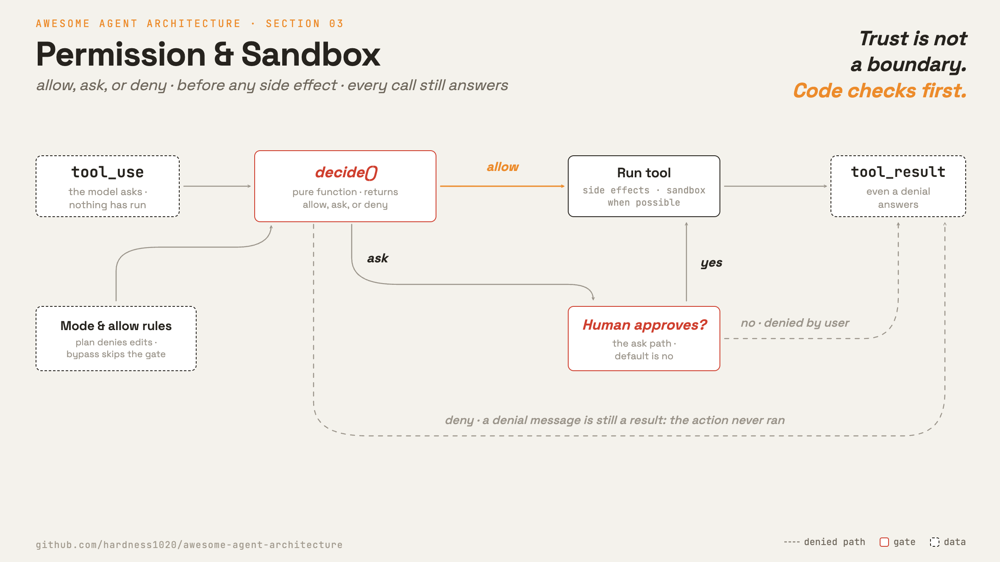

# 3 · Permission & sandbox

[English](README.md) · **繁體中文** · [简体中文](README.zh-CN.md)

> 每個動作在真正碰到系統之前，都要先檢查。

模型可以要求執行任何已啟用的工具。permission 層負責決定該次呼叫是否可以執行。

一個沒有 permission 的工具執行環境，幾乎等同於一個無人看管的遠端 shell。

一次錯誤的工具呼叫可能刪除檔案、洩漏機密，或推送錯誤的程式碼。信任模型不是一道安全邊界。程式必須在執行前檢查請求。

危險是有形狀的。三種能力湊在一起，本來好用的 agent 就變成外洩管道：碰得到私密資料、會讀到不可信的內容、
而且有辦法對外通訊。只湊到兩樣還撐得住。三樣同時到齊，agent 光是讀到一段文字，就可能被牽著去打開機密再送出去。
這就是 lethal trifecta。

持久化的 memory 再加一個維度。被下毒的指令一旦寫進 memory 檔案（第 9 章），下一次 session 又會讀回來，
所以一次注入在承載它的那次對話結束之後，還能繼續生效。

gate 沒辦法把這些能力拿掉。什麼都不能讀、什麼都連不到的 agent 也做不了事。gate 能做的，是在會湊齊這三樣的呼叫前面
擺一道決策，並在放行之後擺一個沙箱。

permission 層必須做到：

1. 在每個工具呼叫執行前先檢視它。
2. 決定 `allow`、`ask` 或 `deny`。
3. 當高風險的呼叫尚未預先核准時，詢問使用者。
4. 當呼叫真的執行時，限制它造成的損害。

沒有這一層，一次錯誤的工具呼叫就可能造成無法回復的後果。

---

## 機制



一個純函式負責做出 permission 決策。它讀取工具、目前的 mode，以及所有的 allow 規則，並回傳三個值之一：

- `allow`：執行工具。
- `ask`：暫停並詢問使用者。
- `deny`：不執行工具。

mode 會改變預設行為。舉例來說，plan mode 允許唯讀工具，但在計畫核准前拒絕編輯。

### New: the gate

`decide()` 就是整個 permission 決策：

```python
def decide(tool, mode, allow_rules) -> str:      # src/permissions.py (new)
    if mode == BYPASS:                            # operator opted out
        return "allow"
    if mode == PLAN:                              # exploring, not acting yet
        if tool.is_read_only:           return "allow"
        if tool.name == "ExitPlanMode": return "ask"     # approval handshake (section 5)
        return "deny"                             # no side effects until approved
    if tool.is_read_only or tool.name in allow_rules:
        return "allow"
    if mode == ACCEPT_EDITS and tool.is_edit:
        return "allow"                            # a class of work pre-approved
    return "ask"                                  # default: when unsure, ask
```

這個函式沒有 I/O。這讓它可以一個 mode 一個 mode 地輕鬆測試。

### How it integrates

gate 在 `_dispatch` 內部執行，就在 `run_tool` 之前：

```python
def _dispatch(block, registry, mode, allow_rules, approver):   # src/loop.py
    ...                                                  # resolve tool (section 2)
    decision = decide(tool, mode, allow_rules)           # 3 · the gate, the new line
    if decision == "deny":
        return res(f"{name} not allowed in {mode} mode")
    if decision == "ask" and not approver(name, block.input):
        return res(f"{name} denied by user")
    return res(run_tool(tool, block.input))              # only now does it run
```

- loop 主體和第 1、2 章相同，沒有改變。
- 只有 `_dispatch` 多了 gate。
- `deny` 以及未核准的 `ask` 永遠不會抵達 `run_tool`。
- 拒絕結果仍會以 `tool_result` 回傳，所以模型看得到發生了什麼，並能隨之調整。
- `approver` 預設為 `False`，所以 `ask` 代表「否」，除非使用者核准。

關鍵不變條件維持不變：每個工具呼叫都會產生一則結果訊息，即使真正的動作沒有執行。

真實系統會加上規則優先序、記住的核准，以及沙箱化的執行。這些都是同一個 gate 的延伸。

接下來三段講的就是這類延伸。它們出自一本書對 production coding agent 的描述，不是本專案讀過原始碼的系統。
所以請把它們當成一份被描述出來的設計，而不是下面表格那些系統確認有的行為。

### Reading the command, not matching it

`decide()` 是照工具名稱管制的。shell 工具需要的更多，因為這一個名稱底下涵蓋了機器上所有的程式。
最常見的第一招是拉一份字串 deny 清單，而這招會輸。`rm -rf /` 很好比對。`find . -exec rm {} \;` 把刪除藏在 flag 裡面。
`$(echo rm) -rf /` 把它藏在替換語法裡面。`curl -o /etc/crontab` 則是整條指令連 `write` 這個字都沒出現。

語意解析器可以補上這些洞。它把指令拆成程式和參數，套用每個程式各自「哪個 flag 會吃掉後面一個值」的規則，
再問這條指令解出來到底做了什麼。`-exec` 後面帶的是一條子指令，那條子指令也要一起送去管制。
`-o` 指的是寫入目標，那個路徑就要當成一次寫入來管制。檢查的是意思，不是字面。

同樣的道理，可以從指令本身延伸到目的。破壞性的捷徑一樣做得出正確的終態：把資料表砍掉再建一次，把目錄刪掉再 clone 一份。
結果檢查（第 21 章）會放行，因為它只看最後長什麼樣。所以 gate 也得管路徑。有些動作就算做出來的結果驗得過，照樣要擋。

### What the sandbox actually limits

gate 負責決定。沙箱負責限制決定錯了要付多少代價。有三個維度扛下大部分的重量。

- **Egress：**網路預設全擋，放行的流量走一個握有 host 允許清單的 proxy。
  這是 harness 最划算能砍掉的那一隻腳。agent 照樣讀程式碼、照樣寫檔案，只是送不出去。
- **Mount：**原始碼用唯讀掛載。憑證檔案一個都不掛。只給一個可寫的工作區，其他都不給。
  機密只要沒進到 agent 看得到的檔案系統，就沒辦法從那裡被讀走。
- **Quota：**CPU、記憶體、磁碟、wall clock 時間都設上限。上限踩到的時候，回一個結構化的錯誤當 tool result，不要無聲把 process 殺掉。
  模型讀到 timeout 就知道要把指令縮短。無聲殺掉只會讓它瞎猜。

### Keeping the ask path fast

一次 `ask` 本來就要花掉使用者一個回合。決策慢的話，前面還要再等一段：使用者盯著沒動靜的畫面，harness 還在算它到底要不要問。
推測式檢查可以把這段等待藏起來。harness 先在背景跑 permission 檢查，畫面上馬上顯示一個沒有副作用的進度提示。
如果檢查先算出 `allow`，呼叫就直接跑，提示框根本不會出現。只有那些沒辦法很快決定的檢查，才會升級成確認提示。

安全性質仍然成立，因為推測的那條路從來不執行工具，它只執行決策。

---

## 各系統做法

各個 agent 如何管制副作用、切換 mode，以及記住決策。

| | Claude Code | mini-swe-agent |
| --- | --- | --- |
| **Pros** | mode、有序規則與沙箱化提供精確的控制。 | 幾分鐘就能稽核完。拒絕會落回對話，模型讀得到原因，loop 繼續跑。 |
| **Cons** | 要推敲的狀態很多。每條 bypass 或預先核准的路徑都必須保持可見且範圍狹窄。 | 對每條指令一視同仁，而且什麼都不記。 |
| **Why** | 每次呼叫都問會造成核准疲勞，所以系統會把核准記下來。 | 損害交給環境去限制，一個確認提示加一份 regex 清單就夠了。 |
| **How: gate point** | 每個工具執行前。Web、MCP 與遠端執行各有核准路徑。 | 每一步的指令執行前。按 Enter 就核准，留言就是拒絕。 |
| **How: permission modes** | Default、edit-approved、plan、deny 與 bypass，另有內部 mode。 | `human`、`confirm` 與 `yolo`，執行期可用斜線指令切換。 |
| **How: sandbox** | Bash 可以在沙箱內執行。 | 環境 class 就是沙箱，每次執行挑：主機本身、用完即丟的容器，或在共用主機上包住執行。 |
| **How: rule persistence** | 規則依優先序從多個來源合併，可存到 session 或 settings。 | 白名單 regex 只寫在 config，符合的指令跳過確認。 |

---

## 哪裡會出錯

- **Pattern-match bypass：**字串式的 deny 清單會漏掉 shell 的各種變體。先把指令解析出來，管制它實際解出來的行為，再讓沙箱擋在解析器後面。
- **Mode 開得太寬：**一條範圍過大的 allow 規則或 bypass mode，可能讓後續的高風險呼叫悄悄執行。限縮 bypass 的範圍，並讓目前的 mode 顯示出來。
- **核准疲勞：**每次呼叫都詢問，會訓練使用者不看內容就核准。預先核准低風險的類別，但讓破壞性動作維持明確詢問。
- **subagent 內的無聲拒絕：**子 agent 可能沒有終端機可以詢問。應把提示往上轉給父 agent 代問，而不是無聲失敗。
- **沙箱被停用：**若一個被允許的指令在沙箱外執行，permission 提示就是最後一道檢查。任何未沙箱化的路徑都要用政策擋在後面。
- **被核准的呼叫照樣外洩：**每一次呼叫單獨看都過得了 gate，整個 session 卻還是讀到機密又把它送出去。
  網路預設就擋掉，那三樣才湊不齊。
- **驗得過但很破壞：**砍掉重建也能通過結果檢查，因為終態是對的。要管的是動作，不是只有結果。
- **memory 被下毒：**注入到 memory 檔案裡的指令，之後每一次 session 都會重播一遍。把存下來的 memory 當成不可信的內容，絕不當成操作者的規則。

---

## 可執行程式

[`src/`](src/) 承接 02 並加上：

- [`permissions.py`](src/permissions.py)：涵蓋四種 mode 的 `decide`。
- [`loop.py`](src/loop.py)：在 `_dispatch` 中於執行前管制每個呼叫。

```bash
python sections/03-permission-sandbox/src/test.py         # offline checks, no key
uv run python sections/03-permission-sandbox/src/demo.py  # live demo, needs a key
```

---

## 出處

- [Claude Code 原始碼](https://github.com/yasasbanukaofficial/claude-code)：`QueryEngine.ts`、`hooks/useCanUseTool.tsx`、`types/permissions.ts`、`utils/permissions/PermissionUpdate.ts`。
- [Claude Code 沙箱與 web gate](https://github.com/yasasbanukaofficial/claude-code)：`tools/BashTool/shouldUseSandbox.ts`、`tools/WebFetchTool/preapproved.ts`。
- [mini-swe-agent source](https://github.com/swe-agent/mini-swe-agent)：`agents/interactive.py`、`environments/docker.py`、`environments/extra/bubblewrap.py`。
- [ai-agent-book · 第 5 章](https://github.com/bojieli/ai-agent-book/blob/main/book/chapter5.md)（《深入理解 AI Agent》，李博杰，以中文原版為準）：
  memory 把攻擊放大的那個維度、沙箱的 egress 與 mount、quota 政策、語意式的指令解析、推測式 permission 檢查，
  以及管路徑而不是只管結果。這幾項設計只有這一個來源。
- [The lethal trifecta for AI agents](https://simonwillison.net/2025/Jun/16/the-lethal-trifecta/)（Simon Willison）：
  私密資料、不可信內容、對外通訊，這三種能力不能湊在一起。
- [learn-claude-code · s03_permission](https://github.com/shareAI-lab/learn-claude-code)：section framing。
