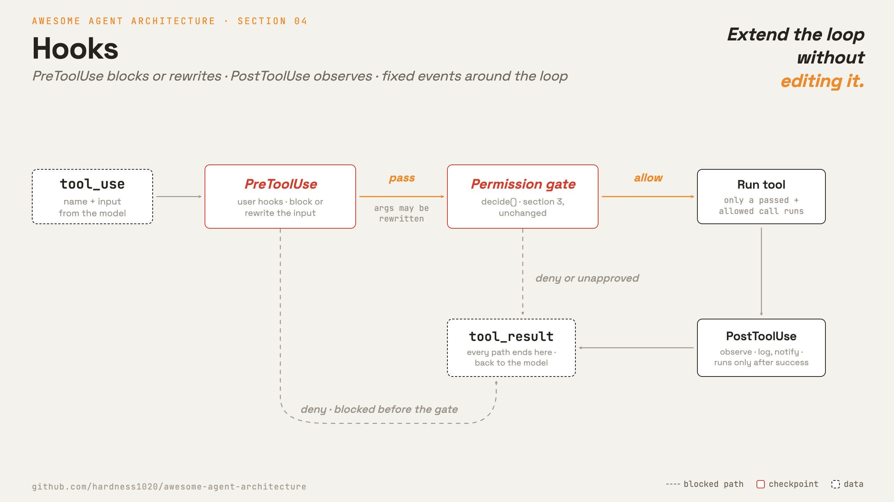

# 4 · Hooks

**English** · [繁體中文](README.zh-TW.md) · [简体中文](README.zh-CN.md)

> Hooks add behavior at fixed points around the loop.

Hooks are user-configured callbacks. They can run before a tool call, after a tool call, when a prompt is submitted, or when a session starts or stops.

Use hooks for logging, validation, notifications, and small policy checks. Without hooks, each new behavior requires editing the loop or forking it.

Hooks keep the loop small. The loop exposes fixed events. Extensions attach to those events.

---

## Mechanism



A `Hooks` object maps event names to callback lists. The loop does not call custom checks directly. Instead, `_dispatch` fires named events.

For tool execution, there are two important points:

- `PreToolUse` runs before the permission gate. It can block the call or rewrite the input.
- `PostToolUse` runs after a successful tool call. It can observe the result.

### New: hooks

```python
class Hooks:                                     # src/hooks.py
    def fire_pre(self, name, args):               # PreToolUse: block or rewrite
        for fn in self._hooks["PreToolUse"]:
            out = fn(name, args) or {}
            if out.get("updated_args"): args = out["updated_args"]
            if out.get("deny"):         return True, args, out.get("message", "")
        return False, args, ""
    def fire_post(self, name, args, result):      # PostToolUse: observe
        for fn in self._hooks["PostToolUse"]: fn(name, args, result)
```

- `on(event, fn)` registers a callback.
- `fire_pre` runs the `PreToolUse` callbacks.
- A pre-hook can return `{"deny": True}` to block.
- A pre-hook can return `{"updated_args": ...}` to rewrite input.
- `fire_post` runs observers after execution.

### How it integrates

Two calls are added to `_dispatch`:

```python
# src/loop.py _dispatch
blocked, args, msg = hooks.fire_pre(name, args)          # 4 · PreToolUse
if blocked: return res(msg)
decision = permissions.decide(tool, mode, allow_rules)   # 3 · gate (section 3)
...                                                      # deny / ask short-circuit
out = res(run_tool(tool, args))                          # 2 · execute -> tool_result
hooks.fire_post(name, args, out)                         # 4 · PostToolUse
```

- A blocked or denied call never reaches `run_tool`.
- `PostToolUse` runs only after a successful run.
- Hooks can tighten the permission result, but they should not loosen it.
- In Claude Code, `resolveHookPermissionDecision` reconciles hook output with rule-based permissions.

The demo uses a `PreToolUse` hook to block `rm -rf` even under `bypassPermissions`.

This section covers lifecycle hooks. React render hooks in a `hooks/` folder are unrelated UI code that share the same word.

---

## Per system

How each agent exposes interception points around the loop.

| | Claude Code |
| --- | --- |
| **Pros** | Users extend behavior without editing the loop. Good for logging, validation, notifications, and policy checks. |
| **Cons** | The fixed event list is also the limit. A hook can only intercept where the system exposes an event. |
| **Why** | Keeps the loop small. New behavior attaches to fixed events instead of editing or forking the loop. |
| **How: hook events** | A fixed list of 27 lifecycle events, covering tool, prompt, session, stop, subagent, compact, and setup. |
| **How: fire point** | Loaded from settings and frozen at startup. `PreToolUse` fires before the permission gate. |
| **How: can block or modify?** | Yes. Deny, ask, update input, add context, or stop. Hook output is reconciled with rule-based permissions. |

---

## Failure modes

- **Hook bypasses permissions.** A hook may try to allow a denied action. Resolve hook output against rule-based permissions.
- **Stop hook loops forever.** A `Stop` hook can block, trigger self-correction, and fire again. Track that the stop hook is already active.
- **Hook config changes mid-session.** A process may edit settings after startup. Snapshot the hook config once.
- **Slow hook stalls the loop.** A hook can shell out to slow work. Add a timeout.
- **PostToolUse stops unexpectedly.** If a post-hook returns `preventContinuation`, surface it as a graceful stop, not a crash.

---

## Runnable

[`src/`](src/) carries 03 forward and adds:

- [`hooks.py`](src/hooks.py): the `Hooks` object with `fire_pre` and `fire_post`.
- [`loop.py`](src/loop.py): `_dispatch` fires `PreToolUse` before the gate and `PostToolUse` after a run.
- [`test.py`](src/test.py): a pre-hook blocks `rm -rf` even under `bypassPermissions`.

```bash
python sections/04-hooks/src/test.py         # offline checks, no key
uv run python sections/04-hooks/src/demo.py  # live demo, needs a key
```

---

## Sources

- [Claude Code source](https://github.com/yasasbanukaofficial/claude-code):
  `types/hooks.ts`, `entrypoints/sdk/coreTypes.ts`, `services/tools/toolHooks.ts`, `query/stopHooks.ts`, `services/tools/toolExecution.ts`, `setup.ts`.
- [learn-claude-code · s04_hooks](https://github.com/shareAI-lab/learn-claude-code): section framing.
