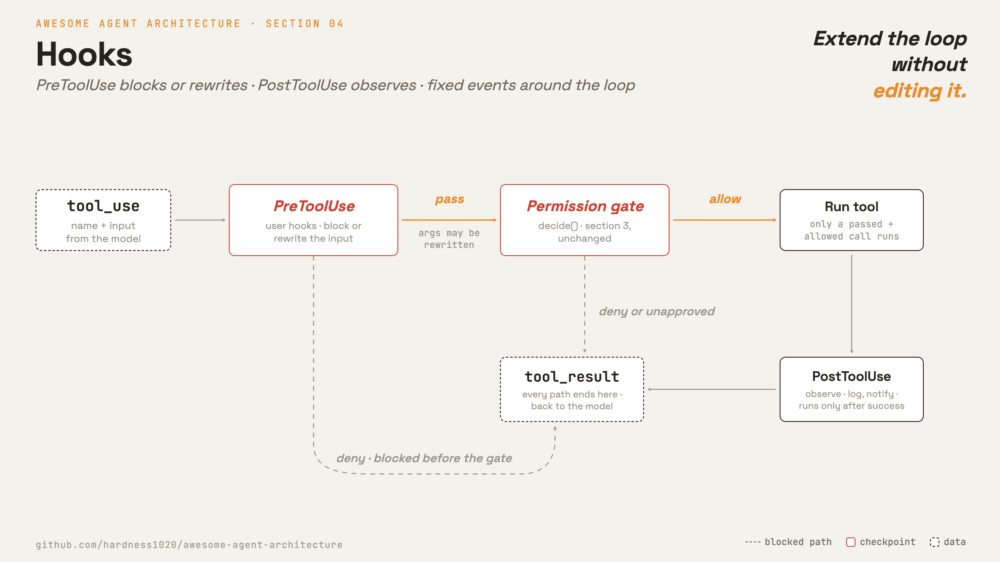

# 4 · Hooks

[English](README.md) · [繁體中文](README.zh-TW.md) · **简体中文**

> hook 在 loop 周围的固定点加入行为。

hook 是用户配置的 callback。它们可以在工具调用前、工具调用后、prompt 发送时，或 session 开始或结束时运行。

用 hook 来做记录、验证、通知，以及小型的策略检查。没有 hook，每一个新行为都得改动 loop 或另外分叉它。

hook 让 loop 保持精简。loop 对外提供固定的事件。扩展行为则挂接到那些事件上。

---

## 机制



一个 `Hooks` 对象把事件名称映射到 callback 列表。loop 不会直接调用自定义的检查。取而代之，`_dispatch` 触发具名的事件。

在工具执行方面，有两个重要的点：

- `PreToolUse` 在 permission gate 之前运行。它可以拦截调用，或改写输入。
- `PostToolUse` 在工具调用成功之后运行。它可以观察结果。

### New: hooks

```python
class Hooks:                                     # src/hooks.py
    def fire_pre(self, name, args):               # PreToolUse: block or rewrite
        for fn in self._hooks["PreToolUse"]:
            out = fn(name, args) or {}
            if out.get("updated_args"): args = out["updated_args"]
            if out.get("deny"):         return True, args, out.get("message", "")
        return False, args, ""
    def fire_post(self, name, args, result):      # PostToolUse: observe
        for fn in self._hooks["PostToolUse"]: fn(name, args, result)
```

- `on(event, fn)` 注册一个 callback。
- `fire_pre` 运行 `PreToolUse` 的 callback。
- pre-hook 可以返回 `{"deny": True}` 来拦截调用。
- pre-hook 可以返回 `{"updated_args": ...}` 来改写输入。
- `fire_post` 在执行之后运行观察者。

### 如何整合

`_dispatch` 加入了两个调用：

```python
# src/loop.py _dispatch
blocked, args, msg = hooks.fire_pre(name, args)          # 4 · PreToolUse
if blocked: return res(msg)
decision = permissions.decide(tool, mode, allow_rules)   # 3 · gate (section 3)
...                                                      # deny / ask short-circuit
out = res(run_tool(tool, args))                          # 2 · execute -> tool_result
hooks.fire_post(name, args, out)                         # 4 · PostToolUse
```

- 被拦截或被拒绝的调用永远不会到达 `run_tool`。
- `PostToolUse` 只在成功执行之后才会运行。
- hook 可以收紧 permission 的结果，但不应该放宽它。
- 在 Claude Code 中，`resolveHookPermissionDecision` 会把 hook 输出和基于规则的 permission 加以协调。

`PostToolUse` 最典型的用法是写入后跑 lint。write 或 edit 工具一返回，hook 就对刚动过的那个文件跑 linter 或 type checker，
再把诊断信息接到 tool result 后面。模型下一轮就会在写入成功的消息旁边看到错误，不用等到之后 build 或跑测试才撞上。

这个做法靠两件事成立。检查是跟着 tool result 一起回去的，所以不必多跑一轮，也不用另外加 prompt。
检查只针对刚动过的那个文件，成本大致跟那次写入差不多。
`PostToolUse` 只在成功运行之后才会跑，所以写入被拦截时，就没有诊断信息可看。

demo 用一个 `PreToolUse` hook，即使在 `bypassPermissions` 之下也拦截 `rm -rf`。

本章谈的是生命周期 hook。放在 `hooks/` 文件夹中的 React render hook，是不相干的 UI 代码，只是共用同一个词。

---

## 各系统做法

各个 agent 如何在 loop 周围提供拦截点。

| | Claude Code |
| --- | --- |
| **Pros** | 用户不必改动 loop 就能扩展行为。适合做记录、验证、通知和策略检查。 |
| **Cons** | 固定的事件列表同时也是它的边界。hook 只能在系统对外提供事件的地方进行拦截。 |
| **Why** | 让 loop 保持精简。新行为挂接到固定事件上，不用改动或分叉 loop。 |
| **How: hook events** | 固定的 27 个生命周期事件，涵盖 tool、prompt、session、stop、subagent、compact 与 setup。 |
| **How: fire point** | 从 settings 加载，启动时冻结。`PreToolUse` 在 permission gate 之前触发。 |
| **How: can block or modify?** | 可以。拒绝、询问、更新输入、加入 context，或停止。hook 输出会和基于规则的 permission 加以协调。 |

---

## 哪里会出错

- **hook 绕过 permission：**hook 可能试图允许一个已被拒绝的动作。要把 hook 输出对照基于规则的 permission 来解析。
- **Stop hook 无限 loop：**一个 `Stop` hook 可能拦截、触发自我修正，然后又再次触发。要追踪 stop hook 是否已经在运行中。
- **hook 配置在 session 中途改变：**某个进程可能在启动后修改 settings。要对 hook 配置做一次快照。
- **慢速 hook 卡住 loop：**hook 可能 shell out 去做很慢的工作。要加上 timeout。
- **PostToolUse 意外停止：**若 post-hook 返回 `preventContinuation`，要把它呈现为一次优雅的停止，而不是崩溃。
- **诊断信息淹没结果：**整个项目跑一次 lint，接上去的文字可能比写入本身还多。检查只跑刚动过的文件，接上去的输出也要设上限。

---

## 可执行程序

[`src/`](src/) 承接 03 并加上：

- [`hooks.py`](src/hooks.py)：带有 `fire_pre` 与 `fire_post` 的 `Hooks` 对象。
- [`loop.py`](src/loop.py)：`_dispatch` 在 gate 之前触发 `PreToolUse`，在执行之后触发 `PostToolUse`。
- [`test.py`](src/test.py)：一个 pre-hook 即使在 `bypassPermissions` 之下也拦截 `rm -rf`。

```bash
python sections/04-hooks/src/test.py         # offline checks, no key
uv run python sections/04-hooks/src/demo.py  # live demo, needs a key
```

---

## 出处

- [Claude Code 源码](https://github.com/yasasbanukaofficial/claude-code)：
  `types/hooks.ts`、`entrypoints/sdk/coreTypes.ts`、`services/tools/toolHooks.ts`、`query/stopHooks.ts`、`services/tools/toolExecution.ts`、`setup.ts`。
- [learn-claude-code · s04_hooks](https://github.com/shareAI-lab/learn-claude-code)：section framing。
- [ai-agent-book · 第 5 章](https://github.com/bojieli/ai-agent-book/blob/main/book/chapter5.md)（《深入理解 AI Agent》，李博杰，以中文原版为准）：
  写入后跑 lint 这个工具层反馈做法，也就是把诊断信息接在 tool result 后面。
