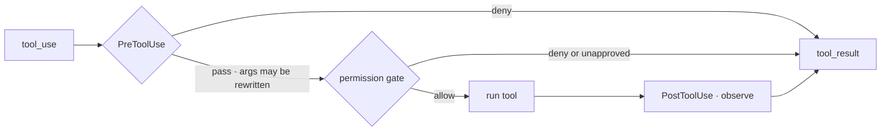

# 4 · Hooks

[English](README.md) · **繁體中文** · [简体中文](README.zh-CN.md)

> hook 在迴圈周圍的固定點加入行為。

hook 是使用者設定的 callback。它們可以在工具呼叫前、工具呼叫後、prompt 送出時，或 session 開始或結束時執行。

用 hook 來做記錄、驗證、通知，以及小型的政策檢查。沒有 hook，每一個新行為都得改動迴圈或另外分岔它。

hook 讓迴圈保持精簡。迴圈對外提供固定的事件。擴充行為則掛接到那些事件上。

---

## 機制



一個 `Hooks` 物件把事件名稱對應到 callback 清單。迴圈不會直接呼叫自訂的檢查。取而代之，`_dispatch` 觸發具名的事件。

在工具執行方面，有兩個重要的點：

- `PreToolUse` 在 permission gate 之前執行。它可以擋下呼叫，或改寫輸入。
- `PostToolUse` 在工具呼叫成功之後執行。它可以觀察結果。

### New: hooks

```python
class Hooks:                                     # src/hooks.py
    def fire_pre(self, name, args):               # PreToolUse: block or rewrite
        for fn in self._hooks["PreToolUse"]:
            out = fn(name, args) or {}
            if out.get("updated_args"): args = out["updated_args"]
            if out.get("deny"):         return True, args, out.get("message", "")
        return False, args, ""
    def fire_post(self, name, args, result):      # PostToolUse: observe
        for fn in self._hooks["PostToolUse"]: fn(name, args, result)
```

- `on(event, fn)` 註冊一個 callback。
- `fire_pre` 執行 `PreToolUse` 的 callback。
- pre-hook 可以回傳 `{"deny": True}` 來擋下呼叫。
- pre-hook 可以回傳 `{"updated_args": ...}` 來改寫輸入。
- `fire_post` 在執行之後跑觀察者。

### How it integrates

`_dispatch` 加入了兩個呼叫：

```python
# src/loop.py _dispatch
blocked, args, msg = hooks.fire_pre(name, args)          # 4 · PreToolUse
if blocked: return res(msg)
decision = permissions.decide(tool, mode, allow_rules)   # 3 · gate (section 3)
...                                                      # deny / ask short-circuit
out = res(run_tool(tool, args))                          # 2 · execute -> tool_result
hooks.fire_post(name, args, out)                         # 4 · PostToolUse
```

- 被擋下或被拒絕的呼叫永遠不會抵達 `run_tool`。
- `PostToolUse` 只在成功執行之後才會跑。
- hook 可以收緊 permission 的結果，但不應該放寬它。
- 在 Claude Code 中，`resolveHookPermissionDecision` 會把 hook 輸出和以規則為基礎的 permission 加以協調。

demo 用一個 `PreToolUse` hook，即使在 `bypassPermissions` 之下也擋下 `rm -rf`。

本章談的是生命週期 hook。放在 `hooks/` 資料夾中的 React render hook，是不相干的 UI 程式碼，只是共用同一個字。

---

## 各系統做法

各個 agent 如何在迴圈周圍提供攔截點。

| System | Hook events | Fire point | Can block or modify? |
| --- | --- | --- | --- |
| **Claude Code** | 固定的生命週期事件。 | 從 settings 設定。`PreToolUse` 在 gate 之前執行。 | 可以。拒絕、詢問、更新輸入、加入 context，或停止。 |

### Claude Code

- `HOOK_EVENTS` 定義了 27 個生命週期事件。
- 重要事件包含 tool、prompt、session、stop、subagent、compact 與 setup 等事件。
- hook 從 `.claude/settings.json` 載入。
- `captureHooksConfigSnapshot()` 在啟動時凍結目前生效的 hook 集合。
- `toolExecution.ts` 在解析 permission 之前執行 `runPreToolUseHooks`。
- `HookResult` 可以包含 `permissionBehavior`、`updatedInput`、`additionalContext`、`preventContinuation` 與 `blockingError`。

> **取捨：** hook 讓使用者不必改動迴圈就能擴充行為。而固定的事件清單同時也是它的界限。hook 只能在系統對外提供事件的地方進行攔截。

---

## 失效模式

- **hook 繞過 permission：**hook 可能試圖允許一個已被拒絕的動作。要把 hook 輸出對照以規則為基礎的 permission 來解析。
- **Stop hook 無限迴圈：**一個 `Stop` hook 可能擋下、觸發自我修正，然後又再次觸發。要追蹤 stop hook 是否已經在運作中。
- **hook 設定在 session 中途改變：**某個程序可能在啟動後修改 settings。要對 hook 設定做一次快照。
- **慢速 hook 卡住迴圈：**hook 可能 shell out 去做很慢的工作。要加上 timeout。
- **PostToolUse 意外停止：**若 post-hook 回傳 `preventContinuation`，要把它呈現為一個優雅的停止，而不是崩潰。

---

## 可執行程式

[`src/`](src/) 承接 03 並加上：

- [`hooks.py`](src/hooks.py)：帶有 `fire_pre` 與 `fire_post` 的 `Hooks` 物件。
- [`loop.py`](src/loop.py)：`_dispatch` 在 gate 之前觸發 `PreToolUse`，在執行之後觸發 `PostToolUse`。
- [`test.py`](src/test.py)：一個 pre-hook 即使在 `bypassPermissions` 之下也擋下 `rm -rf`。

```bash
python sections/04-hooks/src/test.py         # offline checks, no key
uv run python sections/04-hooks/src/demo.py  # live demo, needs a key
```

---

## 出處

- Claude Code 原始碼：`types/hooks.ts`、`entrypoints/sdk/coreTypes.ts`、`services/tools/toolHooks.ts`、`query/stopHooks.ts`、`services/tools/toolExecution.ts`、`setup.ts`。
- learn-claude-code · s04_hooks：section framing。
