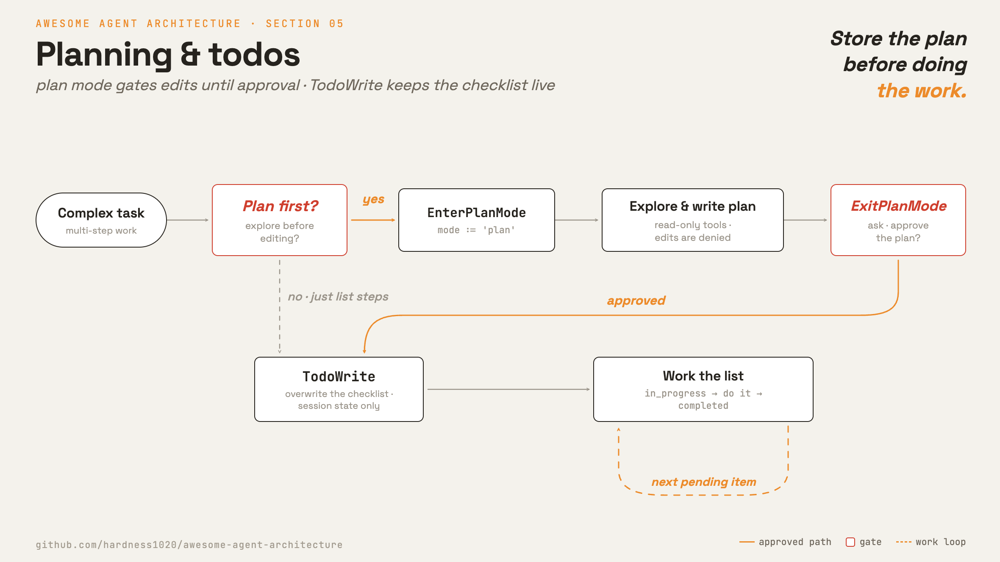

# 5 · Planning & todos

**English** · [繁體中文](README.zh-TW.md) · [简体中文](README.zh-CN.md)

> Store the plan before doing multi-step work.

Large tasks need a visible plan. If the model only keeps the plan in the prompt, it can lose track after many tool results.

Planning solves two separate problems:

1. The agent needs a current checklist while it works.
2. The agent should not edit files before it understands the task.

This section adds both: a todo tool and a plan mode. The todo tool stores the checklist. Plan mode allows read-only exploration until the written plan is approved.

Without this layer, short tasks still work. Longer tasks can skip steps or act too early.

---

## Mechanism



There are two tools. Both are normal model-called tools. Neither changes the core loop.

**Todo list.** The model overwrites a structured checklist. The tool does no file or shell work. It only stores plan state for the session.

**Plan mode.** The session enters a read-only mode. The model explores, writes a plan, and calls `ExitPlanMode`. That exit is gated by the permission layer.

### New: todos and plan-mode tools

```python
@dataclass
class Session:                                   # src/loop.py: mutable, outlives a turn
    mode: str = DEFAULT
    todos: list = field(default_factory=list)

def todo_tool(session):                          # src/planning.py
    def write(a): session.todos = list(a["todos"])    # model overwrites its checklist
    return Tool("TodoWrite", write, is_read_only=True)    # no side effect, never gated

def exit_plan_mode_tool(session):                # src/planning.py
    def exit_plan(_): session.mode = ACCEPT_EDITS     # approval flips the live mode
    return Tool("ExitPlanMode", exit_plan)
```

- `Session` now stores `mode` and `todos`.
- `TodoWrite` mutates only `session.todos`, so it is read-only from the outside.
- `ExitPlanMode` changes `session.mode` after approval.
- The next tool call reads the new mode through the same permission gate.

### How it integrates

The permission logic from section 3 already knows about `PLAN`:

```python
if mode == PLAN:                              # exploring, not acting yet
    if tool.is_read_only:           return "allow"
    if tool.name == "ExitPlanMode": return "ask"     # the approval handshake
    return "deny"                             # no edits until the plan is approved
```

Section 5 adds tools and session state. It does not add a new loop or a new permission path.

A todo item is `{ content, status, activeForm }`.

The status is `pending`, `in_progress`, or `completed`. The model writes the whole list each time, and the harness renders the current state.

---

## Per system

How each agent tracks a plan and gates execution.

| | Claude Code |
| --- | --- |
| **Pros** | Simple and cheap. An in-memory todo list needs no dependencies, persistence, or locking. |
| **Cons** | The list is session state only. Work that must survive a turn or process needs a disk-backed task graph, which adds more tools and on-disk state (section 12). |
| **Why** | The model loses track of a plan kept only in the prompt, so the checklist is stored as session state. The agent should not edit files before the plan is approved. |
| **How: plan artifact** | Todo list plus a plan file. `TodoWrite` overwrites the in-memory list and is always allowed because it has no external side effect. |
| **How: plan mode** | Yes. Entering flips the permission mode to plan, and the session stays read-only until exit. |
| **How: execution gate** | `ExitPlanMode` reads the plan and asks for approval. The call is rejected unless the current mode is plan. |

---

## Failure modes

- **Stale list.** The model stops updating todos. Remind it to keep one item `in_progress` and close items as work completes.
- **Over-planning small work.** A todo list for a one-step task adds noise. Skip it for trivial tasks.
- **Plan mode cannot exit.** Some surfaces cannot show an approval dialog. Disable enter and exit together on those surfaces.
- **Exit without entry.** The model may call `ExitPlanMode` out of context. Validate that the current mode is `plan`.
- **Plan disappears with context.** A flat todo list is session state. Use the task system when work must survive a turn or process.

---

## Runnable

[`src/`](src/) carries 04 forward and adds:

- [`planning.py`](src/planning.py): `TodoWrite` and `ExitPlanMode`.
- [`loop.py`](src/loop.py): holds a `Session` so mode can change mid-run.
- [`test.py`](src/test.py): checks todo writes, plan-mode denial, approval, and edit execution.

```bash
python sections/05-planning-todos/src/test.py         # offline checks, no key
uv run python sections/05-planning-todos/src/demo.py  # live demo, needs a key
```

---

## Sources

- [Claude Code source](https://github.com/yasasbanukaofficial/claude-code):
  `tools/TodoWriteTool/TodoWriteTool.ts`, `tools/EnterPlanModeTool/EnterPlanModeTool.ts`, `tools/ExitPlanModeTool/ExitPlanModeV2Tool.ts`.
- [Claude Code planning helpers](https://github.com/yasasbanukaofficial/claude-code): `utils/plans.ts`, `utils/todo/types.ts`, `types/permissions.ts`.
- [learn-claude-code · s05_todo_write](https://github.com/shareAI-lab/learn-claude-code): section framing.
