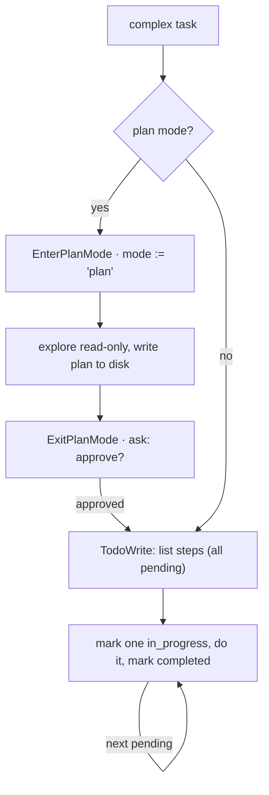

# 5 · Planning & todos

> An agent without a plan drifts. List the steps first, then execute.

Big work needs decomposition. Two mechanisms cover it: a todo list the model writes to itself to track steps, and a plan mode that gates execution until a written plan is approved. Both keep a long task on course by making the plan a first-class artifact the loop carries forward.

---

## Problem

Hand a model a 10-step refactor and it starts well, then drifts. Tool results pile into the context and dilute the original instruction, so by step 4 the model is improvising and steps 5 through 10 are gone from its attention. Two distinct failures hide here:

1. **Mid-task drift.** No running checklist, so completed work is forgotten and remaining work is dropped.
2. **Premature action.** The model edits files before it understands the codebase, then has to undo damage.

Leave planning out and the agent reasons fine on short tasks but loses the thread on anything multi-step, and acts before it has thought.

---

## Mechanism

Two tools, both called by the model, both layered on the loop (section 1) without changing it.

**Todo list.** A tool the model calls to overwrite a structured checklist. It does no work: it reads no files and runs no commands. It only lets the model externalize its plan as state the loop keeps.

**Plan then execute.** A mode the model enters to explore read-only, then exits by presenting a written plan. Exit is gated on user approval before any edit is allowed.



### New: todos and plan-mode tools

```python
@dataclass
class Session:                                   # src/loop.py: mutable, outlives a turn
    mode: str = DEFAULT
    todos: list = field(default_factory=list)

def todo_tool(session):                          # src/planning.py
    def write(a): session.todos = list(a["todos"])    # model overwrites its checklist
    return Tool("TodoWrite", write, is_read_only=True)    # no side effect, never gated

def exit_plan_mode_tool(session):                # src/planning.py
    def exit_plan(_): session.mode = ACCEPT_EDITS     # approval flips the live mode
    return Tool("ExitPlanMode", exit_plan)
```

- `Session` ([`src/loop.py`](src/loop.py)) gains `todos`, and `mode` is mutable, so a tool can change what the next call is allowed to do.
- `todo_tool` and `exit_plan_mode_tool` ([`src/planning.py`](src/planning.py)) are ordinary tools: TodoWrite is `is_read_only` (always allowed, mutates only `session.todos`); ExitPlanMode flips `session.mode` from `plan` to `acceptEdits`.

### How it integrates

No new loop, dispatch, or permission code. Both are tools, and approval reuses the section-3 gate, which already handles `plan` and reads the live `session.mode`:

```python
# src/permissions.py decide(), already there since section 3:
if mode == PLAN:                              # exploring, not acting yet
    if tool.is_read_only:           return "allow"
    if tool.name == "ExitPlanMode": return "ask"     # the approval handshake
    return "deny"                             # no edits until the plan is approved
```

- Section 5 adds no permission code: the `PLAN` branch has lived in `decide()` ([`src/permissions.py`](src/permissions.py)) since section 3.
- The integration is pure state: `ExitPlanMode` flips `session.mode` to `acceptEdits`, and because the gate reads the live `session.mode`, that changes what the very next call may do. That is the whole approval mechanism.
- The demo walks the arc: draft todos, edit denied in plan mode, approve, edit lands.

A todo item is `{ content, status, activeForm }` where `status` is `pending | in_progress | completed`. The model writes the whole list each call; the harness diffs old against new and renders progress. Plan mode is literally a permission mode: `'plan'` sits in the same set as `default`, `acceptEdits`, and `bypassPermissions` (section 3), so entering it tightens the gate and exiting it restores the prior mode.

---

## Per system

How each agent decomposes big work and gates execution.

| System | Plan artifact | Plan mode | Execution gate |
| --- | --- | --- | --- |
| **Claude Code** | in-memory todo list (`TodoWriteTool`) + plan `.md` on disk (`utils/plans.ts`) | yes, `mode: 'plan'` (`EnterPlanModeTool`) | `ExitPlanMode` returns `behavior: 'ask'` ("Exit plan mode?") |
| *(more soon)* | | | |

### Claude Code

- **Todo list.** `TodoWrite` (name in `tools/TodoWriteTool/constants.ts`); `checkPermissions` always returns `allow`, so planning is never gated.
- **Storage.** Items live in `appState.todos[todoKey]`, keyed by `agentId` or session; schema in `utils/todo/types.ts`.
- **Enter plan mode.** `EnterPlanModeTool` takes no parameters, is `isReadOnly`, and flips `toolPermissionContext.mode` to `'plan'`; it throws if a subagent calls it.
- **Plan on disk.** Written as `<slug>.md` (`getPlanFilePath` in `utils/plans.ts`).
- **Exit gate.** `ExitPlanMode` (`ExitPlanModeV2Tool.ts`) reads the plan, returns `behavior: 'ask'` to force approval, and restores `prePlanMode` on approval.
- **Guard.** `validateInput` rejects the call unless the mode is `'plan'`, so the model cannot exit a mode it never entered.

> **Trade-off:** an in-memory todo list (TodoWrite, V1) is cheap and stateless, but it is a flat list with no dependencies, no persistence, and no concurrency safety. Promoting it to a file-backed task graph (the Task system, V2, gated by `isTodoV2Enabled()`, see section 12) buys dependencies, durability, and locks across agents at the cost of four tools instead of one and on-disk state to manage. Choose by whether tasks outlive one context or run in parallel.

---

## Failure modes

- **Stale or abandoned list.** The model stops updating todos as it works, so the rendered plan lies. Mitigation: the tool result nudges every call ("continue to use the todo list to track your progress"), plus a structural nudge when 3+ todos all close with no verification step.
- **Over-planning trivia.** A todo list on a one-line task is pure overhead. Mitigation: the prompt says skip it for single, trivial, or under-3-step work.
- **Plan-mode trap.** A surface that cannot show the approval dialog (a chat channel, not the terminal) lets the model enter plan mode and never exit. Mitigation: disable `EnterPlanMode` and `ExitPlanMode` together when channels are active, so the mode is never a one-way door.
- **Exit without entry.** The deferred-tool list announces `ExitPlanMode` regardless of mode, so the model may call it out of context. Mitigation: `validateInput` rejects it unless `mode === 'plan'`.
- **Plan outlives the context.** A flat todo list dies with the conversation; a large effort needs durable, dependency-aware tasks. Mitigation: the Task system (section 12) persists to disk, and large work splits across subagents with clean contexts (section 6).

---

## Runnable

[`src/`](src/) carries 04 forward and adds:

- [`planning.py`](src/planning.py): the `TodoWrite` and `ExitPlanMode` tools.
- [`loop.py`](src/loop.py): holds a `Session` so plan mode can flip mid-run.
- [`test.py`](src/test.py): walks the arc through the loop's dispatch (draft todos, edit denied in plan mode, approve, edit lands).

```bash
python sections/05-planning-todos/src/test.py         # offline checks, no key
uv run python sections/05-planning-todos/src/demo.py  # live demo, needs a key
```

---

## Sources

- Claude Code source: `tools/TodoWriteTool/TodoWriteTool.ts`, `tools/EnterPlanModeTool/EnterPlanModeTool.ts`, `tools/ExitPlanModeTool/ExitPlanModeV2Tool.ts`, `utils/plans.ts`, `utils/todo/types.ts`, `types/permissions.ts`.
- learn-claude-code · s05_todo_write: section framing.
