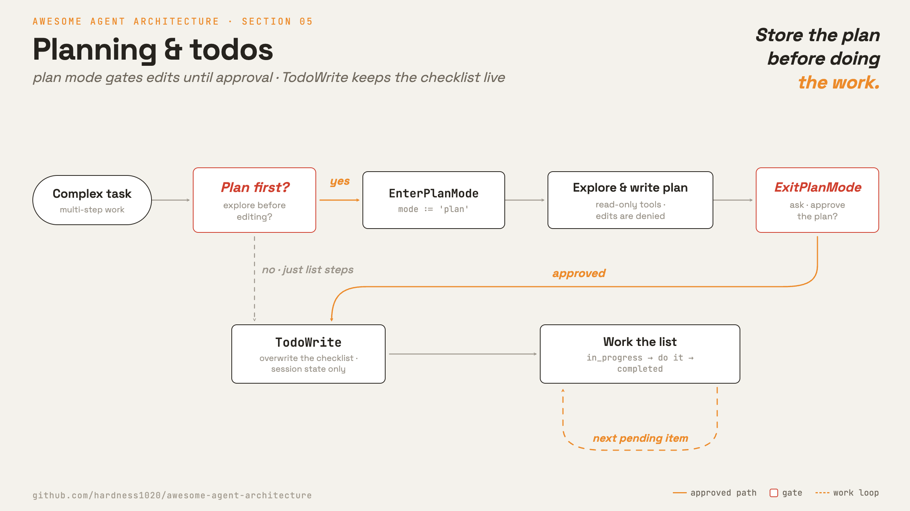

# 5 · Planning & todos

[English](README.md) · [繁體中文](README.zh-TW.md) · **简体中文**

> 在进行多步骤工作之前，先把计划存起来。

大型任务需要一份看得见的计划。如果模型只把计划留在 prompt 里，经过许多工具结果之后，它可能会失去头绪。

规划解决了两个各自独立的问题：

1. agent 在工作时需要一份当前的检查清单。
2. agent 在理解任务之前不该编辑文件。

本章两者都加上：一个 todo 工具和一个 plan mode。todo 工具负责存放检查清单。plan mode 允许只读的探索，直到写好的计划获得批准。

没有这一层，短任务仍然能运作。较长的任务则可能跳过步骤，或太早动手。

---

## 机制



这里有两个工具。两者都是一般由模型调用的工具。两者都不改动核心 loop。

- **Todo list：** 模型会覆写一份结构化的检查清单。这个工具不做任何文件或 shell 的工作。它只为这个 session 存放计划状态。
- **Plan mode：** session 进入只读 mode。模型进行探索、写出计划，然后调用 `ExitPlanMode`。这个离开动作由 permission 层管制。

### New: todos and plan-mode tools

```python
@dataclass
class Session:                                   # src/loop.py: mutable, outlives a turn
    mode: str = DEFAULT
    todos: list = field(default_factory=list)

def todo_tool(session):                          # src/planning.py
    def write(a): session.todos = list(a["todos"])    # model overwrites its checklist
    return Tool("TodoWrite", write, is_read_only=True)    # no side effect, never gated

def exit_plan_mode_tool(session):                # src/planning.py
    def exit_plan(_): session.mode = ACCEPT_EDITS     # approval flips the live mode
    return Tool("ExitPlanMode", exit_plan)
```

- `Session` 现在存放 `mode` 与 `todos`。
- `TodoWrite` 只改动 `session.todos`，所以从外部看它是只读的。
- `ExitPlanMode` 在批准后改变 `session.mode`。
- 下一次工具调用会通过同一个 permission gate 读到新的 mode。

### How it integrates

第 3 章的 permission 逻辑已经认得 `PLAN`：

```python
if mode == PLAN:                              # exploring, not acting yet
    if tool.is_read_only:           return "allow"
    if tool.name == "ExitPlanMode": return "ask"     # the approval handshake
    return "deny"                             # no edits until the plan is approved
```

第 5 章加入的是工具和 session 状态。它并没有加入新的 loop 或新的 permission 路径。

一个 todo 项目是 `{ content, status, activeForm }`。

status 是 `pending`、`in_progress` 或 `completed`。模型每次都会写入整份清单，而 harness 负责把当前状态渲染出来。

---

## 各系统做法

各个 agent 如何追踪计划并管制执行。

| | Claude Code | deepseek-harness |
| --- | --- | --- |
| **Pros** | 简单又便宜。memory 中的 todo list 没有依赖，也没有锁。 | 计划与 todo 状态扛得过重启、fork 与 compaction。 |
| **Cons** | 只是 session 状态。要跨 turn 存活的工作得交给 task graph（见第 12 章）。 | plan mode 自己拦不住任何东西，要 sandbox 或 approval policy 出手才拦得下编辑。 |
| **Why** | 计划只留在 prompt 里会走丢，所以清单存成 session 状态。 | session log 才是唯一的事实来源，所以计划状态也只是一则事件。 |
| **How: plan artifact** | 一份 todo list 加一个 plan 文件。`TodoWrite` 覆写清单，从不被管制。 | `todo_write` 把整份清单当成一则事件追加上去，projection 再重放出来。 |
| **How: plan mode** | 有。进入时把 permission mode 切成 plan，session 保持只读。 | 一个写进 log 的标志，加上 prompt 里的一段指引文字，不动 permission。 |
| **How: execution gate** | `ExitPlanMode` 请求批准。不在 plan mode 时，这个调用会被拒绝。 | 规划期间完全不管制。计划被打回来时，以 tool feedback 返回。 |

---

## 哪里会出错

- **清单过时：**模型不再更新 todos。要提醒它让一个项目保持 `in_progress`，并在工作完成时关闭项目。
- **对小工作过度规划：**为一个单步骤的任务列 todo list 会增加噪声。琐碎的任务就跳过它。
- **Plan mode 无法离开：**有些界面无法显示批准对话框。在那些界面上要把进入与离开一起停用。
- **没进入就离开：**模型可能在不对的情境下调用 `ExitPlanMode`。要验证当前的 mode 是 `plan`。
- **计划随 context 消失：**一份扁平的 todo list 是 session 状态。当工作必须跨越一个 turn 或进程而存活时，要改用 task 系统。

---

## 可执行程序

[`src/`](src/) 承接 04 并加上：

- [`planning.py`](src/planning.py)：`TodoWrite` 与 `ExitPlanMode`。
- [`loop.py`](src/loop.py)：持有一个 `Session`，让 mode 可以在运行中途改变。
- [`test.py`](src/test.py)：检查 todo 写入、plan-mode 拒绝、批准，以及编辑执行。

```bash
python sections/05-planning-todos/src/test.py         # offline checks, no key
uv run python sections/05-planning-todos/src/demo.py  # live demo, needs a key
```

---

## 出处

- [Claude Code 源码](https://github.com/yasasbanukaofficial/claude-code)：
  `tools/TodoWriteTool/TodoWriteTool.ts`、`tools/EnterPlanModeTool/EnterPlanModeTool.ts`、`tools/ExitPlanModeTool/ExitPlanModeV2Tool.ts`。
- [Claude Code planning helpers](https://github.com/yasasbanukaofficial/claude-code)：`utils/plans.ts`、`utils/todo/types.ts`、`types/permissions.ts`。
- [deepseek-harness source](https://github.com/deepseek-ai/deepseek-harness)（`dsh-v0.1.0-rc.7`）：
  `packages/todo/tool-todo/src/index.ts`、`packages/plan/plan-mode/src/index.ts`、`docs/subsystems/plan.md`、`docs/tool-catalog.md`。
- [learn-claude-code · s05_todo_write](https://github.com/shareAI-lab/learn-claude-code)：section framing。
