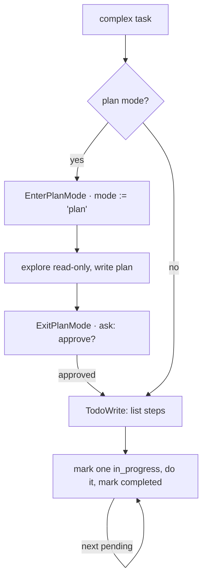

# 5 · Planning & todos

[English](README.md) · **繁體中文**

> 在進行多步驟工作之前，先把計畫存起來。

大型任務需要一份看得見的計畫。如果模型只把計畫留在 prompt 裡，經過許多工具結果之後，它可能會失去頭緒。

規劃解決了兩個各自獨立的問題：

1. agent 在工作時需要一份當前的檢查清單。
2. agent 在理解任務之前不該編輯檔案。

本章兩者都加上：一個 todo 工具和一個 plan mode。todo 工具負責存放檢查清單。plan mode 允許唯讀的探索，直到寫好的計畫獲得核准。

沒有這一層，短任務仍然能運作。較長的任務則可能跳過步驟，或太早動手。

---

## 機制

這裡有兩個工具。兩者都是一般由模型呼叫的工具。兩者都不改動核心迴圈。

**Todo list。** 模型會覆寫一份結構化的檢查清單。這個工具不做任何檔案或 shell 的工作。它只為這個 session 存放計畫狀態。

**Plan mode。** session 進入唯讀 mode。模型進行探索、寫出計畫，然後呼叫 `ExitPlanMode`。這個離開動作由 permission 層管制。



### New: todos and plan-mode tools

```python
@dataclass
class Session:                                   # src/loop.py: mutable, outlives a turn
    mode: str = DEFAULT
    todos: list = field(default_factory=list)

def todo_tool(session):                          # src/planning.py
    def write(a): session.todos = list(a["todos"])    # model overwrites its checklist
    return Tool("TodoWrite", write, is_read_only=True)    # no side effect, never gated

def exit_plan_mode_tool(session):                # src/planning.py
    def exit_plan(_): session.mode = ACCEPT_EDITS     # approval flips the live mode
    return Tool("ExitPlanMode", exit_plan)
```

- `Session` 現在存放 `mode` 與 `todos`。
- `TodoWrite` 只更動 `session.todos`，所以從外部看它是唯讀的。
- `ExitPlanMode` 在核准後改變 `session.mode`。
- 下一次工具呼叫會透過同一個 permission gate 讀到新的 mode。

### How it integrates

第 3 章的 permission 邏輯已經認得 `PLAN`：

```python
if mode == PLAN:                              # exploring, not acting yet
    if tool.is_read_only:           return "allow"
    if tool.name == "ExitPlanMode": return "ask"     # the approval handshake
    return "deny"                             # no edits until the plan is approved
```

第 5 章加入的是工具和 session 狀態。它並沒有加入新的迴圈或新的 permission 路徑。

一個 todo 項目是 `{ content, status, activeForm }`。

status 是 `pending`、`in_progress` 或 `completed`。模型每次都會寫入整份清單，而 harness 負責把目前狀態渲染出來。

---

## 各系統做法

各個 agent 如何追蹤計畫並管制執行。

| System                | Plan artifact                | Plan mode            | Execution gate                |
| --------------------- | ---------------------------- | -------------------- | ----------------------------- |
| **Claude Code** | Todo list 加上一個 plan 檔。 | 有。離開前維持唯讀。 | `ExitPlanMode` 會請求核准。 |

### Claude Code

- `TodoWrite` 存放一份memory中的 todo list。
- `TodoWrite` 一律被允許，因為它沒有任何對外的副作用。
- 項目存在 `appState.todos[todoKey]`。
- `EnterPlanModeTool` 把 permission mode 切換成 `plan`。
- `ExitPlanMode` 讀取計畫並回傳一個 `ask` 決策。
- `validateInput` 會拒絕 `ExitPlanMode`，除非目前的 mode 是 `plan`。
- 持久的任務圖（task graph）由後面的第 12 章處理。

> **取捨：** memory中的 todo list 簡單又便宜。
> 它沒有相依、沒有持久化，也沒有鎖。
> 以磁碟為後盾的任務圖會加上這些特性，但它需要管理更多工具與磁碟上的狀態。

---

## 失效模式

- **清單過時。** 模型不再更新 todos。要提醒它讓一個項目保持 `in_progress`，並在工作完成時關閉項目。
- **對小工作過度規劃。** 為一個單步驟的任務列 todo list 會增加雜訊。瑣碎的任務就略過它。
- **Plan mode 無法離開。** 有些介面無法顯示核准對話框。在那些介面上要把進入與離開一起停用。
- **沒進入就離開。** 模型可能在不對的情境下呼叫 `ExitPlanMode`。要驗證目前的 mode 是 `plan`。
- **計畫隨 context 消失。** 一份扁平的 todo list 是 session 狀態。當工作必須跨越一個 turn 或程序而存活時，要改用 task 系統。

---

## 可執行程式

[`src/`](src/) 承接 04 並加上：

- [`planning.py`](src/planning.py)：`TodoWrite` 與 `ExitPlanMode`。
- [`loop.py`](src/loop.py)：持有一個 `Session`，讓 mode 可以在執行中途改變。
- [`test.py`](src/test.py)：檢查 todo 寫入、plan-mode 拒絕、核准，以及編輯執行。

```bash
python sections/05-planning-todos/src/test.py         # offline checks, no key
uv run python sections/05-planning-todos/src/demo.py  # live demo, needs a key
```

---

## 出處

- Claude Code 原始碼：`tools/TodoWriteTool/TodoWriteTool.ts`、`tools/EnterPlanModeTool/EnterPlanModeTool.ts`、`tools/ExitPlanModeTool/ExitPlanModeV2Tool.ts`。
- Claude Code planning helpers：`utils/plans.ts`、`utils/todo/types.ts`、`types/permissions.ts`。
- learn-claude-code · s05_todo_write：section framing。
