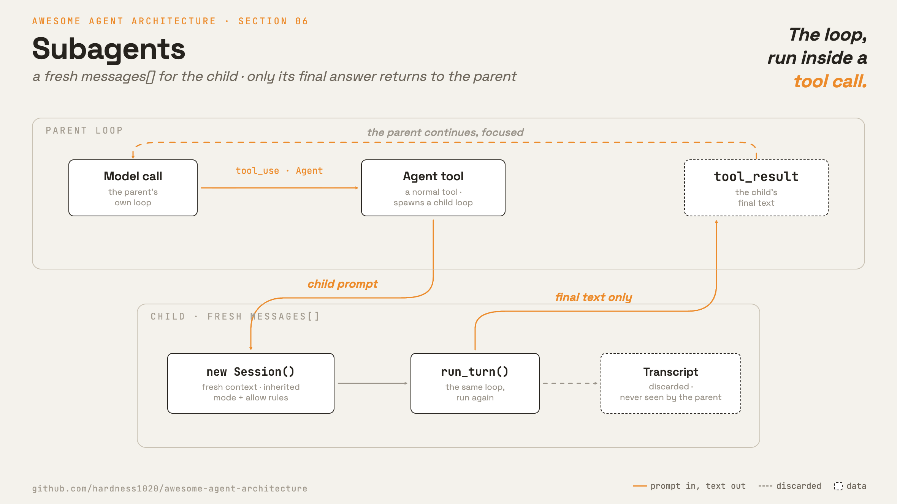

# 6 · Subagents

[English](README.md) · **繁體中文** · [简体中文](README.zh-CN.md)

> 執行一個聚焦的子 loop，只回傳它的結果。

主 agent 可以把工作派給 subagent：派工作的那端叫 parent，被派出去的叫 child。

對 parent 來說，這只是一次 tool call。但這次呼叫裡面跑的，是一個完整的 agent loop。parent 給 child 一段 prompt。child 拿到全新的 `messages[]`，一路執行到完成，然後回傳它的最終答案。

這樣可以把旁支調查排除在 parent 的情境之外。parent 不需要 child 讀過的每個檔案或每個指令結果。它通常只需要結論。

沒有 subagents 的話，每一次調查都會留在主 transcript 裡。長時間執行會變得雜亂、昂貴，也更難讓模型跟上。

---

## 機制



一個 `Agent` tool 會啟動一個 child agent。child 有自己的 session 和 message 清單。它跑的是和 parent 一樣的 loop。

只有 child 的最終文字會回傳。它的 transcript 會被丟棄。檔案寫入和 shell 的副作用仍然會發生在工作目錄裡。

### New: the Agent tool

```python
def agent_tool(model, child_registry, parent_session):     # src/subagents.py
    def spawn(a):
        child = Session(mode=parent_session.mode,          # fresh context, inherited authority
                        allow_rules=set(parent_session.allow_rules))
        messages = [{"role": "user", "content": a["description"]}]   # the child's own conversation
        return run_turn(messages, model, child_registry, child)      # the loop, run again
    return Tool("Agent", spawn, is_read_only=True)
```

- `agent_tool` 回傳一個一般的 tool。
- 它的 handler 用一個新的 `Session` 呼叫 `run_turn()`。
- child 的 `messages[]` 一開始只有 child 的 prompt。
- child 回傳 `run_turn()` 所回傳的文字。

### How it integrates

loop 不會改變。subagent 只是另一個呼叫 loop 的 tool handler。

有三個特性很重要：

- **全新情境。** child 不會繼承 parent 的 transcript。parent 也不會繼承 child 的軌跡。
- **繼承的權限。** child 會複製 parent 的 permission mode 和 allow rules。情境隔離不等於權限隔離。
- **遞迴上限。** 這個 demo 從 child registry 中省略了 `Agent`，所以 child 無法再生出另一個 child。

---

## 各系統做法

各 agent 如何隔離一個子問題，並回傳結果。

| | Claude Code |
| --- | --- |
| **Pros** | child 的情境讓 parent 保持聚焦，旁支調查不會留在主 transcript 裡。 |
| **Cons** | parent 失去了 child 是如何得出答案的細節。摘要太單薄時，parent 就得再問一次，或去讀 child 寫下的檔案。 |
| **Why** | parent 通常只需要結論，不需要 child 讀過的每個檔案或每個指令結果。 |
| **How: spawn primitive** | `Agent` tool，舊的 wire 名稱是 `Task`。用 subagent type 選一個內建 persona，例如 general-purpose、explore、plan。 |
| **How: context isolation** | child 的 messages 是全新的，不帶 parent 的 transcript。fork 出來的 child 不能再 fork。 |
| **How: result return** | child 最後一則訊息的文字回傳給 parent，child 的 transcript 會被丟棄。 |
| **How: resume** | 多數 agent 可以續跑，parent 再發一則訊息就能讓 child 繼續。背景 subagent 會變成被追蹤的 task。 |

---

## 哪裡會出錯

- **摘要遺漏資訊：**child 可能壓縮過頭。要求它把重要發現寫到磁碟上。
- **失控遞迴：**child 生 child 可能無上限地成長。從 child registry 省略 `Agent` tool，或強制設一個深度上限。
- **child 停不下來：**child 和 parent 有一樣的停止風險。給每個 child 自己的 turn 或 token 上限。
- **誤以為有權限隔離：**child 仍然需要正常的 permission gate。不要因為情境是分開的就跳過它。
- **孤兒非同步 child：**一個背景 child 可能在 parent 已經往前走之後才結束。用一筆 task 記錄來追蹤它。

---

## 可執行程式

[`src/`](src/) 沿用 05 並加上：

- [`subagents.py`](src/subagents.py)：`Agent` tool。
- [`loop.py`](src/loop.py)：與第 5 章相同，未變動。
- [`demo.py`](src/demo.py)：parent 把一個計數任務委派給 child。
- [`test.py`](src/test.py)：檢查全新情境、繼承的權限，以及遞迴防護。

```bash
python sections/06-subagents/src/test.py         # offline checks, no key
uv run python sections/06-subagents/src/demo.py  # live demo, needs a key
```

---

## 出處

- [Claude Code 原始碼](https://github.com/yasasbanukaofficial/claude-code)：`tools/AgentTool/AgentTool.tsx`、`runAgent.ts`、`resumeAgent.ts`、`forkSubagent.ts`、`builtInAgents.ts`、`tasks/LocalAgentTask/`。
- [learn-claude-code · s06_subagent](https://github.com/shareAI-lab/learn-claude-code)：章節框架。
