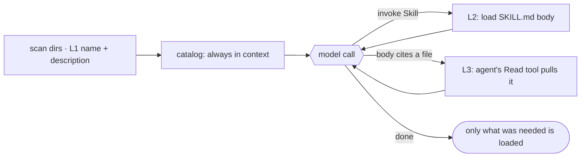

# 7 · Skills

> A skill is a manifest plus instructions, loaded into context only when invoked.

Skills are capabilities you add on demand. Each is a folder with a `SKILL.md` (frontmatter metadata plus a body of instructions). The agent sees a one-line catalog of what is available at all times, but it only pays for the full body when it decides a skill is relevant and invokes it. This is the opposite of stuffing every guideline into the system prompt (section 10).

---

## Problem

You want the agent to follow your React conventions, your SQL style guide, and your PDF workflow. The naive fix is to paste all of it into the system prompt. Now every model call, even one that edits a CSS color, carries thousands of tokens of irrelevant instructions. The cost is paid on every turn and the signal-to-noise drops.

So something must:

1. Tell the agent what capabilities exist, cheaply, on every turn.
2. Load the full instructions only when a capability is actually needed.
3. Discover those capabilities from multiple places (built in, user, project, plugins).

Leave this out and you choose between a bloated always-on prompt or an agent that does not know its own extensions exist.

---

## Mechanism

**Progressive disclosure.** A skill reveals itself to the model in three levels, each loaded only when needed (Anthropic's Agent Skills best practices):

1. **Metadata.** `name` + `description` from the `SKILL.md` frontmatter. Always in context as the cheap catalog; the model reads it to judge relevance.
2. **Instructions.** The `SKILL.md` body. Read into the conversation only when the model invokes the skill.
3. **Resources.** Files bundled in the skill folder. Never auto-loaded; the body points to them and the model reads each only when the task needs it.

The model pays for level N only after level N-1 sent it there, so context stays lean.



### New: scan (L1) and the Skill tool (L2)

```python
@dataclass
class Skill:                                   # src/skills.py
    name: str
    description: str                           # L1: frontmatter -> the catalog
    path: Path                                # SKILL.md; the body is read on invoke

def load_skills(skills_dir) -> list[Skill]:    # L1: scan <dir>/<name>/SKILL.md at startup
    skills = []
    for sub in sorted(Path(skills_dir).iterdir()):
        meta, _ = _split((sub / "SKILL.md").read_text())   # keep frontmatter, not the body
        skills.append(Skill(meta["name"], meta["description"], sub / "SKILL.md"))
    return skills

def skill_tool(skills) -> Tool:                # L2: read the body from disk on invoke
    by_name = {s.name: s for s in skills}
    def load(a):
        _, body = _split(by_name[a["name"]].path.read_text())
        return body                            # tool result -> enters messages[]
    return Tool("Skill", load, is_read_only=True)
```

- `load_skills` ([`src/skills.py`](src/skills.py)) scans `<name>/SKILL.md` and keeps only each frontmatter: L1, the cheap catalog. Claude Code scans `.claude/skills`; the demo scans a local `skills/` dir.
- `skill_tool` reads the matching body from disk on invoke: L2, the instructions, paid for only when the model picks the skill. It is the only skill-specific tool.
- **L3 is plain file access, not a skill tool.** The body points to bundled files (a big field map, a script) by path; the agent reads them with its normal `Read` tool, or runs them with `Bash`, only when the task needs them. The demo bundles `pdf-fill/reference.md` to show the structure; this minimal section ships no file tool (that arrives with the section-3 sandbox), so the body cites the file and the read happens there.

### How it integrates

No loop change. A skill loads through the section-2 tool runtime like any other tool, so [`src/loop.py`](src/loop.py) is unchanged from section 5:

- The `Skill` body returns as ordinary tool-result content, so it lands in `messages[]`, not the system prompt (section 10). That is progressive disclosure in one loop: the catalog rides in the prompt, the body enters the conversation on invoke, and a referenced resource later via the file tool, each only as the model asks.
- Because each is just a message, it is subject to compaction (section 8) like any other, and a vague `description` means the model never invokes the skill at all.
- Skills load by registered name, never an arbitrary path. A bundled resource is read by the file tool, which scopes the path to the skill dir (`resolveSkillFilePath`) so a crafted reference cannot escape it.

---

## Per system

How each agent describes, triggers, and finds its skills.

| System | Skill format | Load trigger | Discovery |
|---|---|---|---|
| **Claude Code** | `SKILL.md` folder: YAML frontmatter (`name`, `description`, `when_to_use`, `allowed-tools`, `context`, `paths`) + Markdown body | `Skill` tool invoke; catalog visible every turn via budgeted listing | `loadSkillsDir.ts` scans managed / user / project / `--add-dir` dirs, `bundledSkills.ts` for built ins, plus plugin and MCP skills |
| *(more soon)* | | | |

In Claude Code the catalog is assembled in `loadSkillsDir.ts` (`formatCommandsWithinBudget`, `getCharBudget`) and the actual invoke is handled by `tools/SkillTool/SkillTool.ts`. The visible tool result is just `Launching skill: {name}`; the real content is returned as `newMessages` injected into the conversation. Frontmatter is parsed by `parseSkillFrontmatterFields`, which also reads `context: 'fork'` (run the skill as a forked sub-agent, section 6), a `model` override, `paths` (conditional skills activated only when matching files are touched), and `user-invocable` (whether `/name` works). The same machinery folds in legacy `.claude/commands/` and MCP-served skills via `mcpSkillBuilders.ts`.

> **Trade-off:** the two-level split buys a near-free catalog and full bodies only when needed, but it leans entirely on the `description` and `when_to_use` text being good enough for the model to self-select. A bad description means the skill is never invoked even though it exists; an always-on prompt would have guaranteed the instructions were seen.

---

## Failure modes

- **Skill never fires.** A vague `description` or missing `when_to_use` means the model cannot tell the catalog entry is relevant, so it never invokes the skill. Mitigation: write trigger-shaped descriptions and keep them within the per-entry budget so they are not truncated.
- **Catalog crowds out context.** Hundreds of skills push the listing past its budget; descriptions get trimmed to names only, eroding selection accuracy. Mitigation: the `SKILL_BUDGET_CONTEXT_PERCENT` cap and per-entry truncation bound the damage, but the real fix is fewer, sharper skills.
- **Body evaporates after compaction.** The loaded `SKILL.md` enters the conversation as messages, so a long run can compact or drop it (section 8) and the agent forgets the instructions mid-task. Mitigation: re-invoke, or keep the skill body short and let it point at files read on demand.
- **Path traversal on load.** Loading by raw file path would let a crafted name escape the skill directory. Mitigation: invoke by registered name through the registry, and resolve bundled file paths against the skill dir (`resolveSkillFilePath` rejects escapes).
- **Forked skill loses the main thread.** A `context: 'fork'` skill runs in an isolated sub-agent (section 6) with its own budget; only its final result returns. Mitigation: use `fork` only for self-contained work, keep `inline` (the default) when the skill must see and edit the live conversation state.

---

## Runnable

[`src/`](src/) carries 06 forward and adds skills. New: [`skills.py`](src/skills.py) (`load_skills`, `catalog`, `Skill` tool) plus sample `skills/<name>/SKILL.md`, one with a bundled `reference.md` (the L3 resource). Unchanged: [`loop.py`](src/loop.py), because a skill is just another tool. [`test.py`](src/test.py) walks the levels: scan the catalog (L1), read a body on invoke (L2), and confirm the bundled file sits on disk for the agent's file tool to read (L3).

```bash
python sections/07-skills/src/test.py         # offline checks, no key
uv run python sections/07-skills/src/demo.py  # live demo, needs a key
```

---

## Sources

- Claude Code structure: `skills/loadSkillsDir.ts` (`parseSkillFrontmatterFields`, `createSkillCommand`, `formatCommandsWithinBudget`, `getCharBudget`, budget constants), `skills/bundledSkills.ts` (`registerBundledSkill`, `resolveSkillFilePath`), `skills/mcpSkillBuilders.ts`, `tools/SkillTool/SkillTool.ts` (`newMessages` injection, `Launching skill`, forked execution), `tools/SkillTool/prompt.ts`.
- Progressive disclosure: [Anthropic Agent Skills best practices](https://platform.claude.com/docs/en/agents-and-tools/agent-skills/best-practices).
- Framing: learn-claude-code · s07_skill_loading

Educational reconstruction from public structure and observed behavior, not an official description of any system.
