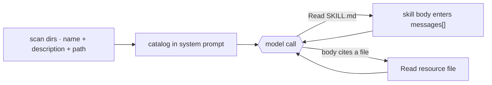

# 7 · Skills

**English** · [繁體中文](README.zh-TW.md) · [简体中文](README.zh-CN.md)

> A skill is a self-contained bundle of expertise, instructions plus any scripts and files, loaded only when a task needs it.

A skill turns a general agent into a specialist for one job.
It packages a workflow: the instructions to follow, plus any scripts to run and reference files to consult.
The agent loads a skill only when a task calls for it, so one agent can reach many specialized capabilities without carrying them all up front.

Each skill is a folder with a `SKILL.md` file. The frontmatter names and describes the skill.
The body holds the instructions, and the folder can bundle extra scripts and reference files that load only when the skill uses them.

The agent needs to know that skills exist, but it should not pay for every skill body on every turn.

The skill system must:

1. List available skills cheaply.
2. Load full instructions only when a skill is selected.
3. Let skills point to extra files without loading them automatically.
4. Discover skills from built-in, user, project, plugin, or MCP sources.

Without this layer, the prompt is either too large or the agent cannot find its extensions.

---

## Mechanism

Skills use progressive disclosure. The model sees only enough information to decide whether to load more.

1. **Metadata.** `name` and `description` from frontmatter, plus the skill's path. This cheap catalog rides in the system prompt every turn.
2. **Instructions.** The `SKILL.md` body. The model reads the file only when a task needs the skill.
3. **Resources.** Extra files in the skill folder. The model reads them with the same file tool when the instructions point to them.

No skill-specific tool is needed. Once the catalog names each skill and its path,
the agent loads a skill by reading its file with the normal Read tool. L2 and L3 are both just file reads.



### New: scan the skills and list them in the prompt

```python
@dataclass
class Skill:                                   # src/skills.py
    name: str
    description: str                           # L1: frontmatter -> the catalog
    path: Path                                # SKILL.md; the body is read on demand

def load_skills(skills_dir) -> list[Skill]:    # L1: scan <dir>/<name>/SKILL.md at startup
    skills = []
    for sub in sorted(Path(skills_dir).iterdir()):
        meta, _ = _split((sub / "SKILL.md").read_text())   # keep frontmatter, not the body
        skills.append(Skill(meta["name"], meta["description"], sub / "SKILL.md"))
    return skills

def catalog_prompt(skills, base_dir) -> str:   # L1: the block added to the system prompt
    lines = [f"- {s.name}: {s.description} (read {s.path.relative_to(base_dir)})" for s in skills]
    return "Available skills (read a skill's path with the Read tool):\n" + "\n".join(lines)
```

- `load_skills` scans `SKILL.md` files and keeps only frontmatter for the catalog.
- `catalog_prompt` renders that catalog into the system prompt, one line per skill, with the path to read.
- The body and the resources are plain files. The normal Read tool loads them on demand, so there is no skill-specific tool.
- The Read tool is scoped to the skills directory, so a skill name can never escape into the filesystem.

### How it integrates

The loop does not change. Reading a skill returns a tool result that enters `messages[]`.

The catalog belongs in the system prompt. The body enters the conversation only after the model reads the file. Resource files are read later only if needed.

Because loaded skill text lives in `messages[]`, it can be compacted like any other message. Keep skill bodies short and point to files for large references.

---

## Per system

How each agent describes, triggers, and finds skills.

| System | Skill format | Load trigger | Discovery |
| --- | --- | --- | --- |
| **Claude Code** | `SKILL.md` folder with frontmatter and body. | `Skill` tool invocation. | Built-in, user, project, plugin, and MCP sources. |

### Claude Code

- `loadSkillsDir.ts` builds the visible catalog within a budget.
- `SkillTool.ts` returns the body as `newMessages`.
- The visible result is a short launch message.
- Frontmatter can include `when_to_use`, `allowed-tools`, `context`, `paths`, `model`, and `user-invocable`.
- `context: 'fork'` runs the skill in a forked subagent.
- `paths` can activate skills when matching files are touched.
- MCP-served skills and legacy `.claude/commands/` use the same machinery.
- A skill that only loads instructions needs no dedicated tool. Claude Code uses `SkillTool.ts` because its skills also fork and scope tools.

> **Trade-off:** A cheap catalog keeps context small. It also depends on good descriptions. If the description is vague, the model may never load the skill.

---

## Failure modes

- **Skill never fires.** The description is too vague. Write trigger-shaped descriptions.
- **Catalog gets too large.** Too many skills can crowd the prompt. Keep skills focused and let the loader trim.
- **Body is lost after compaction.** Re-read the skill file or keep the body short.
- **Path traversal.** The catalog hands the model a path. Scope the Read tool to the skills directory so `../` cannot escape it.
- **Forked skill loses live context.** Use forked skills only for self-contained work.

---

## Runnable

[`src/`](src/) carries 06 forward and adds:

- [`skills.py`](src/skills.py): catalog scan, the system-prompt listing, and a path-scoped `Read` tool.
- `skills/<name>/SKILL.md`: sample skills, including one with a resource file.
- [`loop.py`](src/loop.py): unchanged because loading a skill is just a file read.
- [`test.py`](src/test.py): checks catalog scan, the prompt listing, file loads, and path-traversal rejection.

```bash
python sections/07-skills/src/test.py         # offline checks, no key
uv run python sections/07-skills/src/demo.py  # live demo, needs a key
```

---

## Sources

- Claude Code source: `skills/loadSkillsDir.ts`, `skills/bundledSkills.ts`, `skills/mcpSkillBuilders.ts`, `tools/SkillTool/SkillTool.ts`, `tools/SkillTool/prompt.ts`.
- [Anthropic Agent Skills best practices](https://platform.claude.com/docs/en/agents-and-tools/agent-skills/best-practices): progressive disclosure levels.
- learn-claude-code · s07_skill_loading: section framing.
