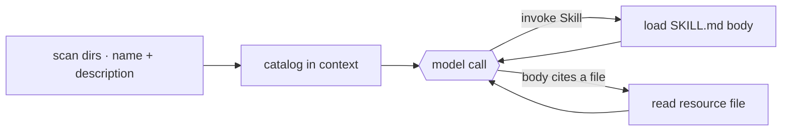

# 7 · Skills

> A skill is a named instruction bundle loaded only when needed.

Skills let an agent use extra instructions without putting all of them in the system prompt.

Each skill is a folder with a `SKILL.md` file. The frontmatter describes the skill. The body contains the instructions.

The agent needs to know that skills exist, but it should not pay for every skill body on every turn.

The skill system must:

1. List available skills cheaply.
2. Load full instructions only when a skill is selected.
3. Let skills point to extra files without loading them automatically.
4. Discover skills from built-in, user, project, plugin, or MCP sources.

Without this layer, the prompt is either too large or the agent cannot find its extensions.

---

## Mechanism

Skills use progressive disclosure. The model sees only enough information to decide whether to load more.

1. **Metadata.** `name` and `description` from frontmatter. This cheap catalog is visible every turn.
2. **Instructions.** The `SKILL.md` body. It is loaded only when the model invokes the skill.
3. **Resources.** Extra files in the skill folder. They are read only when the instructions point to them.



### New: scan and the Skill tool

```python
@dataclass
class Skill:                                   # src/skills.py
    name: str
    description: str                           # L1: frontmatter -> the catalog
    path: Path                                # SKILL.md; the body is read on invoke

def load_skills(skills_dir) -> list[Skill]:    # L1: scan <dir>/<name>/SKILL.md at startup
    skills = []
    for sub in sorted(Path(skills_dir).iterdir()):
        meta, _ = _split((sub / "SKILL.md").read_text())   # keep frontmatter, not the body
        skills.append(Skill(meta["name"], meta["description"], sub / "SKILL.md"))
    return skills

def skill_tool(skills) -> Tool:                # L2: read the body from disk on invoke
    by_name = {s.name: s for s in skills}
    def load(a):
        _, body = _split(by_name[a["name"]].path.read_text())
        return body                            # tool result -> enters messages[]
    return Tool("Skill", load, is_read_only=True)
```

- `load_skills` scans `SKILL.md` files and keeps only frontmatter for the catalog.
- `skill_tool` reads the selected body on demand.
- Resources are not a separate skill mechanism. The loaded instructions point to files, and the normal file tool reads them.
- Skills load by registered name, not by arbitrary path.

### How it integrates

The loop does not change. A skill is a tool result that enters `messages[]`.

The catalog belongs in the prompt. The full body belongs in the conversation only after invocation. Resource files are read later only if needed.

Because loaded skill text lives in `messages[]`, it can be compacted like any other message. Keep skill bodies short and point to files for large references.

---

## Per system

How each agent describes, triggers, and finds skills.

| System | Skill format | Load trigger | Discovery |
| --- | --- | --- | --- |
| **Claude Code** | `SKILL.md` folder with frontmatter and body. | `Skill` tool invocation. | Built-in, user, project, plugin, and MCP sources. |

### Claude Code

- `loadSkillsDir.ts` builds the visible catalog within a budget.
- `SkillTool.ts` returns the body as `newMessages`.
- The visible result is a short launch message.
- Frontmatter can include `when_to_use`, `allowed-tools`, `context`, `paths`, `model`, and `user-invocable`.
- `context: 'fork'` runs the skill in a forked subagent.
- `paths` can activate skills when matching files are touched.
- MCP-served skills and legacy `.claude/commands/` use the same machinery.

> **Trade-off:** A cheap catalog keeps context small. It also depends on good descriptions. If the description is vague, the model may never load the skill.

---

## Failure modes

- **Skill never fires.** The description is too vague. Write trigger-shaped descriptions.
- **Catalog gets too large.** Too many skills can crowd the prompt. Keep skills focused and let the loader trim.
- **Body is lost after compaction.** Re-invoke the skill or keep the body short.
- **Path traversal.** Do not load by raw path. Resolve resources inside the registered skill directory.
- **Forked skill loses live context.** Use forked skills only for self-contained work.

---

## Runnable

[`src/`](src/) carries 06 forward and adds:

- [`skills.py`](src/skills.py): catalog scan and the `Skill` tool.
- `skills/<name>/SKILL.md`: sample skills, including one with a resource file.
- [`loop.py`](src/loop.py): unchanged because a skill is just another tool.
- [`test.py`](src/test.py): checks catalog scan, body load, and bundled files.

```bash
python sections/07-skills/src/test.py         # offline checks, no key
uv run python sections/07-skills/src/demo.py  # live demo, needs a key
```

---

## Sources

- Claude Code source: `skills/loadSkillsDir.ts`, `skills/bundledSkills.ts`, `skills/mcpSkillBuilders.ts`, `tools/SkillTool/SkillTool.ts`, `tools/SkillTool/prompt.ts`.
- [Anthropic Agent Skills best practices](https://platform.claude.com/docs/en/agents-and-tools/agent-skills/best-practices): progressive disclosure levels.
- learn-claude-code · s07_skill_loading: section framing.
