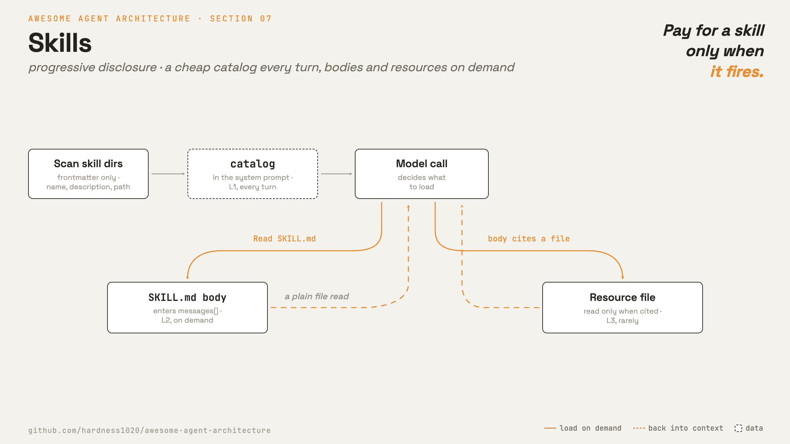

# 7 · Skills

[English](README.md) · [繁體中文](README.zh-TW.md) · **简体中文**

> skill 是一个自成一体的专长包，包含指令，还有需要用到的 script 和文件，只在某个任务需要时才加载。

skill 让一个通用的 agent，变成专做某件事的专家。
它打包的是一整套工作流程：要遵循的指令，加上需要执行的 script 和要参考的文件。
agent 只在任务用得到时才加载某个 skill，所以一个 agent 可以拥有很多专门能力，却不用一开始就全部加载。

每个 skill 是一个文件夹，里面有一个 `SKILL.md` 文件。frontmatter 为这个 skill 命名并描述它。
正文放的是指令，而文件夹还可以打包额外的 script 和参考文件，只有在 skill 用到时才加载。

agent 需要知道有哪些 skill 存在，但它不应该为了每个 skill 的正文，在每一个 turn 都付出代价。

skill 系统必须做到：

1. 用很低的成本列出可用的 skill。
2. 只在某个 skill 被选中时，才加载完整指令。
3. 让 skill 可以指向额外的文件，而不会自动加载它们。
4. 从 built-in、user、project、plugin 或 MCP 来源探索 skill。

没有这一层，prompt 不是太大，就是 agent 找不到它的扩展功能。

---

## 机制



skill 使用 progressive disclosure。模型只会看到刚好足够的信息，来决定要不要加载更多。

1. **Metadata。** 来自 frontmatter 的 `name` 和 `description`，再加上这个 skill 的路径。这份 catalog 只占少量 token，所以一直放在 system prompt 里。
2. **Instructions。** `SKILL.md` 的正文。只有在某个任务需要这个 skill 时，模型才会去读这个文件。
3. **Resources。** skill 文件夹里的额外文件。指令指向它们时，模型用同一个 file tool 读取。

不需要专门的 skill tool。只要 catalog 列出每个 skill 的名称和路径，agent 就用普通的 Read tool 去读那个文件来加载 skill。L2 和 L3 都只是读文件而已。

### New: scan the skills and list them in the prompt

```python
@dataclass
class Skill:                                   # src/skills.py
    name: str
    description: str                           # L1: frontmatter -> the catalog
    path: Path                                # SKILL.md; the body is read on demand

def load_skills(skills_dir) -> list[Skill]:    # L1: scan <dir>/<name>/SKILL.md at startup
    skills = []
    for sub in sorted(Path(skills_dir).iterdir()):
        meta, _ = _split((sub / "SKILL.md").read_text())   # keep frontmatter, not the body
        skills.append(Skill(meta["name"], meta["description"], sub / "SKILL.md"))
    return skills

def catalog_prompt(skills, base_dir) -> str:   # L1: the block added to the system prompt
    lines = [f"- {s.name}: {s.description} (read {s.path.relative_to(base_dir)})" for s in skills]
    return "Available skills (read a skill's path with the Read tool):\n" + "\n".join(lines)
```

- `load_skills` 扫描 `SKILL.md` 文件，只保留 frontmatter 给 catalog。
- `catalog_prompt` 把这份 catalog 渲染进 system prompt，每个 skill 一行，附上要读取的路径。
- 正文和 resource 都是普通文件。普通的 Read tool 在需要时加载它们，所以不需要专门的 skill tool。
- Read tool 的范围限制在 skills 目录内，所以 skill 名称永远无法逃逸到文件系统其他地方。

### New: the store evolves

skill 系统不是只有加载这件事。skill store 本身也会成长、也会淘汰（Hermes 称之为 skill 演化）。

成长靠写入。agent 把一段做完的工作流程沉淀成新的 skill，下一次运行就直接加载指令，不用重新摸索：

```python
def write_skill(skills_dir, name, description, body) -> Path:   # src/skills.py
    base = Path(skills_dir).resolve()
    target = (base / name / "SKILL.md").resolve()
    if not target.is_relative_to(base):              # a name can never escape the skills dir
        raise ValueError(f"skill name {name!r} escapes the skills dir")
    target.parent.mkdir(parents=True, exist_ok=True)
    target.write_text(f"---\nname: {name}\ndescription: {description}\n---\n{body}\n")
    return target
```

- `WriteSkill` 是包住这个函数、面向模型的 tool。写入 skill 会改动文件系统，属于有副作用的操作，所以第 3 章的权限闸门默认会先征询用户；只有 allow 规则预先核准过，才会直接放行。
- 写出来的文件就是普通的 `SKILL.md`。没有任何特殊标记：下一次 `load_skills` 扫描会把它当成一般的 skill 编入 catalog。
- 名称的解析和检查方式跟 `read_tool` 检查路径一样，所以不论读还是写，都逃不出 skills 目录。

要淘汰，得先测量。加载 skill 本身就是使用信号，所以 `read_tool` 在读文件的同时顺手记录：

```python
if target.name == "SKILL.md":                # inside read_tool's read()
    record_use(base, target.parent.name)     # loading a skill counts as use
```

```python
def record_use(skills_dir, name, now=None) -> dict:
    path = Path(skills_dir) / USAGE_FILE     # .usage.json, one record per skill
    usage = json.loads(path.read_text()) if path.exists() else {}
    entry = usage.setdefault(name, {"uses": 0})
    entry["uses"] += 1
    entry["last_used_at"] = now if now is not None else time.time()
    path.write_text(json.dumps(usage))
    return entry

def stale_skills(skills_dir, skills, now=None, stale_after=STALE_AFTER) -> list[str]:
    usage = ...                                  # load .usage.json, default {}
    return [s.name for s in skills
            if now - usage.get(s.name, {}).get("last_used_at", 0) >= stale_after]
```

- 这笔记录以 skill 的文件夹名称为 key，取自模型读取的路径。读 resource（L3）不会累计，只有读 `SKILL.md` 正文（L2）才算。
- 没有记录的 skill，`last_used_at` 是 0，所以从未用过的 skill 也算 stale。
- `stale_skills` 是一份报告，不是一个动作。怎么处理是 curator 的工作；Hermes 用一个后台 curator agent 处理同样的信号（归档、合并、固定（pin））。
- 数据流是一个跨运行的 loop：读取更新 `.usage.json`，curator 读它，catalog 反映留下来的 skill，`WriteSkill` 再补进新条目。

### How it integrates

loop 不用改。读取 skill 就是一次普通的工具调用，tool 结果照样进入 `messages[]`。

三层各有位置：catalog 放在 system prompt。skill 正文要等模型读了 `SKILL.md`，才会进到对话里。resource 文件则等到真的用到时才读。

加载后的 skill 文本就在 `messages[]` 里，所以之后 context 不够用时，它会跟其他消息一起被压缩（第 8 章）。skill 正文要写短，大型参考资料改成指向文件。

---

## 各系统做法

各 agent 如何描述、触发并找到 skill。

| | Claude Code | Hermes Agent |
| --- | --- | --- |
| **Pros** | catalog 建立时有预算上限。skill 可以 fork 成 subagent，还能限制可用的 tool。 | curator 会合并新 skill、归档过期的。hub 安装会经过检查。 |
| **Cons** | 描述太含糊，模型就不会去加载。forked skill 拿不到即时情境。 | 描述含糊在这里一样会埋没 skill。自动改动需要 pin 和暂存核准来把关。 |
| **Why** | skill 还要 fork、还要限制 tool，单纯读文件不够用。 | 加载只是一半，store 本身还要能成长、能淘汰。 |
| **How: skill format** | 带有 frontmatter 和正文的 `SKILL.md` 文件夹。frontmatter 还能限制 tool、指定模型。 | 同样的形式，依分类文件夹整理。 |
| **How: load trigger** | invoke `Skill` tool，正文注入对话。改到符合条件的文件也会触发。 | `skill_view` 返回正文、列出关联文件，并累计使用次数。 |
| **How: discovery** | built-in、user、project、plugin 和 MCP 来源。旧的 slash command 走同一套机制。 | bundled、optional、user、plugin 和 GitHub hub 来源。 |

---

## 哪里会出错

- **skill 从不触发：**描述太含糊。把触发条件直接写进描述里。
- **catalog 变得太大：**skill 太多会挤爆 prompt。让 skill 保持聚焦，并让 loader 做裁剪。
- **压缩后正文丢失：**重新读取该 skill 文件，或让正文保持简短。
- **Path traversal：**catalog 会把路径交给模型。把 Read tool 的范围限制在 skills 目录，让 `../` 无法逃出去。
- **forked skill 失去即时情境：**只在自成一体的工作上使用 forked skill。

---

## 可执行程序

[`src/`](src/) 沿用 06 并加上：

- [`skills.py`](src/skills.py)：catalog 扫描、system prompt 列表、限定范围的 `Read` tool，以及演化那一半（`WriteSkill`、`record_use`、`stale_skills`）。
- `skills/<name>/SKILL.md`：示例 skill，包含一个带有 resource 文件的 skill。
- [`loop.py`](src/loop.py)：未变动，因为加载一个 skill 只是读一个文件。
- [`test.py`](src/test.py)：检查 catalog 扫描、prompt 列表、文件加载、path traversal 的拒绝、使用计数、staleness，以及 agent 写出的 skill 进入 catalog。
- [`demo.py`](src/demo.py)：agent 用了一个 skill，接着存下一个新的；收尾的扫描显示 store 长大了。

```bash
python sections/07-skills/src/test.py         # offline checks, no key
uv run python sections/07-skills/src/demo.py  # live demo, needs a key
```

---

## 出处

- [Claude Code 源码](https://github.com/yasasbanukaofficial/claude-code)：`skills/loadSkillsDir.ts`、`skills/bundledSkills.ts`、`skills/mcpSkillBuilders.ts`、`tools/SkillTool/SkillTool.ts`、`tools/SkillTool/prompt.ts`。
- [Hermes Agent 源码](https://github.com/NousResearch/hermes-agent)：`tools/skills_tool.py`（`skills_list`、`skill_view`）、`tools/skill_usage.py`、`hermes_cli/curator.py`、`tools/skills_hub.py`、`tools/skills_ast_audit.py`。
- [Anthropic Agent Skills best practices](https://platform.claude.com/docs/en/agents-and-tools/agent-skills/best-practices)：progressive disclosure 的层级。
- [learn-claude-code · s07_skill_loading](https://github.com/shareAI-lab/learn-claude-code)：章节框架。
