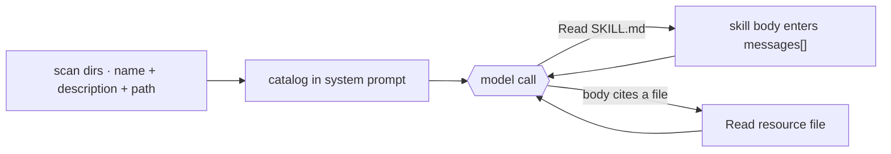

# 7 · Skills

[English](README.md) · [繁體中文](README.zh-TW.md) · **简体中文**

> skill 是一个自成一体的专长包，包含指令，还有需要用到的 script 和文件，只在某个任务需要时才加载。

skill 让一个通用的 agent，变成专做某件事的专家。
它打包的是一整套工作流程：要遵循的指令，加上需要执行的 script 和要参考的文件。
agent 只在任务用得到时才加载某个 skill，所以一个 agent 可以拥有很多专门能力，却不用一开始就把它们全部扛在身上。

每个 skill 是一个文件夹，里面有一个 `SKILL.md` 文件。frontmatter 为这个 skill 命名并描述它。
正文放的是指令，而文件夹还可以打包额外的 script 和参考文件，只有在 skill 用到时才加载。

agent 需要知道有哪些 skill 存在，但它不应该为了每个 skill 的正文，在每一个 turn 都付出代价。

skill 系统必须做到：

1. 用很低的成本列出可用的 skill。
2. 只在某个 skill 被选中时，才加载完整指令。
3. 让 skill 可以指向额外的文件，而不会自动加载它们。
4. 从 built-in、user、project、plugin 或 MCP 来源探索 skill。

没有这一层，prompt 不是太大，就是 agent 找不到它的扩展功能。

---

## 机制

skill 使用 progressive disclosure。模型只会看到刚好足够的信息，来决定要不要加载更多。

1. **Metadata。** 来自 frontmatter 的 `name` 和 `description`，再加上这个 skill 的路径。这份低成本的 catalog 每个 turn 都待在 system prompt 里。
2. **Instructions。** `SKILL.md` 的正文。只有在某个任务需要这个 skill 时，模型才会去读这个文件。
3. **Resources。** skill 文件夹里的额外文件。指令指向它们时，模型用同一个 file tool 读取。

不需要专门的 skill tool。只要 catalog 列出每个 skill 的名称和路径，agent 就用普通的 Read tool 去读那个文件来加载 skill。L2 和 L3 都只是读文件而已。



### New: scan the skills and list them in the prompt

```python
@dataclass
class Skill:                                   # src/skills.py
    name: str
    description: str                           # L1: frontmatter -> the catalog
    path: Path                                # SKILL.md; the body is read on demand

def load_skills(skills_dir) -> list[Skill]:    # L1: scan <dir>/<name>/SKILL.md at startup
    skills = []
    for sub in sorted(Path(skills_dir).iterdir()):
        meta, _ = _split((sub / "SKILL.md").read_text())   # keep frontmatter, not the body
        skills.append(Skill(meta["name"], meta["description"], sub / "SKILL.md"))
    return skills

def catalog_prompt(skills, base_dir) -> str:   # L1: the block added to the system prompt
    lines = [f"- {s.name}: {s.description} (read {s.path.relative_to(base_dir)})" for s in skills]
    return "Available skills (read a skill's path with the Read tool):\n" + "\n".join(lines)
```

- `load_skills` 扫描 `SKILL.md` 文件，只保留 frontmatter 给 catalog。
- `catalog_prompt` 把这份 catalog 渲染进 system prompt，每个 skill 一行，附上要读取的路径。
- 正文和 resource 都是普通文件。普通的 Read tool 在需要时加载它们，所以不需要专门的 skill tool。
- Read tool 的范围限制在 skills 目录内，所以 skill 名称永远无法逃逸到文件系统其他地方。

### How it integrates

循环不会改变。读取一个 skill，会返回一个进入 `messages[]` 的 tool 结果。

catalog 属于 system prompt。正文只有在模型读了那个文件之后，才会进入这段对话。resource 文件只有在需要时才会稍后读取。

因为加载的 skill 文本存在于 `messages[]`，它可以像其他消息一样被压缩。让 skill 正文保持简短，大型参考资料则指向文件。

---

## 各系统做法

各 agent 如何描述、触发并找到 skill。

| System | Skill format | Load trigger | Discovery |
| --- | --- | --- | --- |
| **Claude Code** | 带有 frontmatter 和正文的 `SKILL.md` 文件夹。 | invoke `Skill` tool。 | built-in、user、project、plugin 和 MCP 来源。 |

### Claude Code

- `loadSkillsDir.ts` 在一定预算内建立可见的 catalog。
- `SkillTool.ts` 以 `newMessages` 返回正文。
- 可见的结果是一则简短的启动消息。
- frontmatter 可以包含 `when_to_use`、`allowed-tools`、`context`、`paths`、`model` 和 `user-invocable`。
- `context: 'fork'` 会在一个 forked subagent 中运行该 skill。
- `paths` 可以在符合条件的文件被改动到时启用 skill。
- MCP 提供的 skill 和旧的 `.claude/commands/` 使用同一套机制。
- 只提供指令的 skill 不需要专门的 tool。Claude Code 之所以用 `SkillTool.ts` 包住正文加载，是因为它的 skill 还会 fork 并限制可用工具，这是单纯读文件做不到的。

> **取舍：** 低成本的 catalog 让情境保持精简。它也依赖好的描述。如果描述含糊不清，模型可能永远不会加载这个 skill。

---

## 失效模式

- **skill 从不触发。** 描述太含糊。写成带有触发条件形状的描述。
- **catalog 变得太大。** skill 太多会挤爆 prompt。让 skill 保持聚焦，并让 loader 做裁剪。
- **压缩后正文丢失。** 重新读取该 skill 文件，或让正文保持简短。
- **Path traversal。** catalog 会把路径交给模型。把 Read tool 的范围限制在 skills 目录，让 `../` 无法逃出去。
- **forked skill 失去即时情境。** 只在自成一体的工作上使用 forked skill。

---

## 可执行程序

[`src/`](src/) 沿用 06 并加上：

- [`skills.py`](src/skills.py)：catalog 扫描、system prompt 列表，以及一个限定范围的 `Read` tool。
- `skills/<name>/SKILL.md`：示例 skill，包含一个带有 resource 文件的 skill。
- [`loop.py`](src/loop.py)：未变动，因为加载一个 skill 只是读一个文件。
- [`test.py`](src/test.py)：检查 catalog 扫描、prompt 列表、文件加载，以及 path traversal 的拒绝。

```bash
python sections/07-skills/src/test.py         # offline checks, no key
uv run python sections/07-skills/src/demo.py  # live demo, needs a key
```

---

## 出处

- Claude Code 源码：`skills/loadSkillsDir.ts`、`skills/bundledSkills.ts`、`skills/mcpSkillBuilders.ts`、`tools/SkillTool/SkillTool.ts`、`tools/SkillTool/prompt.ts`。
- [Anthropic Agent Skills best practices](https://platform.claude.com/docs/en/agents-and-tools/agent-skills/best-practices)：progressive disclosure 的层级。
- learn-claude-code · s07_skill_loading：章节框架。
