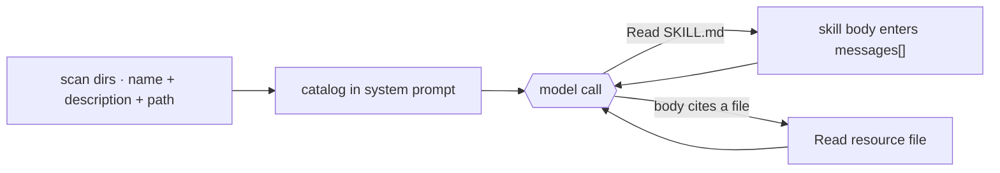

# 7 · Skills

[English](README.md) · **繁體中文** · [简体中文](README.zh-CN.md)

> skill 是一個自成一體的專長包，包含指令，還有需要用到的 script 和檔案，只在某個任務需要時才載入。

skill 讓一個通用的 agent，變成專做某件事的專家。
它打包的是一整套工作流程：要遵循的指令，加上需要執行的 script 和要參考的檔案。
agent 只在任務用得到時才載入某個 skill，所以一個 agent 可以擁有很多專門能力，卻不用一開始就把它們全部扛在身上。

每個 skill 是一個資料夾，裡面有一個 `SKILL.md` 檔案。frontmatter 為這個 skill 命名並描述它。
本文放的是指令，而資料夾還可以打包額外的 script 和參考檔案，只有在 skill 用到時才載入。

agent 需要知道有哪些 skill 存在，但它不應該為了每個 skill 的本文，在每一個 turn 都付出代價。

skill 系統必須做到：

1. 用很低的成本列出可用的 skill。
2. 只在某個 skill 被選中時，才載入完整指令。
3. 讓 skill 可以指向額外的檔案，而不會自動載入它們。
4. 從 built-in、user、project、plugin 或 MCP 來源探索 skill。

沒有這一層，prompt 不是太大，就是 agent 找不到它的擴充功能。

---

## 機制

skill 使用 progressive disclosure。模型只會看到剛好足夠的資訊，來決定要不要載入更多。

1. **Metadata。** 來自 frontmatter 的 `name` 和 `description`，再加上這個 skill 的路徑。這份低成本的 catalog 每個 turn 都待在 system prompt 裡。
2. **Instructions。** `SKILL.md` 的本文。只有在某個任務需要這個 skill 時，模型才會去讀這個檔案。
3. **Resources。** skill 資料夾裡的額外檔案。指令指向它們時，模型用同一個 file tool 讀取。

不需要專門的 skill tool。只要 catalog 列出每個 skill 的名稱和路徑，agent 就用一般的 Read tool 去讀那個檔案來載入 skill。L2 和 L3 都只是讀檔而已。



### New: scan the skills and list them in the prompt

```python
@dataclass
class Skill:                                   # src/skills.py
    name: str
    description: str                           # L1: frontmatter -> the catalog
    path: Path                                # SKILL.md; the body is read on demand

def load_skills(skills_dir) -> list[Skill]:    # L1: scan <dir>/<name>/SKILL.md at startup
    skills = []
    for sub in sorted(Path(skills_dir).iterdir()):
        meta, _ = _split((sub / "SKILL.md").read_text())   # keep frontmatter, not the body
        skills.append(Skill(meta["name"], meta["description"], sub / "SKILL.md"))
    return skills

def catalog_prompt(skills, base_dir) -> str:   # L1: the block added to the system prompt
    lines = [f"- {s.name}: {s.description} (read {s.path.relative_to(base_dir)})" for s in skills]
    return "Available skills (read a skill's path with the Read tool):\n" + "\n".join(lines)
```

- `load_skills` 掃描 `SKILL.md` 檔案，只保留 frontmatter 給 catalog。
- `catalog_prompt` 把這份 catalog 渲染進 system prompt，每個 skill 一行，附上要讀取的路徑。
- 本文和 resource 都是普通檔案。一般的 Read tool 在需要時載入它們，所以不需要專門的 skill tool。
- Read tool 的範圍限制在 skills 目錄內，所以 skill 名稱永遠無法逃逸到檔案系統其他地方。

### New: the store evolves

skill 系統不是只有載入這件事。skill store 本身也會成長、也會汰舊（Hermes 稱之為 skill 演化）。

成長靠寫入。agent 把一段做完的工作流程沉澱成新的 skill，下一次執行就直接載入指令，不用重新摸索：

```python
def write_skill(skills_dir, name, description, body) -> Path:   # src/skills.py
    base = Path(skills_dir).resolve()
    target = (base / name / "SKILL.md").resolve()
    if not target.is_relative_to(base):              # a name can never escape the skills dir
        raise ValueError(f"skill name {name!r} escapes the skills dir")
    target.parent.mkdir(parents=True, exist_ok=True)
    target.write_text(f"---\nname: {name}\ndescription: {description}\n---\n{body}\n")
    return target
```

- `WriteSkill` 是包住這個函式、面向模型的 tool。寫入 skill 會改動檔案系統，屬於有副作用的操作，所以第 3 章的權限閘門預設會先徵詢使用者；只有 allow 規則預先核准過，才會直接放行。
- 寫出來的檔案就是普通的 `SKILL.md`。沒有任何特殊標記：下一次 `load_skills` 掃描會像收錄手寫 skill 一樣把它編入 catalog。
- 名稱的解析和檢查方式跟 `read_tool` 檢查路徑一樣，所以不論讀或寫，都逃不出 skills 目錄。

要汰舊，得先量測。載入 skill 本身就是使用訊號，所以 `read_tool` 在讀檔的同時順手記錄：

```python
if target.name == "SKILL.md":                # inside read_tool's read()
    record_use(base, target.parent.name)     # loading a skill counts as use
```

```python
def record_use(skills_dir, name, now=None) -> dict:
    path = Path(skills_dir) / USAGE_FILE     # .usage.json, one record per skill
    usage = json.loads(path.read_text()) if path.exists() else {}
    entry = usage.setdefault(name, {"uses": 0})
    entry["uses"] += 1
    entry["last_used_at"] = now if now is not None else time.time()
    path.write_text(json.dumps(usage))
    return entry

def stale_skills(skills_dir, skills, now=None, stale_after=STALE_AFTER) -> list[str]:
    usage = ...                                  # load .usage.json, default {}
    return [s.name for s in skills
            if now - usage.get(s.name, {}).get("last_used_at", 0) >= stale_after]
```

- 這筆記錄以 skill 的資料夾名稱為 key，取自模型讀取的路徑。讀 resource（L3）不會累計，只有讀 `SKILL.md` 本文（L2）才算。
- 沒有記錄的 skill，`last_used_at` 是 0，所以從未用過的 skill 也算 stale。
- `stale_skills` 是一份報告，不是一個動作。要怎麼處理是 curator 的工作；Hermes 用一個背景 curator agent 處理同樣的訊號（封存、整併、釘選）。
- 資料流是一個跨執行的迴圈：讀取更新 `.usage.json`，curator 讀它，catalog 反映留下來的 skill，`WriteSkill` 再補進新條目。

### How it integrates

迴圈不會改變。讀取一個 skill，會回傳一個進入 `messages[]` 的 tool 結果。

catalog 屬於 system prompt。本文只有在模型讀了那個檔案之後，才會進入這段對話。resource 檔案只有在需要時才會稍後讀取。

因為載入的 skill 文字存在於 `messages[]`，它可以像其他訊息一樣被壓縮。讓 skill 本文保持簡短，大型參考資料則指向檔案。

---

## 各系統做法

各 agent 如何描述、觸發並找到 skill。

| System | Skill format | Load trigger | Discovery |
| --- | --- | --- | --- |
| **Claude Code** | 帶有 frontmatter 和本文的 `SKILL.md` 資料夾。 | invoke `Skill` tool。 | built-in、user、project、plugin 和 MCP 來源。 |
| **Hermes Agent** | 帶有 frontmatter 和本文的 `SKILL.md` 資料夾。 | invoke `skill_view` tool。 | bundled、optional、user、plugin 和 GitHub hub 來源。 |

### Claude Code

- `loadSkillsDir.ts` 在一定預算內建立可見的 catalog。
- `SkillTool.ts` 以 `newMessages` 回傳本文。
- 可見的結果是一則簡短的啟動訊息。
- frontmatter 可以包含 `when_to_use`、`allowed-tools`、`context`、`paths`、`model` 和 `user-invocable`。
- `context: 'fork'` 會在一個 forked subagent 中執行該 skill。
- `paths` 可以在符合條件的檔案被動到時啟用 skill。
- MCP 提供的 skill 和舊的 `.claude/commands/` 使用同一套機制。
- 只提供指令的 skill 不需要專門的 tool。Claude Code 之所以用 `SkillTool.ts` 包住本文載入，是因為它的 skill 還會 fork 並限制可用工具，這是單純讀檔做不到的。

### Hermes Agent

- 兩個 tool 完成 disclosure：`skills_list` 回傳 catalog，`skill_view` 回傳本文，外加一個列出 references、templates 和 scripts 的 `linked_files` dict。
- skill 依分類資料夾整理。內建 skill 放在 `skills/`，額外的在 `optional-skills/`，plugin skill 使用 `plugin:skill` 的限定名稱形式。
- hub skill 從 GitHub 安裝（`skills_hub.py`）。`HubLockFile` 記錄 repo 和內容雜湊，quarantine 目錄存放被拒絕的 skill。
- `skills_ast_audit.py` 掃描 skill script 裡的動態 import，標記為審查提示，而不是硬性關卡。
- skill 會演化。每次 `skill_view` 都會累計 `.usage.json` 裡的 view 和 use 計數（`skill_usage.py`）。curator 的 stale 計時器以 `last_used_at` 為準。
- curator（`agent/curator.py`、`hermes_cli/curator.py`）跑一個 forked 背景審查 agent，整併 agent 寫出的 skill，並封存過期的。
- 防護規則拒絕 curator 寫入釘選、hub 安裝或內建的 skill。`hermes curator pin` 保護一個 skill；`PROTECTED_BUILTIN_SKILLS` 讓 `plan` 永不被封存。
- skill 寫入可以先暫存等待核准（`write_approval.py`），而不是直接落地。

> **取捨：** 低成本的 catalog 讓情境保持精簡。它也仰賴好的描述。如果描述含糊不清，模型可能永遠不會載入這個 skill。

---

## 失效模式

- **skill 從不觸發：**描述太含糊。寫成帶有觸發條件形狀的描述。
- **catalog 變得太大：**skill 太多會擠爆 prompt。讓 skill 保持聚焦，並讓 loader 做裁剪。
- **壓縮後本文遺失：**重新讀取該 skill 檔案，或讓本文保持簡短。
- **Path traversal：**catalog 會把路徑交給模型。把 Read tool 的範圍限制在 skills 目錄，讓 `../` 無法逃出去。
- **forked skill 失去即時情境：**只在自成一體的工作上使用 forked skill。

---

## 可執行程式

[`src/`](src/) 沿用 06 並加上：

- [`skills.py`](src/skills.py)：catalog 掃描、system prompt 列表、限定範圍的 `Read` tool，以及演化那一半（`WriteSkill`、`record_use`、`stale_skills`）。
- `skills/<name>/SKILL.md`：範例 skill，包含一個帶有 resource 檔案的 skill。
- [`loop.py`](src/loop.py)：未變動，因為載入一個 skill 只是讀一個檔案。
- [`test.py`](src/test.py)：檢查 catalog 掃描、prompt 列表、檔案載入、path traversal 的拒絕、使用計數、staleness，以及 agent 寫出的 skill 進入 catalog。
- [`demo.py`](src/demo.py)：agent 用了一個 skill，接著存下一個新的；收尾的掃描顯示 store 長大了。

```bash
python sections/07-skills/src/test.py         # offline checks, no key
uv run python sections/07-skills/src/demo.py  # live demo, needs a key
```

---

## 出處

- Claude Code 原始碼：`skills/loadSkillsDir.ts`、`skills/bundledSkills.ts`、`skills/mcpSkillBuilders.ts`、`tools/SkillTool/SkillTool.ts`、`tools/SkillTool/prompt.ts`。
- Hermes Agent 原始碼：`tools/skills_tool.py`（`skills_list`、`skill_view`）、`tools/skill_usage.py`、`hermes_cli/curator.py`、`tools/skills_hub.py`、`tools/skills_ast_audit.py`。
- [Anthropic Agent Skills best practices](https://platform.claude.com/docs/en/agents-and-tools/agent-skills/best-practices)：progressive disclosure 的層級。
- learn-claude-code · s07_skill_loading：章節框架。
