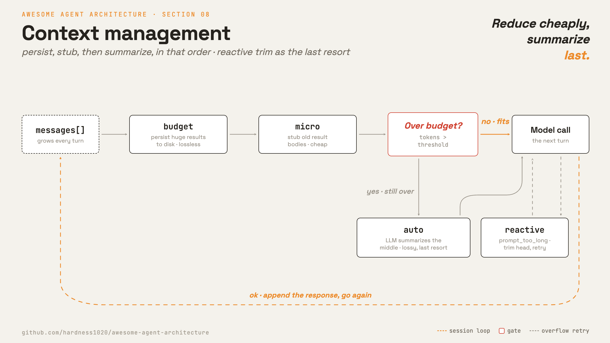

# 8 · Context management

[English](README.md) · [繁體中文](README.zh-TW.md) · **简体中文**

> 让长时间的 session 维持在 context limit 以内。

`messages[]` 会在执行过程中不断增长。每个 tool 结果、assistant 回复和 user turn 都会加入更多文字。长时间的 session 最终会碰到模型的 context limit。

context management 让 session 保持可用。它会在下一次 model call 之前，移除、用 stub 替换、持久化或摘要旧的内容。

当上下文被填满时：

1. API 可能会拒绝该请求。
2. 调用会变得更慢也更贵。
3. 旧的、比较没用的内容，会和当前任务的信息互相竞争。

没有这一层，一旦 prompt 塞不下，长任务就会失败。

---

## 机制



在摘要之前先用低成本的 reducer。低成本的 reducer 是本地处理，而且大致上不损失信息。摘要则要付出一次 model call，而且可能丢失细节。

Claude Code 采用分层的顺序：

```text
budget   -> persist huge tool results to disk, leave a preview
snip     -> drop stale middle turns, keep head + recent tail
micro    -> replace old tool-result bodies with a stub
collapse -> optional independent context system
auto     -> LLM summarizes the whole history into one message
--- on prompt_too_long despite the above ---
reactive -> truncate the head and re-summarize, with a retry cap
```

顺序很重要。举例来说，大型的 tool 结果应该先被持久化，之后任何 pass 才可以用 stub 替换它的本体。

### New: the reduction passes

```python
def manage(messages, summarizer=None):                 # src/context.py, run every turn
    _budget(messages)                                  # persist huge results   (lossless)
    _micro(messages, KEEP_RECENT)                      # stub old result bodies (cheap)
    if summarizer and estimate_tokens(messages) > TOKEN_LIMIT:
        return _auto(messages, KEEP_RECENT, summarizer)  # summarize history (lossy, last resort)
    return messages
```

- `manage` 在每个 turn 执行低成本的 pass。
- `_budget` 把过大的 tool 结果写到磁盘，并留下一段简短的 preview。
- `_micro` 把旧的 tool 结果本体换成 stub。
- `_auto` 保留第一个 turn 和最近的尾端，然后摘要中间的部分。
- `summarizer=None` 在 demo 中禁用了会损失信息的摘要。

### How it integrates

context management 在每次 model call 之前执行：

```python
for _ in range(max_steps):                             # src/loop.py
    messages = context.manage(messages, summarizer=summarizer)   # 8 · keep context under the window
    response = model(messages, registry)
    ...
```

这是一个真正的循环变更。先前的章节加的是 tool 或 dispatch 行为。context 必须在 model call 之前执行，所以它属于循环。

循环仍然维持同样的不变条件：它用一个有效的 `messages[]` 调用模型，接着附上响应和任何 tool 结果。

---

## 各系统做法

各 agent 如何决定要腾出空间，以及要移除什么。

| System | Trigger | Strategy | Budget rule |
| --- | --- | --- | --- |
| **Claude Code** | token 阈值加上溢出时的后备方案。 | 先用低成本 reducer，再用 LLM 摘要。 | 保留 output 和安全缓冲空间。 |

### Claude Code

- `query.ts` 在 model call 之前执行这些 pass。
- `applyToolResultBudget` 把超过单条消息字符上限的 tool 结果持久化。
- 被持久化的结果会留下一段 preview 和一个类似路径的标记。
- `microcompactMessages` 把旧的 tool 结果本体清成 stub。
- `autoCompactIfNeeded` 只在 token 数仍然超过阈值时才调用模型。
- 压缩之后，最近的文件可以在一定的 token 预算内被还原。
- reactive compaction 处理的是在 proactive pass 失败后才出现的 `prompt_too_long` 响应。

> **取舍：** 分层的 reducer 让长 session 成为可能，也让许多次的缩减都保持低成本。
> 它们也带来排序规则和摘要风险。
> 摘要可能省略掉模型之后会用到的细节。

---

## 失效模式

- **摘要漏掉需要的细节：**持久化完整输出，并在需要时重新读取文件。
- **压缩反复失败：**使用 retry 上限或断路器。
- **单个巨大 turn 仍然溢出：**对 `prompt_too_long` 做出反应，执行一次有界限的最后手段裁剪。
- **pass 顺序错误而丢失数据：**在把旧结果 stub 化之前，先持久化大型结果。
- **拆散的 tool 配对：**不要把一个 `tool_use` 和它相配的 `tool_result` 拆开。

---

## 可执行程序

[`src/`](src/) 沿用 07 并加上：

- [`context.py`](src/context.py)：`budget`、`micro` 和 `auto` 这几个 pass 都通过 `manage` 执行。
- [`loop.py`](src/loop.py)：在每个 turn 的最上方调用 `context.manage()`。
- [`test.py`](src/test.py)：独立检查每一个 pass。
- [`demo.py`](src/demo.py)：驱动已接上 context management 的循环。

```bash
python sections/08-context-management/src/test.py         # offline checks, no key
uv run python sections/08-context-management/src/demo.py  # live demo, needs a key
```

---

## 来源

- Claude Code 源码：`services/compact/autoCompact.ts`、`microCompact.ts`、`timeBasedMCConfig.ts`、`compact.ts`、`utils/toolResultStorage.ts`、`query.ts`、`query/tokenBudget.ts`。
- learn-claude-code · s08_context_compact：章节框架。

推测而来，并未完整存在于这份 clone 中：

- `snipCompact.ts`：只看得到 `snipCompactIfNeeded(messages)` 的调用点。
- `reactiveCompact.ts`：reactive 路径看起来位于 `compact.ts` 中。
