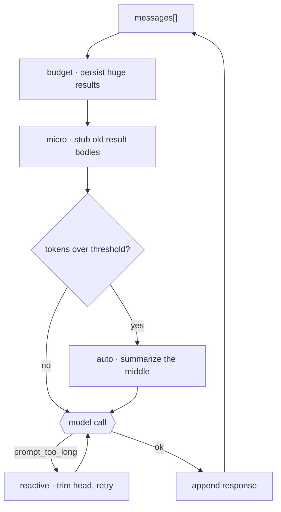

# 8 · Context management

[English](README.md) · **繁體中文** · [简体中文](README.zh-CN.md)

> 讓長時間的 session 維持在 context limit 以內。

`messages[]` 會在執行過程中不斷成長。每個 tool 結果、assistant 回覆和 user turn 都會加入更多文字。長時間的 session 最終會碰到模型的 context limit。

context management 讓 session 保持可用。它會在下一次 model call 之前，移除、以 stub 取代、持久化或摘要舊的內容。

當情境被填滿時：

1. API 可能會拒絕該請求。
2. 呼叫會變得更慢也更貴。
3. 舊的、比較沒用的內容，會和當前任務的資訊互相競爭。

沒有這一層，一旦 prompt 塞不下，長任務就會失敗。

---

## 機制



在摘要之前先用低成本的 reducer。低成本的 reducer 是在地處理，而且大致上不損失資訊。摘要則要付出一次 model call，而且可能遺失細節。

Claude Code 採用分層的順序：

```text
budget   -> persist huge tool results to disk, leave a preview
snip     -> drop stale middle turns, keep head + recent tail
micro    -> replace old tool-result bodies with a stub
collapse -> optional independent context system
auto     -> LLM summarizes the whole history into one message
--- on prompt_too_long despite the above ---
reactive -> truncate the head and re-summarize, with a retry cap
```

順序很重要。舉例來說，大型的 tool 結果應該先被持久化，之後任何 pass 才可以用 stub 取代它的本體。

### New: the reduction passes

```python
def manage(messages, summarizer=None):                 # src/context.py, run every turn
    _budget(messages)                                  # persist huge results   (lossless)
    _micro(messages, KEEP_RECENT)                      # stub old result bodies (cheap)
    if summarizer and estimate_tokens(messages) > TOKEN_LIMIT:
        return _auto(messages, KEEP_RECENT, summarizer)  # summarize history (lossy, last resort)
    return messages
```

- `manage` 在每個 turn 執行低成本的 pass。
- `_budget` 把過大的 tool 結果寫到磁碟，並留下一段簡短的 preview。
- `_micro` 把舊的 tool 結果本體換成 stub。
- `_auto` 保留第一個 turn 和最近的尾端，然後摘要中間的部分。
- `summarizer=None` 在 demo 中停用了會損失資訊的摘要。

### How it integrates

context management 在每次 model call 之前執行：

```python
for _ in range(max_steps):                             # src/loop.py
    messages = context.manage(messages, summarizer=summarizer)   # 8 · keep context under the window
    response = model(messages, registry)
    ...
```

這是一個真正的迴圈變更。先前的章節加的是 tool 或 dispatch 行為。context 必須在 model call 之前執行，所以它屬於迴圈。

迴圈仍然維持同樣的不變條件：它用一個有效的 `messages[]` 呼叫模型，接著附上回應和任何 tool 結果。

---

## 各系統做法

各 agent 如何決定要騰出空間，以及要移除什麼。

| System | Trigger | Strategy | Budget rule |
| --- | --- | --- | --- |
| **Claude Code** | token 門檻加上溢位時的後備方案。 | 先用低成本 reducer，再用 LLM 摘要。 | 保留 output 和安全緩衝空間。 |

### Claude Code

- `query.ts` 在 model call 之前執行這些 pass。
- `applyToolResultBudget` 把超過單則訊息字元上限的 tool 結果持久化。
- 被持久化的結果會留下一段 preview 和一個類似路徑的標記。
- `microcompactMessages` 把舊的 tool 結果本體清成 stub。
- `autoCompactIfNeeded` 只在 token 數仍然超過門檻時才呼叫模型。
- 壓縮之後，最近的檔案可以在一定的 token 預算內被還原。
- reactive compaction 處理的是在 proactive pass 失敗後才出現的 `prompt_too_long` 回應。

> **取捨：** 分層的 reducer 讓長 session 成為可能，也讓許多次的縮減都保持低成本。
> 它們也帶來排序規則和摘要風險。
> 摘要可能省略掉模型之後會用到的細節。

---

## 失效模式

- **摘要漏掉需要的細節：**持久化完整輸出，並在需要時重新讀取檔案。
- **壓縮反覆失敗：**使用 retry 上限或斷路器。
- **單一巨大 turn 仍然溢位：**對 `prompt_too_long` 做出反應，執行一次有界限的最後手段裁剪。
- **pass 順序錯誤而遺失資料：**在把舊結果 stub 化之前，先持久化大型結果。
- **拆散的 tool 配對：**不要把一個 `tool_use` 和它相配的 `tool_result` 拆開。

---

## 可執行程式

[`src/`](src/) 沿用 07 並加上：

- [`context.py`](src/context.py)：`budget`、`micro` 和 `auto` 這幾個 pass 都透過 `manage` 執行。
- [`loop.py`](src/loop.py)：在每個 turn 的最上方呼叫 `context.manage()`。
- [`test.py`](src/test.py)：獨立檢查每一個 pass。
- [`demo.py`](src/demo.py)：驅動已接上 context management 的迴圈。

```bash
python sections/08-context-management/src/test.py         # offline checks, no key
uv run python sections/08-context-management/src/demo.py  # live demo, needs a key
```

---

## 出處

- Claude Code 原始碼：`services/compact/autoCompact.ts`、`microCompact.ts`、`timeBasedMCConfig.ts`、`compact.ts`、`utils/toolResultStorage.ts`、`query.ts`、`query/tokenBudget.ts`。
- learn-claude-code · s08_context_compact：章節框架。

推測而來，並未完整存在於這份 clone 中：

- `snipCompact.ts`：只看得到 `snipCompactIfNeeded(messages)` 的呼叫點。
- `reactiveCompact.ts`：reactive 路徑看起來位於 `compact.ts` 中。
