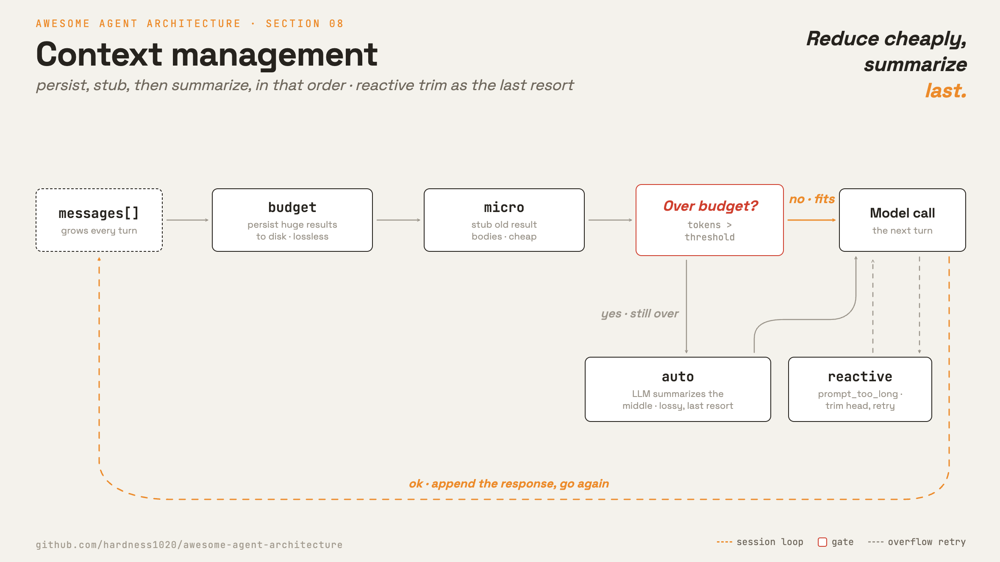

# 8 · Context management

[English](README.md) · **繁體中文** · [简体中文](README.zh-CN.md)

> 讓長時間的 session 維持在 context limit 以內。

`messages[]` 會在執行過程中不斷成長。每個 tool 結果、assistant 回覆和 user turn 都會加入更多文字。長時間的 session 最終會碰到模型的 context limit。

context management 讓 session 保持可用。它會在下一次 model call 之前，移除、以 stub 取代、持久化或摘要舊的內容。

當情境被填滿時：

1. API 可能會拒絕該請求。
2. 呼叫會變得更慢也更貴。
3. 舊的、比較沒用的內容，會和當前任務的資訊互相競爭。

第 3 點有個名字：context rot。無關的內容越堆越多，模型找對資訊的機率就越低。
這件事遠在 window 塞滿之前就開始了。agent 還是跑得動，只是判斷變差。

所以壓縮不只是為了塞得下和省錢。in-context learning 比較像檢索，不太像推理。
寫在上下文裡的某一件事，模型找得到；散在幾十輪對話裡的事實要它兜起來，就不太行。
與其每次呼叫都讓模型重推一遍，不如先把結論寫下來，這樣便宜多了。
所以摘要做得好，就算 window 還有空間，回答也會變好。

沒有這一層，一旦 prompt 塞不下，長任務就會失敗。

---

## 機制



在摘要之前先用低成本的 reducer。低成本的 reducer 是在地處理，而且大致上不損失資訊。摘要則要付出一次 model call，而且可能遺失細節。

Claude Code 採用分層的順序：

```text
budget   -> 把巨大的 tool 結果存到硬碟，留下一段預覽
snip     -> 丟掉中段的舊輪次，保留開頭和最近的結尾
micro    -> 把舊的 tool 結果本體換成一個 stub
collapse -> 可選的獨立 context 系統
auto     -> 用 LLM 把整段歷史摘要成一則訊息
--- 以上都做了還是 prompt_too_long 時 ---
reactive -> 截掉開頭並重新摘要，有重試上限
```

順序很重要。舉例來說，大型的 tool 結果應該先被持久化，之後任何 pass 才可以用 stub 取代它的本體。

### New: 縮減 pass

```python
def manage(messages, summarizer=None):                 # src/context.py, run every turn
    _budget(messages)                                  # persist huge results   (lossless)
    _micro(messages, KEEP_RECENT)                      # stub old result bodies (cheap)
    if summarizer and estimate_tokens(messages) > TOKEN_LIMIT:
        return _auto(messages, KEEP_RECENT, summarizer)  # summarize history (lossy, last resort)
    return messages
```

- `manage` 在每個 turn 執行低成本的 pass。
- `_budget` 把過大的 tool 結果寫到硬碟，並留下一段簡短的 preview。
- `_micro` 把舊的 tool 結果本體換成 stub。
- `_auto` 保留第一個 turn 和最近的尾端，然後摘要中間的部分。
- `summarizer=None` 在 demo 中停用了會損失資訊的摘要。

### 如何整合

context management 在每次 model call 之前執行：

```python
for _ in range(max_steps):                             # src/loop.py
    messages = context.manage(messages, summarizer=summarizer)   # 8 · keep context under the window
    response = model(messages, registry)
    ...
```

這一章動到的是 loop 本體。前幾章加的都是 tool 或 dispatch 行為，loop 本身不用改。但 context 縮減必須在每次 model call 之前跑，所以只能寫進 loop 裡。

loop 仍然維持同樣的不變條件：它用一個有效的 `messages[]` 呼叫模型，接著附上回應和任何 tool 結果。

### 延伸閱讀

以下講的是正式產品等級的 agent 怎麼處理 context，取自 ai-agent-book 對這些系統的說明。
這些做法 `src/` 都沒有實作，也沒有在下面表格那幾個系統上被證實。

**凍結的 tool 結果 stub。**用來取代 tool 結果的那段文字，每次都要一模一樣。
第一次替換時就把它定下來，之後照抄，連 session 從硬碟還原回來也照抄。
stub 如果重新算過，帶上新的時間戳或新的路徑，前綴就變了，它後面的 cache 也沒了。

**壓縮和 cache 的拉扯。**動過歷史，改動點之後的 cache 就全部失效。
每個 turn 都修一點，下一次呼叫就每個 turn 都要重讀整段前綴。
累積到 token 門檻再一次修完，這筆帳只付一次。壓縮要跑在兩次 API 呼叫之間，不能跑在一次呼叫裡面。

**API 層的 context editing。**這類 pass，Claude API 可以在伺服器端直接做掉。
context editing 會把比較舊的 tool 結果從前綴裡拿掉，harness 這邊一行程式都不用寫。
但它一樣要重建一次 cache，所以位置比較適合擺在靠近 overflow 那一端，不是每個 turn 都用。

**針對任務寫摘要。**摘要要為當前任務而寫，不是把整個 session 從頭回顧一遍。
它要回答的問題只有一個：下一次呼叫還需要什麼。有四樣東西要留，照這個順序：

1. 已經定案的架構與設計決策。
2. 新增或改過的檔案，以及改了什麼。
3. 最近一次檢查或測試的成敗狀態。
4. 還沒做完的 TODO，以及現在做到哪一步。

最先丟掉的是原始 tool 輸出。大的結果 budget pass 早就寫進硬碟了，真的需要再讀回來就好。

---

## 各系統做法

各 agent 如何決定要騰出空間，以及要移除什麼。

| | Claude Code | mini-swe-agent |
| --- | --- | --- |
| **Pros** | 長 session 撐得下去。多數縮減成本低，完整輸出留在硬碟上，之後還能重讀。 | 沒有東西要調度、要調參，行為一眼就能看懂。 |
| **Cons** | 各個 pass 要講究執行順序。摘要可能丟掉模型之後會用到的細節。 | 歷史只會成長。run 拖得比預算久，window 塞爆就直接中止。 |
| **Why** | 互動式 session 沒有固定終點，window 遲早會滿。 | 假設任務會先結束（提交或撞到成本上限，見第 21 章），輪不到 window 被塞滿。 |
| **How: trigger** | token 門檻，外加 `prompt_too_long` 的反應式後備。 | 每則 observation，在 render 時處理。 |
| **How: strategy** | 先跑低成本 reducer（大結果存檔、舊結果清成 stub），最後才用 LLM 摘要。 | 過長的輸出只保留頭尾，沒有壓縮。 |
| **How: budget** | 保留 output 和安全緩衝空間。 | 每則 observation 上限一萬字元。 |

---

## 哪裡會出錯

- **摘要漏掉需要的細節：**持久化完整輸出，並在需要時重新讀取檔案。
- **壓縮反覆失敗：**使用 retry 上限或斷路器。
- **單一巨大 turn 仍然 overflow：**對 `prompt_too_long` 做出反應，執行一次有界限的最後手段裁剪。
- **pass 順序錯誤而遺失資料：**在把舊結果 stub 化之前，先持久化大型結果。
- **拆散的 tool 配對：**不要把一個 `tool_use` 和它相配的 `tool_result` 拆開。
- **stub 文字每次都不一樣：**preview 若帶著新的時間戳或路徑重新產生，前綴就變了，cache 直接失效。stub 字串第一次生成後就固定下來。
- **每個 turn 都修一點：**每次改動都會讓改動點之後的 cache 失效，小修小補反而比一次修完貴。用門檻觸發，成批處理。
- **模型全盤相信摘要：**注入的狀態摘要，模型會當成事實讀，幾乎不會回頭查證。摘要裡留下指向原始檔案的線索，寫錯了才追得回來。

---

## 可執行程式

[`src/`](src/) 沿用 07 並加上：

- [`context.py`](src/context.py)：`budget`、`micro` 和 `auto` 這幾個 pass 都透過 `manage` 執行。
- [`loop.py`](src/loop.py)：在每個 turn 的最上方呼叫 `context.manage()`。
- [`test.py`](src/test.py)：獨立檢查每一個 pass。
- [`demo.py`](src/demo.py)：驅動已接上 context management 的 loop。

```bash
python sections/08-context-management/src/test.py         # offline checks, no key
uv run python sections/08-context-management/src/demo.py  # live demo, needs a key
```

---

## 出處

- [Claude Code 原始碼](https://github.com/yasasbanukaofficial/claude-code)：`services/compact/autoCompact.ts`、`microCompact.ts`、`timeBasedMCConfig.ts`、
  `compact.ts`、`utils/toolResultStorage.ts`、`query.ts`、`query/tokenBudget.ts`。
- [mini-swe-agent source](https://github.com/swe-agent/mini-swe-agent)：`config/mini.yaml` 的 observation template、`models/litellm_model.py` 的 `abort_exceptions`。
- [learn-claude-code · s08_context_compact](https://github.com/shareAI-lab/learn-claude-code)：章節框架。
- [ai-agent-book · 第 2 章](https://github.com/bojieli/ai-agent-book/blob/main/book/chapter2.md)（《深入理解 AI Agent》，李博杰，以中文原版為準）：
  context rot、in-context learning 其實是檢索、壓縮與 cache 的相互影響、針對任務的壓縮與保留優先序、
  API 層的 context editing、凍結的 tool 結果 stub，以及模型會把注入的摘要當成事實這個結論。
- [Lost in the Middle](https://arxiv.org/abs/2307.03172)（Liu 等人，TACL 2024）：放在長上下文中段的事實，取用準確度會掉下來。這是 context rot 的依據。

以下是推測，在上面那份 Claude Code 原始碼 repo 裡找不到完整實作：

- `snipCompact.ts`：只看得到 `snipCompactIfNeeded(messages)` 的呼叫點。
- `reactiveCompact.ts`：reactive 路徑看起來位於 `compact.ts` 中。
