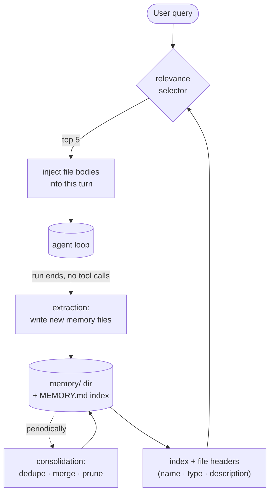

# 9 · Memory

> Remember what matters, forget what doesn't.

An agent's `messages[]` (section 1) is the memory of one run. It dies when the run ends, and it gets lossy the moment context is compacted (section 8). Memory is the separate, durable layer: a small store of facts the agent writes during a run, keeps across runs, and pulls back in when relevant. It is what lets the agent learn your preferences once instead of every session.

---

## Problem

The model has no persistent state. Everything it knows lives in the context window, and the window is finite and lossy. Compaction (section 8) summarizes old turns, so a precise constraint like "use tabs, never spaces" degrades to "user has a style preference," then vanishes. Open a fresh session and even the summary is gone.

So something must:

1. Decide what is worth keeping (selection on the way in).
2. Write it somewhere outside the conversation (a store).
3. Pull the right pieces back in at the right moment (recall).
4. Keep the store from rotting as it grows (consolidation).

Leave this out and the agent re-learns the same facts every session, asks the same questions twice, and repeats corrections you already gave it. Keep everything instead and the store accumulates stale, contradictory notes that degrade later recall.

---

## Mechanism

Memory is a file store plus an index plus on-demand recall. The conversation loop never reads the whole store; it reads a one-line-per-file index, and a selector pulls only the few files that matter for the current query.



Four distinct operations, easy to conflate:

- **Selection** decides what to write. Code patterns, file structure, git history are derivable on demand (grep, `git`, `CLAUDE.md`), so they are not memories. Memory is reserved for context you cannot reconstruct: who the user is, how they want work done, why a project is the way it is.
- **Recall** runs at query time and reads nothing into long-term storage. It ranks existing files against the current query and injects a few bodies into this turn only.
- **Extraction** runs at run end and writes new files. It is the only operation that grows the store.
- **Consolidation** runs rarely in the background. It rewrites the store to dedupe and prune. It is section 13's job applied to memory.

Recall and extraction are opposite directions and must not be confused: recall reads, extraction writes.

### New: index, recall, extraction, and the store

The store is a directory of `.md` files. `load_index` reads only each file's frontmatter, so the always-on catalog never pays for the bodies:

```python
def load_index(memory_dir) -> list[Memory]:            # src/memory.py
    mems = []
    for md in sorted(Path(memory_dir).glob("*.md")):
        if md.name == "MEMORY.md":                     # the index file is not a memory
            continue
        meta, _body = _split(md.read_text())           # frontmatter only, never the body
        mems.append(Memory(md.stem, meta.get("type", ""), meta.get("description", ""), md))
    return mems

def manifest(mems) -> str:                             # one cheap line per memory, ranked at recall
    return "\n".join(f"- {m.name} ({m.type}): {m.description}" for m in mems)
```

Recall ranks that index against the query and reads the bodies of only the few that fit. Offline it is word overlap; live, an LLM `selector` reads the manifest and judges relevance (Claude Code's `sideQuery`):

```python
def recall(mems, query, k=RECALL_K, selector=None) -> list[Memory]:
    if selector is not None:
        chosen = set(selector(manifest(mems), query))  # live: an LLM returns the names to inject
        return [m for m in mems if m.name in chosen][:k]
    scored = ((_overlap(query, m), m) for m in mems)    # offline: word overlap on name + description
    hits = sorted((s for s in scored if s[0]), key=lambda s: s[0], reverse=True)
    return [m for _score, m in hits[:k]]

def recall_block(mems, query, k=RECALL_K, selector=None) -> str:
    hits = recall(mems, query, k, selector)             # only now read the bodies that survived ranking
    return "\n\n".join(f"[memory · {m.type}] {_split(m.path.read_text())[1]}" for m in hits)
```

Extraction is the only operation that grows the store: at run end an `extractor` proposes memories and each is rendered to a file:

```python
def extract(memory_dir, messages, extractor) -> list[Path]:
    written = []
    for m in extractor(messages) or []:                # extractor(messages) -> list of memory dicts
        path = Path(memory_dir) / f"{m['name']}.md"
        path.write_text(_render(m))                    # frontmatter (type, description) + body
        written.append(path)
    return written
```

A `Store` is the handle the loop holds: `recall` reads the index, `write` persists what the extractor proposes. Both LLM hooks are optional, so the same code runs offline:

```python
@dataclass
class Store:
    root: Path
    selector: Callable | None = None    # None -> word overlap
    extractor: Callable | None = None   # None -> write nothing

    def recall(self, query, k=RECALL_K) -> str:
        return recall_block(load_index(self.root), query, k, self.selector)

    def write(self, messages) -> list[Path]:
        return extract(self.root, messages, self.extractor) if self.extractor else []
```

### How it integrates

Memory wraps the loop on both ends, recall before and extraction after:

```python
if memory is not None:                                 # src/loop.py · before the loop (read-only)
    user_text = messages[-1]["content"]                # the new user turn, already appended
    recalled = memory.recall(user_text)
    if recalled:
        messages[-1]["content"] = f"<system-reminder>\n{recalled}\n</system-reminder>\n\n{user_text}"
...
if response.stop_reason != "tool_use":
    if memory is not None:
        memory.write(messages)                         # run ends: extract (write-only)
    return final_text(response)
```

- Recall runs once before the loop and injects the bodies as a `<system-reminder>`, so a memory rides in `messages[]` and is subject to compaction (section 8) like any other content.
- Extraction runs at run end, when the model stops without a tool call, on the fuller transcript before the next session opens.
- The `memory` handle is optional: pass `None` and the loop is exactly the section-8 loop, no recall and no extract.

---

## Per system

Rows are systems; columns are the four memory operations.

| System                | Store                                                                                                                                                                                                                                                                                                                                      | Recall                                                                                                                                                                                                                              | Extraction                                                                                                                                                                         | Consolidation                                                                                                                                              |
| --------------------- | ------------------------------------------------------------------------------------------------------------------------------------------------------------------------------------------------------------------------------------------------------------------------------------------------------------------------------------------ | ----------------------------------------------------------------------------------------------------------------------------------------------------------------------------------------------------------------------------------- | ---------------------------------------------------------------------------------------------------------------------------------------------------------------------------------- | ---------------------------------------------------------------------------------------------------------------------------------------------------------- |
| **Claude Code** | `memory/` dir under `~/.claude/projects/<sanitized-git-root>/` (`memdir/paths.ts`); per-memory `.md` files with YAML frontmatter (`type`, `description`); `MEMORY.md` index, capped 200 lines / 25KB (`memdir/memdir.ts`); four types `user` · `feedback` · `project` · `reference` (`memdir/memoryTypes.ts`) | `findRelevantMemories.ts`: `memoryScan.ts` builds a header manifest (name + type + description, newest-first, max 200 files), a Sonnet `sideQuery` picks up to 5, bodies injected with a freshness note from `memoryAge.ts` | `services/extractMemories/extractMemories.ts`: forked agent at run end (no tool calls), `skipTranscript: true`, `maxTurns: 5`, skipped if the run already wrote memory files | `services/autoDream/autoDream.ts` ("Dream"): forked agent gated by time (>= 24h), sessions touched (>= 5), and a `.consolidate-lock` file (section 13) |
| *(more soon)*       |                                                                                                                                                                                                                                                                                                                                            |                                                                                                                                                                                                                                     |                                                                                                                                                                                    |                                                                                                                                                            |

> **Trade-off:** picking memories with an LLM `sideQuery` (Claude Code's choice) judges relevance the way a reader would (it reads "warnings about a tool you are using" as useful, "API docs for that tool" as noise) and needs no embedding index to maintain. It costs a model call per turn and a few hundred tokens, where a vector store would be a single cheap lookup. Choose by whether semantic nuance or per-turn latency matters more.

---

## Failure modes

- **Recall misses or floods.** A loose selector pulls 5 near-irrelevant files and crowds out the real task; a strict one returns nothing useful. Claude Code's selector prompt is explicitly conservative ("if unsure, do not include it") and capped at 5, trading recall for precision.
- **Stale memory asserted as fact.** A memory citing `file.ts:42` stays in the store after the code moves, and the model repeats it confidently. The fix is freshness metadata: `memoryAge.ts` stamps each injected memory ("47 days ago") and adds a caveat that point-in-time observations may be outdated, so the model weighs age instead of trusting blindly.
- **Store rot.** Extraction only ever appends, so duplicates and contradictions accumulate and degrade every later recall. Consolidation (Dream, section 13) is the answer, but it must be gated (time, session count, a lock) or it churns the store on every idle moment or races a second process.
- **Saving the derivable.** Writing code structure or git facts as memories bloats the index with things a grep would answer fresher. The `memoryTypes.ts` taxonomy exists to keep memory to the non-derivable: user, feedback, project, reference.
- **Lossy capture.** Extraction runs after the turn against a transcript that compaction (section 8) may already have thinned, so a nuance stated mid-run can be gone before it is ever written. Running extraction at run end on the fuller transcript, before the next compaction, narrows the window but does not close it.

---

## Runnable

[`src/`](src/) carries 08 forward and adds [`memory.py`](src/memory.py): a `Store` over a dir of `.md` files, with `load_index` and `manifest` (the cheap catalog), `recall` (word overlap by default, an LLM `selector` when live), and `extract` (writes new files at run end). [`loop.py`](src/loop.py) now recalls into the opening turn and extracts when the run ends. [`test.py`](src/test.py) walks the four operations on a temporary store.

```bash
python sections/09-memory/src/test.py         # offline checks, no key
uv run python sections/09-memory/src/demo.py  # live demo, needs a key
```

---

## Sources

- Claude Code structure (verified `cc-src/src` paths): `memdir/findRelevantMemories.ts`, `memdir/memoryScan.ts`, `memdir/memoryTypes.ts`, `memdir/memoryAge.ts`, `memdir/memdir.ts`, `memdir/paths.ts`, `services/extractMemories/extractMemories.ts`, `services/autoDream/autoDream.ts` (and `config.ts`), `services/SessionMemory/sessionMemory.ts`.
- Framing: learn-claude-code · s09_memory

Educational reconstruction from public structure and observed behavior, not an official description of any system.
