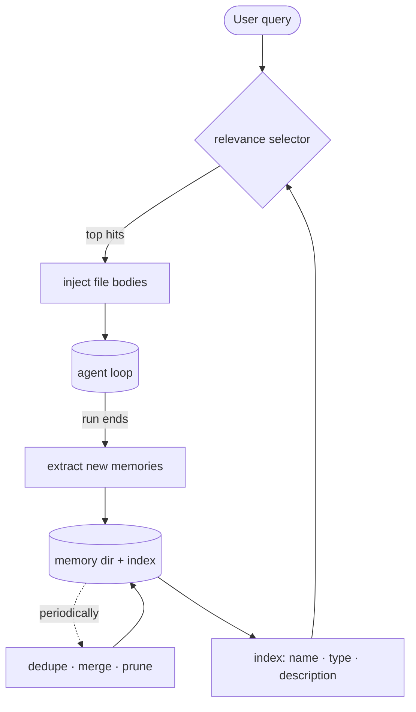

# 9 · Memory

**English** · [繁體中文](README.zh-TW.md) · [简体中文](README.zh-CN.md)

> Store durable facts outside the conversation.

`messages[]` is memory for one run. It ends with the run and can be compacted during the run.

Long-term memory is different. It stores durable facts outside the conversation, then recalls the relevant ones for a future turn.

Memory must:

1. Decide what is worth saving.
2. Write it outside the conversation.
3. Recall only relevant items.
4. Clean up stale or duplicate items over time.

Without memory, the agent repeats questions and forgets user preferences between sessions. If it saves everything, recall gets noisy and stale.

---

## Mechanism



Memory is a file store plus an index plus on-demand recall.

The loop does not read the whole store. It reads a cheap index, then loads only the few memory files that match the current query.

There are four operations:

- **Selection** decides what to save. Save facts that cannot be derived again with grep, git, or project files.
- **Recall** runs at query time. It ranks existing memories and injects only the selected bodies into the turn's `messages[]`, as a `<system-reminder>` block ahead of the user text.
- **Extraction** runs at run end. It writes new memory files.
- **Consolidation** runs rarely. It merges duplicates and prunes stale entries.

Recall reads. Extraction writes. Keeping those directions separate avoids accidental store growth.

### New: index, recall, extraction, and the store

The store is a directory of `.md` files. `load_index` reads frontmatter only:

```python
def load_index(memory_dir) -> list[Memory]:            # src/memory.py
    mems = []
    for md in sorted(Path(memory_dir).glob("*.md")):
        if md.name == "MEMORY.md":                     # the index file is not a memory
            continue
        meta, _body = _split(md.read_text())           # frontmatter only, never the body
        mems.append(Memory(md.stem, meta.get("type", ""), meta.get("description", ""), md))
    return mems

def manifest(mems) -> str:                             # one cheap line per memory
    return "\n".join(f"- {m.name} ({m.type}): {m.description}" for m in mems)
```

Recall ranks the index against the query. Offline, the demo uses word overlap. Live, a selector can choose memory names:

```python
def recall(mems, query, k=RECALL_K, selector=None) -> list[Memory]:
    if selector is not None:
        chosen = set(selector(manifest(mems), query))  # live: an LLM returns names to inject
        return [m for m in mems if m.name in chosen][:k]
    scored = ((_overlap(query, m), m) for m in mems)
    hits = sorted((s for s in scored if s[0]), key=lambda s: s[0], reverse=True)
    return [m for _score, m in hits[:k]]
```

Extraction is the only operation that grows the store:

```python
def extract(memory_dir, messages, extractor) -> list[Path]:
    written = []
    for m in extractor(messages) or []:
        path = Path(memory_dir) / f"{m['name']}.md"
        path.write_text(_render(m))
        written.append(path)
    return written
```

The memory dir above holds distilled facts, and it is not the only store. Raw history works as a second one: log each run's text, then search it back by keyword. The log keeps everything, so a fact extraction missed is still findable. This is the design behind Hermes's `state.db`.

`log_run` appends each run's text to a SQLite FTS5 table at run end:

```python
def log_run(db_path, session_id, messages) -> int:     # src/memory.py
    rows = [(session_id, m["role"], t) for m in messages if (t := _text_of(m))]
    con = _db(db_path)                                  # CREATE VIRTUAL TABLE ... USING fts5
    con.executemany("INSERT INTO session_log VALUES (?, ?, ?)", rows)
    con.commit()
    con.close()
    return len(rows)
```

- `_text_of` flattens one message to searchable text: a plain string passes through, an API response keeps only its text blocks. Tool-use blocks carry no text and drop out.
- Each row is `(session_id, role, content)`. The session id is the lineage key, so a hit can say which past run it came from.
- FTS5 ships inside CPython's `sqlite3`, so the log costs no dependency.

`search_sessions` reads the log back, ranked, with no model call:

```python
def search_sessions(db_path, query, k=SEARCH_K) -> list[tuple]:
    words = _words(query)                               # the same tokenizer recall uses
    if not words or not Path(db_path).exists():
        return []
    con = _db(db_path)
    rows = con.execute("SELECT session_id, role, content FROM session_log "
                       "WHERE session_log MATCH ? ORDER BY rank LIMIT ?",
                       (" OR ".join(sorted(words)), k)).fetchall()
    con.close()
    return rows
```

- The query words join with `OR`, so any word can hit; `ORDER BY rank` (bm25) puts the best match first.
  That is keyword recall with fuzzy ranking, the shape of Hermes' `session_search`.
- `k` caps the returned rows for the same reason `RECALL_K` caps injected memories: precision over volume.
- `search_tool` wraps this as the read-only `SessionSearch` tool, so consulting past sessions is the model's decision, made mid-turn.
  Extracted-memory recall stays the harness's decision, made before the turn. The two paths differ in who pulls the trigger.

`Store` is the handle the loop uses, and it now feeds both stores at run end:

```python
def write(self, messages) -> list[Path]:               # Store.write, called at run end
    if self.db is not None:
        log_run(self.db, self.session_id, messages)     # everything, searchable later
    return extract(self.root, messages, self.extractor) if self.extractor else []   # the distilled few
```

The selector, extractor, and session db are all optional, so the tests can run offline.

### How it integrates

Memory wraps the loop on both ends:

```python
if memory is not None:                                 # before the loop
    user_text = messages[-1]["content"]
    recalled = memory.recall(user_text)
    if recalled:
        messages[-1]["content"] = f"<system-reminder>\n{recalled}\n</system-reminder>\n\n{user_text}"
...
if response.stop_reason != "tool_use":
    if memory is not None:
        memory.write(messages)                         # run ends: extract
    return final_text(response)
```

- Recall runs once before the turn and injects selected memory text.
- Extract runs when the model stops without another tool call.
- `memory=None` keeps the section-8 loop behavior.
- Recalled text enters `messages[]`, so context management can later compact it.

---

## Per system

Rows are systems. Columns are the four memory operations.

| System | Store | Recall | Extraction | Consolidation |
| --- | --- | --- | --- | --- |
| **Claude Code** | Markdown files with frontmatter. | Selector chooses a small set. | Forked agent writes memories at run end. | Background process merges and prunes. |
| **Hermes Agent** | Two markdown files plus a SQLite index. | Prompt snapshot plus session search. | Memory tool writes entries. | Model rewrite on char-budget overflow. |

### Claude Code

- Memories live under `~/.claude/projects/<sanitized-git-root>/memory/`.
- Each memory is a `.md` file with YAML frontmatter.
- Memory types include `user`, `feedback`, `project`, and `reference`.
- `MEMORY.md` is an index, not a memory body.
- Recall builds a manifest from names, types, descriptions, and age.
- A Sonnet side query chooses up to 5 memories.
- Bodies are injected with freshness notes.
- Extraction runs as a forked agent at run end.
- Consolidation is the "Dream" background task, gated by time, session count, and a lock.

### Hermes Agent

- Two files, two subjects: `MEMORY.md` holds agent observations, `USER.md` holds the user profile. Entries split on a `§` delimiter (`ENTRY_DELIMITER`).
- Both files are frozen into the system prompt at session start (`load_from_disk` captures a snapshot).
- Mid-session writes hit disk but not the prompt, which keeps the prompt cache warm.
- Budgets are characters, not tokens: 2200 for memory, 1375 for the user profile. Overflow triggers a model-driven consolidation pass, with failure tracking.
- `_scan_memory_content` checks entries for injection patterns before they enter the prompt.
- Cross-session recall is a separate path: `session_search` queries `state.db` (SQLite FTS5, `SessionDB`) and returns actual past messages, no model call needed.
- `session_search` has three modes: DISCOVERY by query, SCROLL around one message, BROWSE recent sessions.
- Ranking demotes cron-sourced sessions below interactive ones (`_DEMOTED_SESSION_SOURCES`) and hides subagent and tool sessions.
- Memory writes can be staged for approval (`write_approval.py`) instead of landing directly.

> **Trade-off:** LLM-based recall can judge relevance better than simple keywords.
> It costs an extra model call.
> A vector store is cheaper at lookup time, but it adds an index to maintain.

---

## Failure modes

- **Recall misses useful memory.** Tune the selector and keep descriptions concrete.
- **Recall floods the turn.** Cap the number of injected memories and prefer precision.
- **Stale memory is treated as fact.** Include age or freshness metadata.
- **Store gets noisy.** Consolidate duplicates and contradictions.
- **Saving derivable facts.** Do not store facts that grep, git, or source files can answer better.
- **Extraction misses details.** Compaction may have removed nuance before extraction. Extract near run end and keep important facts in files.

---

## Runnable

[`src/`](src/) carries 08 forward and adds:

- [`memory.py`](src/memory.py): a `Store`, index loading, recall, extraction, and the session log (`log_run`, `search_sessions`, the `SessionSearch` tool).
- [`loop.py`](src/loop.py): recalls into the opening turn and extracts at run end.
- [`test.py`](src/test.py): walks the four operations on a temporary store, then logs and searches past sessions.
- [`demo.py`](src/demo.py): the agent answers from a past session's raw history via `SessionSearch`.

```bash
python sections/09-memory/src/test.py         # offline checks, no key
uv run python sections/09-memory/src/demo.py  # live demo, needs a key
```

---

## Sources

- Claude Code source: `memdir/findRelevantMemories.ts`, `memdir/memdir.ts`, `services/SessionMemory/sessionMemory.ts`.
- Claude Code memory services: `services/extractMemories/extractMemories.ts`, `services/autoDream/autoDream.ts`.
- Hermes Agent source: `tools/memory_tool.py`, `hermes_state.py` (`SessionDB`), `tools/session_search_tool.py`, `tools/write_approval.py`.
- learn-claude-code · s09_memory: section framing.
