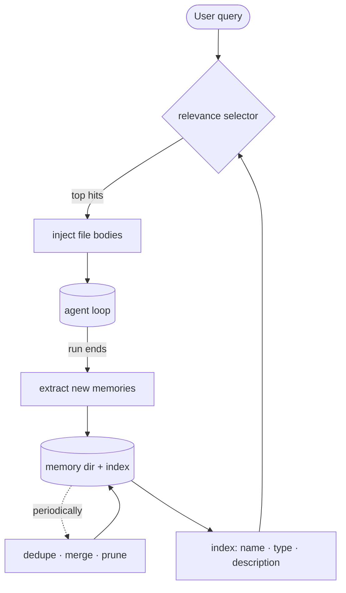

# 9 · Memory

[English](README.md) · [繁體中文](README.zh-TW.md) · **简体中文**

> 把持久的事实存储在对话之外。

`messages[]` 是单次执行的记忆。它会随着执行结束而消失，执行过程中也可能被压缩。

长期记忆不一样。它把持久的事实存储在对话之外，之后再为某一轮回想出相关的项目。

记忆必须做到：

1. 判断哪些内容值得存储。
2. 把它写在对话之外。
3. 只回想相关的项目。
4. 随时间清理过时或重复的项目。

没有记忆，agent 会重复提问，并在不同 session 之间忘记用户的偏好。如果它什么都存，回想就会变得杂乱又过时。

---

## 机制

记忆是一个文件存储区，加上一份索引，再加上按需回想。

循环不会读取整个存储区。它先读一份便宜的索引，然后只加载少数几个符合当前查询的记忆文件。



一共有四种操作：

- **Selection** 决定要存储什么。只存储那些无法靠 grep、git 或项目文件再次推导出来的事实。
- **Recall** 在查询时执行。它对现有记忆排序，只注入被选中的内容。
- **Extraction** 在执行结束时执行。它写入新的记忆文件。
- **Consolidation** 很少执行。它合并重复项并清除过时项目。

Recall 只读取。Extraction 只写入。把这两个方向分开，可以避免存储区意外膨胀。

### New: index, recall, extraction, and the store

存储区是一个放 `.md` 文件的目录。`load_index` 只读取 frontmatter：

```python
def load_index(memory_dir) -> list[Memory]:            # src/memory.py
    mems = []
    for md in sorted(Path(memory_dir).glob("*.md")):
        if md.name == "MEMORY.md":                     # the index file is not a memory
            continue
        meta, _body = _split(md.read_text())           # frontmatter only, never the body
        mems.append(Memory(md.stem, meta.get("type", ""), meta.get("description", ""), md))
    return mems

def manifest(mems) -> str:                             # one cheap line per memory
    return "\n".join(f"- {m.name} ({m.type}): {m.description}" for m in mems)
```

Recall 拿索引对查询排序。离线时，demo 使用字词重叠来计算。上线时，selector 可以直接选择记忆名称：

```python
def recall(mems, query, k=RECALL_K, selector=None) -> list[Memory]:
    if selector is not None:
        chosen = set(selector(manifest(mems), query))  # live: an LLM returns names to inject
        return [m for m in mems if m.name in chosen][:k]
    scored = ((_overlap(query, m), m) for m in mems)
    hits = sorted((s for s in scored if s[0]), key=lambda s: s[0], reverse=True)
    return [m for _score, m in hits[:k]]
```

Extraction 是唯一会让存储区增长的操作：

```python
def extract(memory_dir, messages, extractor) -> list[Path]:
    written = []
    for m in extractor(messages) or []:
        path = Path(memory_dir) / f"{m['name']}.md"
        path.write_text(_render(m))
        written.append(path)
    return written
```

`Store` 是循环使用的句柄。selector 和 extractor 都是可选的，所以测试可以离线执行。

### How it integrates

记忆在循环的两端包住它：

```python
if memory is not None:                                 # before the loop
    user_text = messages[-1]["content"]
    recalled = memory.recall(user_text)
    if recalled:
        messages[-1]["content"] = f"<system-reminder>\n{recalled}\n</system-reminder>\n\n{user_text}"
...
if response.stop_reason != "tool_use":
    if memory is not None:
        memory.write(messages)                         # run ends: extract
    return final_text(response)
```

- Recall 在这一轮之前执行一次，并注入被选中的记忆文字。
- Extract 在模型停下且没有再调用工具时执行。
- `memory=None` 会维持第 8 章的循环行为。
- 回想的文字会进入 `messages[]`，所以之后 context 管理可以把它压缩。

---

## 各系统做法

各行是系统。各列是四种记忆操作。

| System | Store | Recall | Extraction | Consolidation |
| --- | --- | --- | --- | --- |
| **Claude Code** | 带 frontmatter 的 Markdown 文件。 | Selector 选出一小组。 | 分叉出的 agent 在执行结束时写入记忆。 | 后台进程负责合并与清理。 |

### Claude Code

- 记忆放在 `~/.claude/projects/<sanitized-git-root>/memory/` 底下。
- 每个记忆都是一个带 YAML frontmatter 的 `.md` 文件。
- 记忆类型包含 `user`、`feedback`、`project` 和 `reference`。
- `MEMORY.md` 是索引，不是记忆内文。
- Recall 从名称、类型、描述和存在时间建出一份 manifest。
- 一个 Sonnet 侧查询最多选出 5 个记忆。
- 内文注入时会附上新鲜度注记。
- Extraction 在执行结束时以分叉出的 agent 执行。
- Consolidation 是「Dream」后台任务，由时间、session 数量和一个 lock 控管。

> **取舍：** 以 LLM 为基础的 recall 在判断相关性上比单纯的关键字更准。
> 它的代价是多一次模型调用。
> 向量存储在查询时比较便宜，但它多了一份要维护的索引。

---

## 失效模式

- **Recall 漏掉有用的记忆。** 调整 selector，并把描述写得具体。
- **Recall 灌爆这一轮。** 限制注入记忆的数量，并以精准度为优先。
- **过时记忆被当成事实。** 带上存在时间或新鲜度的元数据。
- **存储区变杂乱。** 合并重复项与相互矛盾的项目。
- **存储可推导的事实。** 不要存储 grep、git 或源码文件能回答得更好的事实。
- **Extraction 漏掉细节。** 压缩可能在 extraction 之前就移除了细微信息。在接近执行结束时抽取，并把重要事实留在文件里。

---

## 可执行程序

[`src/`](src/) 承接 08 并加入：

- [`memory.py`](src/memory.py)：一个 `Store`、索引加载、recall 和 extraction。
- [`loop.py`](src/loop.py)：在开头那一轮回想，并在执行结束时抽取。
- [`test.py`](src/test.py)：在一个临时的存储区上走过这四种操作。

```bash
python sections/09-memory/src/test.py         # offline checks, no key
uv run python sections/09-memory/src/demo.py  # live demo, needs a key
```

---

## 来源

- Claude Code 源码：`memdir/findRelevantMemories.ts`、`memdir/memdir.ts`、`services/SessionMemory/sessionMemory.ts`。
- Claude Code 记忆服务：`services/extractMemories/extractMemories.ts`、`services/autoDream/autoDream.ts`。
- learn-claude-code · s09_memory：章节框架。
