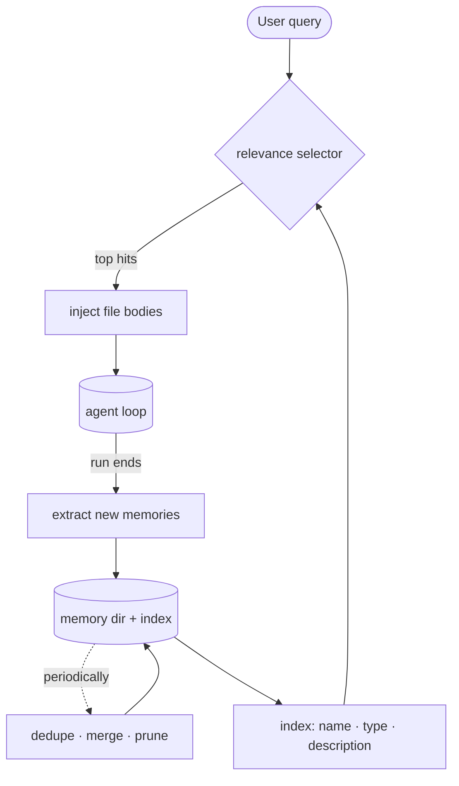

# 9 · Memory

[English](README.md) · **繁體中文** · [简体中文](README.zh-CN.md)

> 把持久的事實儲存在對話之外。

`messages[]` 是單次執行的記憶。它會隨著執行結束而消失，執行過程中也可能被壓縮。

長期記憶不一樣。它把持久的事實儲存在對話之外，之後再為某一輪回想出相關的項目。

記憶必須做到：

1. 判斷哪些內容值得儲存。
2. 把它寫在對話之外。
3. 只回想相關的項目。
4. 隨時間清理過時或重複的項目。

沒有記憶，agent 會重複提問，並在不同 session 之間忘記使用者的偏好。如果它什麼都存，回想就會變得雜亂又過時。

---

## 機制



記憶是一個檔案儲存區，加上一份索引，再加上按需回想。

迴圈不會讀取整個儲存區。它先讀一份便宜的索引，然後只載入少數幾個符合當前查詢的記憶檔案。

一共有四種操作：

- **Selection** 決定要儲存什麼。只儲存那些無法靠 grep、git 或專案檔案再次推導出來的事實。
- **Recall** 在查詢時執行。它對現有記憶排序，把選中的內文注入這一輪的 `messages[]`：包成 `<system-reminder>` 區塊，接在 user 訊息前面。
- **Extraction** 在執行結束時執行。它寫入新的記憶檔案。
- **Consolidation** 很少執行。它合併重複項並清除過時項目。

Recall 只讀取。Extraction 只寫入。把這兩個方向分開，可以避免儲存區意外膨脹。

### New: index, recall, extraction, and the store

儲存區是一個放 `.md` 檔案的目錄。`load_index` 只讀取 frontmatter：

```python
def load_index(memory_dir) -> list[Memory]:            # src/memory.py
    mems = []
    for md in sorted(Path(memory_dir).glob("*.md")):
        if md.name == "MEMORY.md":                     # the index file is not a memory
            continue
        meta, _body = _split(md.read_text())           # frontmatter only, never the body
        mems.append(Memory(md.stem, meta.get("type", ""), meta.get("description", ""), md))
    return mems

def manifest(mems) -> str:                             # one cheap line per memory
    return "\n".join(f"- {m.name} ({m.type}): {m.description}" for m in mems)
```

Recall 拿索引對查詢排序。離線時，demo 使用字詞重疊來計算。上線時，selector 可以直接選擇記憶名稱：

```python
def recall(mems, query, k=RECALL_K, selector=None) -> list[Memory]:
    if selector is not None:
        chosen = set(selector(manifest(mems), query))  # live: an LLM returns names to inject
        return [m for m in mems if m.name in chosen][:k]
    scored = ((_overlap(query, m), m) for m in mems)
    hits = sorted((s for s in scored if s[0]), key=lambda s: s[0], reverse=True)
    return [m for _score, m in hits[:k]]
```

Extraction 是唯一會讓儲存區成長的操作：

```python
def extract(memory_dir, messages, extractor) -> list[Path]:
    written = []
    for m in extractor(messages) or []:
        path = Path(memory_dir) / f"{m['name']}.md"
        path.write_text(_render(m))
        written.append(path)
    return written
```

上面的記憶目錄放的是提煉過的事實，但它不是唯一的儲存區。原始對話歷史可以當第二個：把每次執行的文字記下來，之後用關鍵字搜回來。log 保留所有內容，所以 extraction 漏掉的事實仍然找得到。Hermes 的 `state.db` 就是這種設計。

`log_run` 在執行結束時，把這次執行的文字附加到一個 SQLite FTS5 資料表：

```python
def log_run(db_path, session_id, messages) -> int:     # src/memory.py
    rows = [(session_id, m["role"], t) for m in messages if (t := _text_of(m))]
    con = _db(db_path)                                  # CREATE VIRTUAL TABLE ... USING fts5
    con.executemany("INSERT INTO session_log VALUES (?, ?, ?)", rows)
    con.commit()
    con.close()
    return len(rows)
```

- `_text_of` 把一則訊息攤平成可搜尋的文字：純字串直接通過，API 回應只保留 text block。tool-use block 沒有文字，會被略過。
- 每一列是 `(session_id, role, content)`。session id 是 lineage 的 key，所以一筆命中可以說出它來自哪一次執行。
- FTS5 內建在 CPython 的 `sqlite3` 裡，所以這份 log 不需要額外的相依套件。

`search_sessions` 把 log 讀回來，排好序，完全不用呼叫模型：

```python
def search_sessions(db_path, query, k=SEARCH_K) -> list[tuple]:
    words = _words(query)                               # the same tokenizer recall uses
    if not words or not Path(db_path).exists():
        return []
    con = _db(db_path)
    rows = con.execute("SELECT session_id, role, content FROM session_log "
                       "WHERE session_log MATCH ? ORDER BY rank LIMIT ?",
                       (" OR ".join(sorted(words)), k)).fetchall()
    con.close()
    return rows
```

- 查詢字詞以 `OR` 相連，任何一個字都能命中；`ORDER BY rank`（bm25）把最佳結果排在最前面。
  這就是帶模糊排序的關鍵字回想，跟 Hermes `session_search` 的做法一樣。
- `k` 限制回傳的列數，理由跟 `RECALL_K` 限制注入記憶一樣：精準度優先於數量。
- `search_tool` 把它包成唯讀的 `SessionSearch` tool，所以要不要查過去的 session，是模型在 turn 進行中自己決定的。
  抽取記憶的 recall 則是 harness 在 turn 開始前決定的。兩條路徑的差別在於由誰發動。

`Store` 是迴圈使用的把手，現在它在執行結束時同時餵兩個儲存區：

```python
def write(self, messages) -> list[Path]:               # Store.write, called at run end
    if self.db is not None:
        log_run(self.db, self.session_id, messages)     # everything, searchable later
    return extract(self.root, messages, self.extractor) if self.extractor else []   # the distilled few
```

selector、extractor 和 session db 都是選用的，所以測試可以離線執行。

### How it integrates

記憶在迴圈的兩端包住它：

```python
if memory is not None:                                 # before the loop
    user_text = messages[-1]["content"]
    recalled = memory.recall(user_text)
    if recalled:
        messages[-1]["content"] = f"<system-reminder>\n{recalled}\n</system-reminder>\n\n{user_text}"
...
if response.stop_reason != "tool_use":
    if memory is not None:
        memory.write(messages)                         # run ends: extract
    return final_text(response)
```

- Recall 在這一輪之前執行一次，並注入被選中的記憶文字。
- Extract 在模型停下且沒有再呼叫工具時執行。
- `memory=None` 會維持第 8 章的迴圈行為。
- 回想的文字會進入 `messages[]`，所以之後 context 管理可以把它壓縮。

---

## 各系統做法

各列是系統。各欄是四種記憶操作。

| System | Store | Recall | Extraction | Consolidation |
| --- | --- | --- | --- | --- |
| **Claude Code** | 帶 frontmatter 的 Markdown 檔案。 | Selector 選出一小組。 | 分叉出的 agent 在執行結束時寫入記憶。 | 背景程序負責合併與清理。 |
| **Hermes Agent** | 兩個 markdown 檔案加一份 SQLite 索引。 | prompt 快照加 session 搜尋。 | memory tool 寫入條目。 | 字元預算爆掉時由模型改寫。 |

### Claude Code

- 記憶放在 `~/.claude/projects/<sanitized-git-root>/memory/` 底下。
- 每個記憶都是一個帶 YAML frontmatter 的 `.md` 檔案。
- 記憶類型包含 `user`、`feedback`、`project` 和 `reference`。
- `MEMORY.md` 是索引，不是記憶內文。
- Recall 從名稱、類型、描述和存在時間建出一份 manifest。
- 一個 Sonnet 側查詢最多選出 5 個記憶。
- 內文注入時會附上新鮮度註記。
- Extraction 在執行結束時以分叉出的 agent 執行。
- Consolidation 是「Dream」背景任務，由時間、session 數量和一個 lock 控管。

### Hermes Agent

- 兩個檔案、兩個主題：`MEMORY.md` 放 agent 的觀察，`USER.md` 放使用者輪廓。條目以 `§` 分隔符切開（`ENTRY_DELIMITER`）。
- 兩個檔案在 session 開始時凍結進 system prompt（`load_from_disk` 擷取一份快照）。
- session 中途的寫入只落到磁碟、不動 prompt，讓 prompt cache 保持有效。
- 預算以字元計，不是 token：記憶 2200 字元，使用者輪廓 1375。爆掉會觸發由模型執行的整併，並追蹤失敗。
- `_scan_memory_content` 在條目進入 prompt 之前檢查注入模式。
- 跨 session 的回想是另一條路：`session_search` tool 查詢 `state.db`（SQLite FTS5，`SessionDB`），回傳真正的過往訊息，不需要模型呼叫。
- `session_search` 有三種模式：DISCOVERY 用查詢、SCROLL 繞著一則訊息、BROWSE 看最近的 session。
- 排序會把 cron 來源的 session 壓到互動 session 之下（`_DEMOTED_SESSION_SOURCES`），並隱藏 subagent 和 tool 的 session。
- 記憶寫入可以先暫存等待核准（`write_approval.py`），而不是直接落地。

> **取捨：** 以 LLM 為基礎的 recall 在判斷相關性上比單純的關鍵字更準。
> 它的代價是多一次模型呼叫。
> 向量儲存在查詢時比較便宜，但它多了一份要維護的索引。

---

## 失效模式

- **Recall 漏掉有用的記憶：**調整 selector，並把描述寫得具體。
- **Recall 灌爆這一輪：**限制注入記憶的數量，並以精準度為優先。
- **過時記憶被當成事實：**帶上存在時間或新鮮度的中繼資料。
- **儲存區變雜亂：**合併重複項與相互矛盾的項目。
- **儲存可推導的事實：**不要儲存 grep、git 或原始碼檔案能回答得更好的事實。
- **Extraction 漏掉細節：**壓縮可能在 extraction 之前就移除了細微資訊。在接近執行結束時抽取，並把重要事實留在檔案裡。

---

## 可執行程式

[`src/`](src/) 承接 08 並加入：

- [`memory.py`](src/memory.py)：一個 `Store`、索引載入、recall、extraction，以及 session log（`log_run`、`search_sessions`、`SessionSearch` tool）。
- [`loop.py`](src/loop.py)：在開頭那一輪回想，並在執行結束時抽取。
- [`test.py`](src/test.py)：在一個暫時的儲存區上走過這四種操作，接著記錄並搜尋過去的 session。
- [`demo.py`](src/demo.py)：agent 透過 `SessionSearch` 從某個過去 session 的原始歷史找出答案。

```bash
python sections/09-memory/src/test.py         # offline checks, no key
uv run python sections/09-memory/src/demo.py  # live demo, needs a key
```

---

## 出處

- Claude Code 原始碼：`memdir/findRelevantMemories.ts`、`memdir/memdir.ts`、`services/SessionMemory/sessionMemory.ts`。
- Claude Code 記憶服務：`services/extractMemories/extractMemories.ts`、`services/autoDream/autoDream.ts`。
- Hermes Agent 原始碼：`tools/memory_tool.py`、`hermes_state.py`（`SessionDB`）、`tools/session_search_tool.py`、`tools/write_approval.py`。
- learn-claude-code · s09_memory：章節框架。
