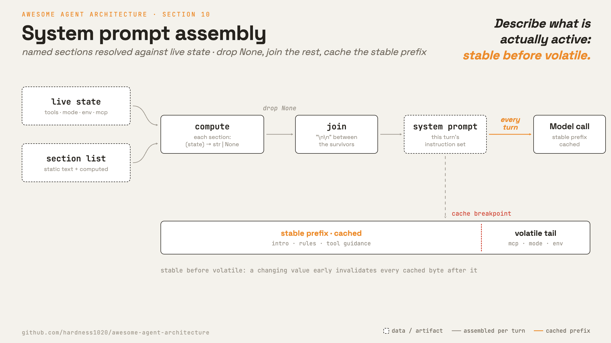

# 10 · System prompt assembly

**English** · [繁體中文](README.zh-TW.md) · [简体中文](README.zh-CN.md)

> Build the prompt from live state each turn.

The system prompt is the agent's standing instruction set. It describes identity, rules, tools, project context, and active features.

In a real agent, this cannot stay as one hardcoded string.

Tools, memory, output style, MCP servers, and modes can vary by session. The prompt should describe what is actually active.

A prompt assembler solves three problems:

1. New feature text has a clear place to live.
2. Inactive feature text can be skipped.
3. Stable sections can use prompt caching.

Without assembly, the prompt becomes stale, bloated, or hard to change safely.

---

## Mechanism



Define the prompt as named sections. Some sections are static. Others compute text from live state and return `None` when they do not apply.

Assembly is simple: resolve every section, drop `None`, and join the rest.

```python
sections = [
    intro, system_rules, doing_tasks, tools_section,
    session_guidance(), memory(), env_info(),
    output_style(), mcp_instructions(),
]
prompt = [s for s in resolve(sections) if s is not None]
```

Two rules keep it manageable:

1. Include sections by state, not keyword guesses.
2. Keep volatile content away from the stable prompt prefix.

### New: sections and assemble

```python
@dataclass
class Section:                                          # src/prompt.py
    name: str
    compute: Callable    # (state) -> str | None ; static sections ignore state

def static(name, text) -> Section:
    return Section(name, lambda _state: text)

def assemble(sections, state) -> str:                  # the prompt for this turn
    parts = (s.compute(state) for s in sections)
    return "\n\n".join(p for p in parts if p is not None)
```

The section list owns state-driven inclusion:

```python
DEMO_SECTIONS = [
    static("intro", "You are a tiny agent. ..."),
    Section("tools", lambda s: "Tools: " + ", ".join(s["tools"]) if s.get("tools") else None),
    Section("env", lambda s: f"cwd: {s['cwd']}" if s.get("cwd") else None),
    Section("mcp", lambda s: "MCP servers connected; ..." if s.get("mcp") else None),
]
```

Recalled memory is not part of this prompt. It is injected as a `<system-reminder>` message by section 9. That keeps the prompt prefix more stable.

### Prompt caching

Most system prompt sections are stable during a session. The demo sets a top-level cache breakpoint:

```python
client.messages.create(model=MODEL, system=assemble(DEMO_SECTIONS, state),
                       messages=messages, cache_control={"type": "ephemeral"})
```

Stable content should come before volatile content. If a changing value appears early, it can invalidate more of the cache.

Claude Code also uses an explicit dynamic boundary. That protects a large static prefix when a smaller dynamic tail changes.

### How it integrates

The loop assembles the prompt before each model call:

```python
for _ in range(max_steps):                             # src/loop.py
    messages = context.manage(messages, summarizer=summarizer)
    system = prompt(registry, session) if prompt else None   # 10 · assemble from live state
    response = model(messages, registry, system)
    ...
```

- `prompt` is a callable that closes over the section list.
- It reads live state such as enabled tools and session mode.
- Passing `prompt=None` keeps the section-9 behavior.

---

## Per system

How the prompt is composed each turn.

| | Claude Code | mini-swe-agent |
| --- | --- | --- |
| **Pros** | No stale or irrelevant instructions. Tool guidance matches the enabled tool set. | One render from config. Nothing to memoize or invalidate. |
| **Cons** | Needs a section registry, cache invalidation rules, and ordering discipline. | The prompt cannot change mid-run. Later state reaches the model as observations. |
| **Why** | Tools, memory, and modes vary by session. The prompt should describe what is active. | Assumes the tool set never changes mid-run, so one render at start holds. |
| **How: assembly point** | A prompt builder that returns one string per section. | Jinja2 templates in config. A missing variable fails loudly. |
| **How: sections** | Static and dynamic sections. Project context goes in context messages. | Two templates: system and instance, filled from config, environment, and run state. |
| **How: when built** | Per turn from live state. Dynamic parts stay memoized until the session is cleared or compacted. | Once, at run start, adapted to the platform. |

---

## Failure modes

- **Volatile text busts the cache.** Put changing content late or outside the prompt prefix.
- **Stale section cache.** Clear memoized sections when session state changes.
- **Prompt names missing tools.** Generate tool text from the live enabled-tool set.
- **Context mixed into prompt.** Put project files, date, and git status in context messages when they change often.
- **Prompt overrides conflict.** Use one resolver to define priority.

---

## Runnable

[`src/`](src/) carries 09 forward and adds:

- [`prompt.py`](src/prompt.py): `Section`, `static`, and `assemble`.
- [`loop.py`](src/loop.py): re-assembles the prompt each turn.
- [`demo.py`](src/demo.py): adds top-level `cache_control`.
- [`test.py`](src/test.py): checks state-driven inclusion.

```bash
python sections/10-system-prompt/src/test.py         # offline checks, no key
uv run python sections/10-system-prompt/src/demo.py  # live demo, needs a key
```

---

## Sources

- [Claude Code source](https://github.com/yasasbanukaofficial/claude-code): `constants/prompts.ts`, `constants/systemPromptSections.ts`, `utils/api.ts`, `QueryEngine.ts`.
- [mini-swe-agent source](https://github.com/swe-agent/mini-swe-agent):
  `config/mini.yaml`, `_render_template` and `get_template_vars` in `agents/default.py`, `models/utils/cache_control.py`.
- [Anthropic prompt caching](https://platform.claude.com/docs/en/build-with-claude/prompt-caching): cache breakpoints, TTLs, pricing, and token minimums.
- [learn-claude-code · s10_system_prompt](https://github.com/shareAI-lab/learn-claude-code): section framing.
