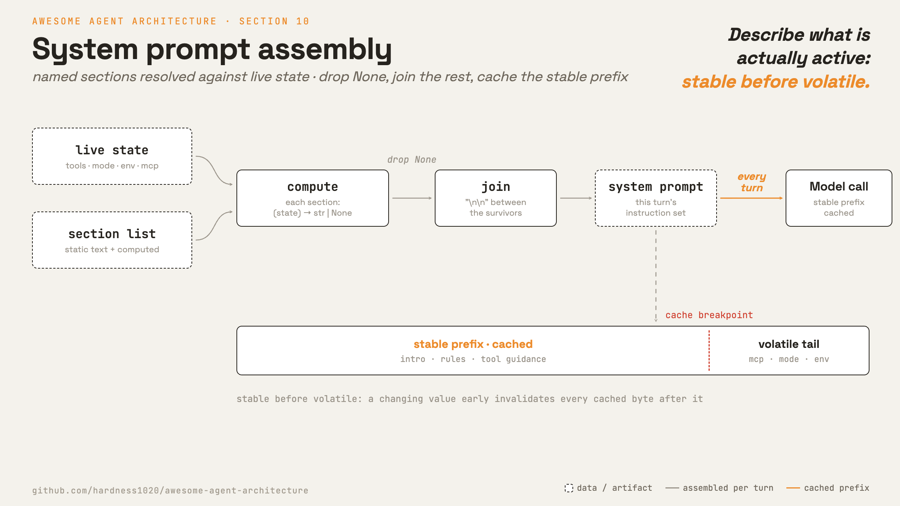

# 10 · System prompt assembly

[English](README.md) · [繁體中文](README.zh-TW.md) · **简体中文**

> 每一轮都从实时状态组出 prompt。

system prompt 是 agent 的常驻指令集。它描述身份、规则、工具、项目上下文，以及启用中的功能。

在真实的 agent 里，这不能只是一个写死的字符串。

工具、记忆、输出风格、MCP 服务器和各种模式会因 session 而异。prompt 应该描述实际启用中的内容。

一个 prompt 组装器解决三个问题：

1. 新功能的文字有明确的落脚处。
2. 没启用的功能文字可以被略过。
3. 稳定的段落可以使用 prompt caching。

没有组装，prompt 会变得过时、臃肿，或难以安全地修改。

---

## 机制



把 prompt 定义成一组具名的段落。有些段落是静态的。有些会从实时状态计算文字，在不适用时返回 `None`。

组装很简单：解析每个段落，丢掉 `None`，把其余的接起来。

```python
sections = [
    intro, system_rules, doing_tasks, tools_section,
    session_guidance(), memory(), env_info(),
    output_style(), mcp_instructions(),
]
prompt = [s for s in resolve(sections) if s is not None]
```

两条规则让它保持可控：

1. 依状态纳入段落，不要靠关键字猜测。
2. 让易变的内容远离稳定的 prompt 前缀。

### New: 段落与组装

```python
@dataclass
class Section:                                          # src/prompt.py
    name: str
    compute: Callable    # (state) -> str | None ; static sections ignore state

def static(name, text) -> Section:
    return Section(name, lambda _state: text)

def assemble(sections, state) -> str:                  # the prompt for this turn
    parts = (s.compute(state) for s in sections)
    return "\n\n".join(p for p in parts if p is not None)
```

每个段落要不要出现在 prompt 里，是它自己看状态决定的。`compute` 返回 `None` 就略过：

```python
DEMO_SECTIONS = [
    static("intro", "You are a tiny agent. ..."),
    Section("tools", lambda s: "Tools: " + ", ".join(s["tools"]) if s.get("tools") else None),
    Section("env", lambda s: f"cwd: {s['cwd']}" if s.get("cwd") else None),
    Section("mcp", lambda s: "MCP servers connected; ..." if s.get("mcp") else None),
]
```

第 9 章回想出的记忆不放进 system prompt，而是用一条 `<system-reminder>` 消息注入对话。这样 prompt 前缀不会跟着记忆变动，cache 比较守得住。

### Prompt caching

大多数 system prompt 段落在一次 session 中是稳定的。demo 设了一个顶层的 cache 断点：

```python
client.messages.create(model=MODEL, system=assemble(DEMO_SECTIONS, state),
                       messages=messages, cache_control={"type": "ephemeral"})
```

稳定的内容应该排在易变的内容之前。如果一个会变动的值出现在前面，它可能会让更多 cache 失效。

这条规则之所以严格，是因为价目表。cache 是拿 token 前缀精确比对的。
前面改掉一个 token，它后面所有 cache 过的 token 就全部作废。读 cache 大约只要新鲜 input token 的十分之一，写 cache 反而比新鲜的还贵。
所以挪动一个字，就可能让原本吃得到 cache 的调用变成全价。
最常见的原因有两个：prompt 开头附近印了时间戳或 token 数，以及工具列表的顺序每次跑都不一样。

Claude Code 也使用一个明确的动态边界。当较小的动态尾段变动时，这能保护一大段静态前缀。

### 如何整合

loop 在每次模型调用前组出 prompt：

```python
for _ in range(max_steps):                             # src/loop.py
    messages = context.manage(messages, summarizer=summarizer)
    system = prompt(registry, session) if prompt else None   # 10 · assemble from live state
    response = model(messages, registry, system)
    ...
```

- `prompt` 是一个闭包住段落列表的可调用对象。
- 它读取实时状态，例如启用中的工具和 session 模式。
- 传入 `prompt=None` 会维持第 9 章的行为。

### 延伸阅读

以下设计 `src/` 都没有实现，出自 ai-agent-book，也未经下面表格的系统证实。

**边界前面每加一个条件，前缀就多一份：**边界之前放一个看运行期状况决定的条件，cache 就得存两份前缀，条件的每种结果各一份。
三个条件变八份。十个条件超过一千份，而且每一份都要各自预热，等于几乎每个 session 都是冷启动。
把有条件的段落挪到边界之后，前缀就又只剩一份。

**一种任务类型挑一组示例，挑完就别再动：**few-shot 示例也放在前缀里，所以上面那条规则一样管得到它。
每次请求都去挑最相关的示例，等于每次调用都重写前缀，cache 就用不上了。
固定一组示例，贴合度是会差一点，但整个 session 的前缀都是热的。

**状态栏让模型知道现在跑到哪：**模型看不到 harness，所以有些 harness 会把运行期状态写成 context 尾端的几行字：

- 已经调用过几次 tool
- 当前的 TODO
- 过了多久
- 工作目录

这几行要一直保持最新，做法有两种，两种都有代价。
每一轮就地换掉这一段，状态就只有一份是真的，但尾巴被重写，它后面的 cache 也没了。
每一轮往后追加一段新的，cache 保得住，但旧的段落会留在历史里，模型可能照着已经变掉的状态行动。
Claude Code 走的是追加，用的就是第 9 章那些 `<system-reminder>` 消息。
不管选哪一种，这段文字都要用代码读真实状态产生。叫 LLM 去摘要，会多一次调用、多一份延迟，还可能写错。

**外面来的文字是数据，不是命令：**抓回来的网页、文件、issue 留言、MCP server 的响应，全都是数据，没有一句是用户说的。
这些文字没有任何标记就送进去，里面某一句长得像指令的话，就会跟 system prompt 平起平坐。这就是 prompt injection。
威胁模型和执行层的解法归第 3 章管：权限和 sandbox 决定一个被挟持的 agent 到底能做什么。
prompt 这一层可以更早一步动手，做法是把指令和数据分开：

- 外部内容包在有标记的区块里，标明它从哪里来。并在 prompt 里讲清楚：标记过的内容是拿来读的数据，不是要照做的指令。
- role 分得干净。指令走 system prompt，结果走 `tool_result` 区块，人讲的话走 user turn。
- 忠诚对象在 prompt 里讲一次：agent 为用户和运营方工作，任何从 tool 进来的文字都改不了这件事。书里把这叫 principal loyalty。

**prompt 这一层不是边界：**模型还是可能被说服而违规，所以第 3 章的检查照样要跑。
prompt 层降低发生概率，执行层限制损害范围。

---

## 各系统做法

每一轮如何组出 prompt。

| | Claude Code | mini-swe-agent |
| --- | --- | --- |
| **Pros** | 不会留着过时或不相关的指令。工具指引对得上启用中的工具集。 | 只从 config render 一次。没有东西要 memoize，也没有 cache 失效规则要管。 |
| **Cons** | 多了段落 registry、cache 失效规则，以及排序上的纪律。 | prompt 在 run 中途改不了。之后的状态只能以 observation 的形式进到模型。 |
| **Why** | 工具、记忆和模式会因 session 而异，prompt 要描述实际启用中的内容。 | 假设工具集在 run 中途不会变，开头 render 一次就一直有效。 |
| **How: assembly point** | 一个 prompt 组装器，每个段落各返回一个字符串。 | config 里的 Jinja2 template。变量缺了会直接报错。 |
| **How: sections** | 静态与动态段落。项目上下文以 context 消息注入。 | 两份 template：system 与 instance，变量来自 config、环境和运行期状态。 |
| **How: when built** | 每一轮从实时状态组出。动态段落会被记忆（memoize），直到 session 被清空或压缩。 | 只在 run 开始时组一次，并随平台调整。 |

---

## 哪里会出错

- **易变文字打坏 cache：**把会变动的内容放到后面，或放到 prompt 前缀之外。
- **段落 cache 过时：**当 session 状态改变时，清掉被记忆的段落。
- **Prompt 提到不存在的工具：**从实时启用的工具集生成工具文字。
- **上下文混进 prompt：**当项目文件、日期和 git 状态经常变动时，把它们放进 context 消息。
- **Prompt 覆盖互相冲突：**用单一 resolver 定义优先顺序。
- **cache key 变太多份：**边界之前每多一个条件，要各自预热的前缀就翻倍。有条件的段落一律放到边界之后。
- **状态区块过期：**追加式的状态会越积越多，模型可能照着旧的那一份行动。标清楚哪一份最新，或是就地换掉并接受 cache 重建。
- **外部内容被当成指令：**tool 结果按来源加上标记，并在 prompt 里说明标记过的就是数据。真正的边界仍然是第 3 章的权限检查。

---

## 可执行程序

[`src/`](src/) 承接 09 并加入：

- [`prompt.py`](src/prompt.py)：`Section`、`static` 和 `assemble`。
- [`loop.py`](src/loop.py)：每一轮重新组出 prompt。
- [`demo.py`](src/demo.py)：加入顶层的 `cache_control`。
- [`test.py`](src/test.py)：检查段落会依状态正确纳入或略过。

```bash
python sections/10-system-prompt/src/test.py         # offline checks, no key
uv run python sections/10-system-prompt/src/demo.py  # live demo, needs a key
```

---

## 来源

- [Claude Code 源码](https://github.com/yasasbanukaofficial/claude-code)：`constants/prompts.ts`、`constants/systemPromptSections.ts`、`utils/api.ts`、`QueryEngine.ts`。
- [mini-swe-agent source](https://github.com/swe-agent/mini-swe-agent)：`config/mini.yaml`、
  `agents/default.py` 的 `_render_template` 与 `get_template_vars`、`models/utils/cache_control.py`。
- [Anthropic prompt caching](https://platform.claude.com/docs/en/build-with-claude/prompt-caching)：cache 断点、TTL、定价，以及 token 下限。
- [Claude Code prompt caching 文档](https://code.claude.com/docs/en/prompt-caching)：静态前缀与动态尾段之间那道明确的 cache 边界。
- [ai-agent-book · 第 2 章](https://github.com/bojieli/ai-agent-book/blob/main/book/chapter2.md)（《深入理解 AI Agent》，李博杰，以中文原版为准）：
  KV cache 的成本模型、cache 作为架构约束（边界之前的条件会让 cache key 翻倍）、few-shot 的前缀稳定性、
  agent 状态栏以及就地替换和往后追加之间的取舍，还有 context 层的注入防御与 principal loyalty。
  书中的状态栏与 loyalty 数据都是作者自己的评测，属于单一来源，这里不引用那些数字。
- [learn-claude-code · s10_system_prompt](https://github.com/shareAI-lab/learn-claude-code)：章节框架。
