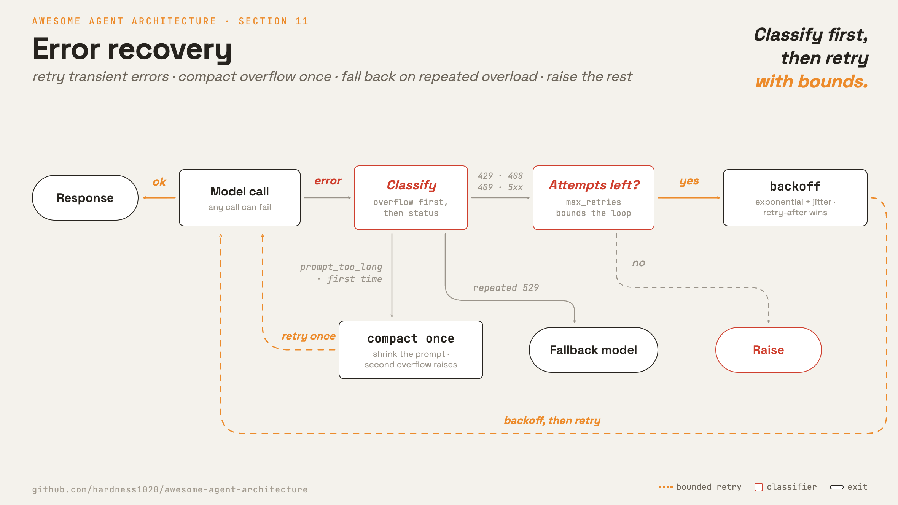

# 11 · Error recovery

**English** · [繁體中文](README.zh-TW.md) · [简体中文](README.zh-CN.md)

> Classify failures, then retry, adjust, or stop.

An agent run can span many model calls. Any call can fail because of network issues, overload, rate limits, output limits, or context overflow.

The loop needs different responses for different failures:

1. Retry transient errors.
2. Adjust and retry when the prompt or output limit is the problem.
3. Stop when the error is not recoverable.

Without recovery, one temporary API failure can end a long task.

---

## Mechanism



Wrap the model call in a retry helper. The helper classifies the failure, then takes a bounded action.

- Transient status codes back off and retry.
- Prompt overflow runs a compaction callback once, then retries.
- Repeated overload can trigger a fallback model.
- Unknown or non-retryable errors are raised.

### New: classification, backoff, and the retry helper

```python
RETRY_STATUS = {408, 409, 429}                         # src/recovery.py; these plus any 5xx

def should_retry(status) -> bool:
    return status in RETRY_STATUS or (status is not None and 500 <= status < 600)

def retry_delay(attempt, retry_after=None) -> float:   # exponential backoff + jitter
    if retry_after is not None:
        return float(retry_after)
    base = min(BASE_DELAY * 2 ** (attempt - 1), MAX_DELAY)
    return base + base * 0.25 * random()
```

Overflow is checked before generic status handling. A `prompt_too_long` error can be recoverable if compaction can shrink the prompt.

```python
def _status(e):
    return getattr(e, "status_code", None)

def _is_overflow(e) -> bool:
    return getattr(e, "overflow", False) or "prompt is too long" in str(e).lower()
```

`with_retry` holds the per-attempt state:

```python
def with_retry(call, on_overflow=None, fallback_model=None,
               max_retries=DEFAULT_MAX_RETRIES, sleep=time.sleep):
    consecutive_529 = 0
    overflowed = False
    for attempt in range(1, max_retries + 2):
        try:
            return call()
        except Exception as e:
            if _is_overflow(e):
                if on_overflow is None or overflowed:
                    raise
                overflowed = True
                on_overflow()
                continue
            status = _status(e)
            if status is None:
                raise
            if status == 529:
                consecutive_529 += 1
                if fallback_model and consecutive_529 >= MAX_529_RETRIES:
                    raise FallbackTriggered(fallback_model)
            if attempt > max_retries or not should_retry(status):
                raise
            sleep(retry_delay(attempt, getattr(e, "retry_after", None)))
```

### How it integrates

The loop wraps its model call:

```python
response = recovery.with_retry(
    lambda: model(messages, registry, system),
    on_overflow=lambda: _reactive_trim(messages),
    fallback_model=fallback_model)
```

- Recovery wraps only the model call.
- `_reactive_trim` mutates `messages[]` in place for one overflow retry.
- When recovery gives up, the error is surfaced instead of hidden.

---

## Per system

Recovery wraps the model call. The loop body stays the same.

| | Claude Code | mini-swe-agent |
| --- | --- | --- |
| **Pros** | Specific recovery paths save more runs than a blanket retry. | Only three bounded paths to maintain. A crash still leaves a complete trajectory on disk. |
| **Cons** | More branches and bounds to maintain. | Saves fewer runs. Context overflow aborts, and three format errors in a row end the run. |
| **Why** | One temporary API failure should not end a long task. | Keeps three paths: retry transient errors, return format errors to the model, named exit for the rest. |
| **How: retry** | Backoff retries on 429, 408, 409, and 5xx. A server `retry-after` wins. | tenacity backoff, 4 to 60 seconds, 10 attempts. Skips errors a retry cannot fix. |
| **How: token handling** | Escalate output tokens, continue after a `max_tokens` stop, or compact on `prompt_too_long`. | None. Context overflow aborts the run. |
| **How: model fallback** | Fallback model after repeated overload (529). Background 529 retries are capped. | None. |

---

## Failure modes

- **Retry storm.** Many clients retrying overload can make load worse. Limit retries and respect `retry-after`.
- **Infinite recovery.** Escalation, continuation, and compaction can loop. Bound each path.
- **Overflow cannot shrink.** If one reactive compaction fails, stop instead of compacting forever.
- **Error disappears.** A swallowed error leaves the transcript with a missing result. Surface failure after recovery is exhausted.
- **Stop hook repeats an API error.** Skip stop hooks for API-error messages.

---

## Runnable

[`src/`](src/) carries 10 forward and adds:

- [`recovery.py`](src/recovery.py): retry classification, backoff, overflow handling, and fallback trigger.
- [`loop.py`](src/loop.py): wraps its model call in `with_retry`.
- [`test.py`](src/test.py): drives each path with a fake flaky call.
- [`demo.py`](src/demo.py): injects one simulated overload in a live run.

```bash
python sections/11-error-recovery/src/test.py         # offline checks, no key
uv run python sections/11-error-recovery/src/demo.py  # live demo, needs a key
```

---

## Sources

- [Claude Code source](https://github.com/yasasbanukaofficial/claude-code):
  `services/api/withRetry.ts`, `query.ts`, `services/api/claude.ts`, `services/api/errors.ts`, `query/tokenBudget.ts`, `utils/context.ts`.
- [mini-swe-agent source](https://github.com/swe-agent/mini-swe-agent):
  `models/utils/retry.py`, `models/litellm_model.py`, `run()` and `max_consecutive_format_errors` in `agents/default.py`.
- [learn-claude-code · s11_error_recovery](https://github.com/shareAI-lab/learn-claude-code): section framing.
