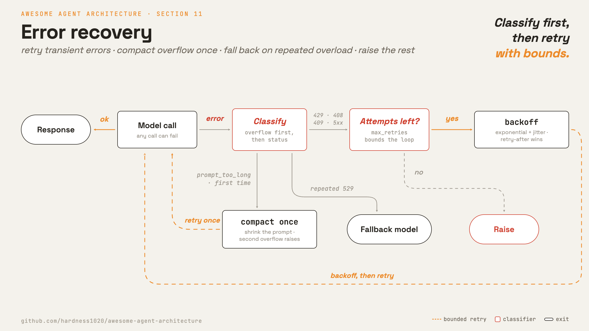

# 11 · Error recovery

**English** · [繁體中文](README.zh-TW.md) · [简体中文](README.zh-CN.md)

> Classify failures, then retry, adjust, or stop.

An agent run can span many model calls. Any call can fail because of network issues, overload, rate limits, output limits, or context overflow.

Model calls are only one source of failure. One study of production coding agents sorts failures into four layers.
API failures are timeouts, rate limits, and overload. Tool failures are a command that exits non-zero, or a handler that raises.
Context failures are prompt overflow and a broken message history. Control-flow failures are steps that repeat and get nowhere.
Work out the layer first, then start counting attempts. Counting first spends the budget on errors that no retry can fix.

The loop needs different responses for different failures:

1. Retry transient errors.
2. Adjust and retry when the prompt or output limit is the problem.
3. Stop when the error is not recoverable.

Without recovery, one temporary API failure can end a long task.

---

## Mechanism



Wrap the model call in a retry helper. The helper classifies the failure, then takes a bounded action.

- Transient status codes back off and retry.
- Prompt overflow runs a compaction callback once, then retries.
- Repeated overload can trigger a fallback model.
- Unknown or non-retryable errors are raised.

### New: classification, backoff, and the retry helper

```python
RETRY_STATUS = {408, 409, 429}                         # src/recovery.py; these plus any 5xx

def should_retry(status) -> bool:
    return status in RETRY_STATUS or (status is not None and 500 <= status < 600)

def retry_delay(attempt, retry_after=None) -> float:   # exponential backoff + jitter
    if retry_after is not None:
        return float(retry_after)
    base = min(BASE_DELAY * 2 ** (attempt - 1), MAX_DELAY)
    return base + base * 0.25 * random()
```

Overflow is checked before generic status handling. A `prompt_too_long` error can be recoverable if compaction can shrink the prompt.

```python
def _status(e):
    return getattr(e, "status_code", None)

def _is_overflow(e) -> bool:
    return getattr(e, "overflow", False) or "prompt is too long" in str(e).lower()
```

`with_retry` holds the per-attempt state:

```python
def with_retry(call, on_overflow=None, fallback_model=None,
               max_retries=DEFAULT_MAX_RETRIES, sleep=time.sleep):
    consecutive_529 = 0
    overflowed = False
    for attempt in range(1, max_retries + 2):
        try:
            return call()
        except Exception as e:
            if _is_overflow(e):
                if on_overflow is None or overflowed:
                    raise
                overflowed = True
                on_overflow()
                continue
            status = _status(e)
            if status is None:
                raise
            if status == 529:
                consecutive_529 += 1
                if fallback_model and consecutive_529 >= MAX_529_RETRIES:
                    raise FallbackTriggered(fallback_model)
            if attempt > max_retries or not should_retry(status):
                raise
            sleep(retry_delay(attempt, getattr(e, "retry_after", None)))
```

### How it integrates

The loop wraps its model call:

```python
response = recovery.with_retry(
    lambda: model(messages, registry, system),
    on_overflow=lambda: _reactive_trim(messages),
    fallback_model=fallback_model)
```

- Recovery wraps only the model call.
- `_reactive_trim` mutates `messages[]` in place for one overflow retry.
- When recovery gives up, the error is surfaced instead of hidden.

### Further reading

The designs below come from ai-agent-book's account of production agents. None of them is implemented in this section's `src/`.
None of them is confirmed behaviour of the systems in the table either. Read them as designs, not as findings.

**Beyond the model call.** The helper above covers the API layer. The other three layers need checks of their own.

**No progress.** Give every tool call a fingerprint: its name plus its arguments. A fingerprint that repeats means the agent is redoing the same call.
Nothing raises, so no retry path fires. A step cap does stop the run, but only once the budget is gone.
A fingerprint counter stops it in a few steps, and it can name the call that is stuck.
Give each recovery path its own counter too. A path that keeps failing then trips its own breaker.

**No liveness.** A connect timeout only checks that the stream opened. It does not notice a stream that opens and then goes quiet.
Add an idle watchdog. When no token arrives inside the window, cancel the call.
The retry helper then treats the cancellation as an ordinary transient failure.

**Broken history.** A crash mid turn can leave a `tool_use` block with no matching `tool_result`.
The next request fails on message shape, not on the work. So repair the pairs before sending.
What repair means depends on what the transcript is for.
A product harness adds a placeholder result saying the call was interrupted, and the run continues.
A harness that records training data refuses to repair. A made-up result would teach a step that never ran.

**Grading the recovery.** Recovery is not one decision. Grade it by how much the caller should see.

1. Retry quietly. The caller sees only the final result.
2. Degrade and continue. Return a smaller result, and say what is missing.
3. Surface the failure. List the attempts, so the model can try another path.

Errors from the first two grades stay inside the helper. Release them only when recovery gives up.
An error that reaches the model early looks final. The model may then redo work that had already succeeded.

Recovery can also feed itself. An error path can trigger a hook, a summary, or a notification.
That work calls the model again, and fails again. So turn off side-effect logic on error paths.
Keep a recursion depth counter too, to break any chain that survives.
Background calls get no retries at all. They sit off the critical path, so a retry only spends quota the main loop needs.

Set the bounds from measured failures, not from intuition. The book's three-strike compaction bound came from production data on repeated recovery failures.

---

## Per system

Recovery wraps the model call. The loop body stays the same.

| | Claude Code | mini-swe-agent |
| --- | --- | --- |
| **Pros** | Specific recovery paths save more runs than a blanket retry. | Only three bounded paths to maintain. A crash still leaves a complete trajectory on disk. |
| **Cons** | More branches and bounds to maintain. | Saves fewer runs. Context overflow aborts, and three format errors in a row end the run. |
| **Why** | One temporary API failure should not end a long task. | Keeps three paths: retry transient errors, return format errors to the model, named exit for the rest. |
| **How: retry** | Backoff retries on 429, 408, 409, and 5xx. A server `retry-after` wins. | tenacity backoff, 4 to 60 seconds, 10 attempts. Skips errors a retry cannot fix. |
| **How: token handling** | Escalate output tokens, continue after a `max_tokens` stop, or compact on `prompt_too_long`. | None. Context overflow aborts the run. |
| **How: model fallback** | Fallback model after repeated overload (529). Background 529 retries are capped. | None. |

---

## Failure modes

- **Retry storm.** Many clients retrying overload can make load worse. Limit retries and respect `retry-after`.
- **Infinite recovery.** Escalation, continuation, and compaction can loop. Bound each path.
- **Overflow cannot shrink.** If one reactive compaction fails, stop instead of compacting forever.
- **Error disappears.** A swallowed error leaves the transcript with a missing result. Surface failure after recovery is exhausted.
- **Stop hook repeats an API error.** Skip stop hooks for API-error messages.
- **Stuck without an error.** A call that keeps repeating raises nothing, so no retry path fires. Count repeated tool-plus-args fingerprints, and stop the run.
- **Silent stream stall.** A stream can open and then go quiet. The connect timeout has already passed, so nothing fires. Add an idle watchdog.
- **Repair pollutes the record.** A placeholder `tool_result` keeps a product run alive. It also records a step that never ran. Do not repair a transcript kept as training data.
- **Intermediate error leaks.** An error shown before recovery finishes looks final, and the model redoes the work. Hold it inside the helper until recovery gives up.

---

## Runnable

[`src/`](src/) carries 10 forward and adds:

- [`recovery.py`](src/recovery.py): retry classification, backoff, overflow handling, and fallback trigger.
- [`loop.py`](src/loop.py): wraps its model call in `with_retry`.
- [`test.py`](src/test.py): drives each path with a fake flaky call.
- [`demo.py`](src/demo.py): injects one simulated overload in a live run.

```bash
python sections/11-error-recovery/src/test.py         # offline checks, no key
uv run python sections/11-error-recovery/src/demo.py  # live demo, needs a key
```

---

## Sources

- [Claude Code source](https://github.com/yasasbanukaofficial/claude-code):
  `services/api/withRetry.ts`, `query.ts`, `services/api/claude.ts`, `services/api/errors.ts`, `query/tokenBudget.ts`, `utils/context.ts`.
- [mini-swe-agent source](https://github.com/swe-agent/mini-swe-agent):
  `models/utils/retry.py`, `models/litellm_model.py`, `run()` and `max_consecutive_format_errors` in `agents/default.py`.
- [ai-agent-book · chapter 5](https://github.com/bojieli/ai-agent-book/blob/main/book/chapter5.md) (《深入理解 AI Agent》, 李博杰; the Chinese original is canonical):
  the four-layer failure taxonomy, tool-plus-args loop fingerprints, the idle watchdog, `tool_result` pair repair with its product versus training-data split,
  graded recovery with error quarantine, and the death-spiral defenses. Its footnote ch5-3 sources the taxonomy from a study of production agents,
  Claude Code among them, and warns that the implementation moves fast. It also sets its three-strike compaction bound from measured production failures.
- [learn-claude-code · s11_error_recovery](https://github.com/shareAI-lab/learn-claude-code): section framing.
