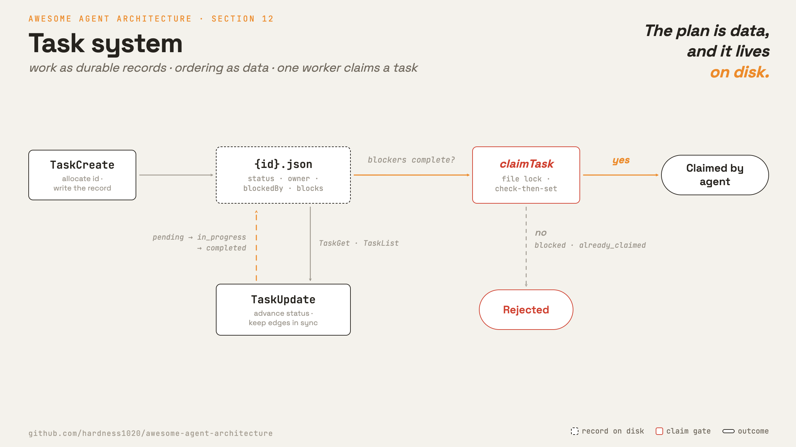

# 12 · Task system

**English** · [繁體中文](README.zh-TW.md) · [简体中文](README.zh-CN.md)

> Store work as durable tasks with dependencies.

A turn-scoped checklist disappears when the turn or process ends. It also does not enforce ordering.

A task system stores work as records on disk. Each record can have dependencies. Workers claim tasks when their blockers are complete.

The task system must:

1. Store each unit of work as a durable object.
2. Represent ordering as data.
3. Survive turns, sessions, and crashes.
4. Let only one worker claim a task.

Without this layer, the plan exists only in the current context window.

---

## Mechanism



A task is a JSON record on disk. `blockedBy` and `blocks` are dependency edges. A file lock serializes claims.

- IDs are sequential and never reused.
- Create, get, update, and list are plain CRUD.
- `claim` is the gate. It checks ownership and blockers before assigning an owner.
- The disk graph stores the plan. A separate runtime can track active background work.

### New: the task store and claim gate

`create` allocates an id and writes a task:

```python
def create(self, subject, blocked_by=()):              # src/tasks.py
    tid = self._next_id()
    task = {"id": tid, "subject": subject, "status": "pending",
            "owner": None, "blockedBy": list(blocked_by), "blocks": []}
    self._write(task)
    ...                                                # keep the reverse `blocks` edge in sync
    return task
```

`claim` is locked. That makes check-then-set safe across workers:

```python
def claim(self, tid, owner):                           # src/tasks.py
    with self._lock():                                 # fcntl.flock, exclusive
        task = self.get(tid)
        if task["owner"] is not None:
            return {"ok": False, "reason": "already_claimed"}
        unmet = [b for b in task["blockedBy"]
                 if (self.get(b) or {}).get("status") != "completed"]
        if unmet:
            return {"ok": False, "reason": "blocked"}
        task["owner"], task["status"] = owner, "in_progress"
        self._write(task)
        return {"ok": True, "task": task}
```

### How it integrates

Task tools are thin wrappers over the store:

```python
for t in task_tools(TaskStore(dir)):                   # src/demo.py
    reg.register(t)                                    # TaskCreate / TaskUpdate / TaskGet / TaskList
```

The loop does not change. The model calls `TaskCreate`, `TaskUpdate`, `TaskGet`, and `TaskList` like any other tools.

---

## Per system

How the durable task graph is shaped and advanced.

| System | Task record | Dependencies | Persistence | Lifecycle |
| --- | --- | --- | --- | --- |
| **Claude Code** | JSON task file. | `blockedBy` and `blocks`. | One file per task plus a high-water mark. | `pending -> in_progress -> completed`. |

### Claude Code

- `TaskSchema` defines fields such as `id`, `subject`, `status`, `owner`, `blocks`, and `blockedBy`.
- Each task is stored at `~/.claude/tasks/{taskListId}/{id}.json`.
- `.highwatermark` tracks the largest issued id.
- `createTask` can write blocked tasks.
- `claimTask` refuses a task until all blockers are complete.
- `proper-lockfile` serializes claims.
- `unassignTeammateTasks` clears ownership when a teammate exits.
- `isTodoV2Enabled()` decides whether durable tasks replace in-memory todos.

> **Trade-off:** File-backed tasks survive crashes and support multiple workers. They cost filesystem reads, writes, and locks. They also need validation to avoid bad graph shapes.

---

## Failure modes

- **Dependency cycle.** Two tasks can block each other. Keep the graph acyclic or add cycle checks.
- **Claim race.** Two agents can try the same task. Lock the claim path.
- **Orphaned in-progress task.** A worker can die after claiming. Clear ownership on worker exit.
- **Invalid record.** Hand-edited or old files may not match the schema. Parse safely and skip bad records.
- **Durable system disabled.** In-memory todos can still be lost. Use disk-backed tasks for work that must survive.

---

## Runnable

[`src/`](src/) carries 11 forward and adds:

- [`tasks.py`](src/tasks.py): a disk-backed `TaskStore`, claim gate, and `Task*` tools.
- [`test.py`](src/test.py): checks dependencies, claim gating, and a 10-agent claim race.
- [`demo.py`](src/demo.py): persists a three-task plan as JSON files.

```bash
python sections/12-task-system/src/test.py         # offline checks, no key
uv run python sections/12-task-system/src/demo.py  # live demo, needs a key
```

---

## Sources

- Claude Code source: `utils/tasks.ts`, `Task.ts`, and the `Task*Tool/` directories.
- learn-claude-code · s12_task_system: section framing.
