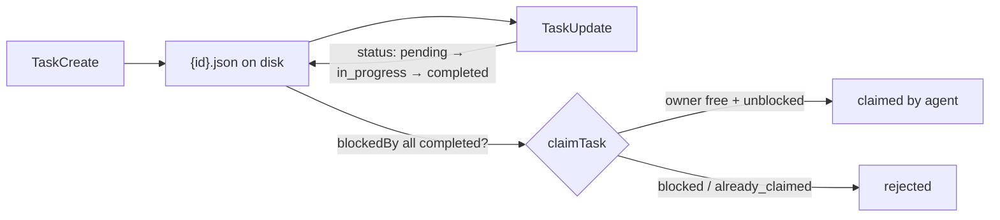

# 12 · Task system

> Big goals break into small tasks, ordered, persisted to disk.

A turn-scoped checklist dies when the turn ends. Give an agent a multi-step project (`set up schema`, then `write the API`, then `add tests`) and the only place it tracks progress is the in-memory message list. If the loop turn ends, the process exits, or a second agent joins, that progress is gone. Worse, nothing enforces order: the agent can start the API before the schema exists, then backtrack. A task system promotes work into durable records that outlive a single loop turn (section 1), so something must:

1. Record each unit of work as a durable object, not a transient line in the prompt.
2. Express ordering as data (`task X is blocked by task Y`).
3. Survive across turns, sessions, and processes by living on disk.
4. Let exactly one worker claim a task without two grabbing it.

Leave it out and "the plan" exists only in the current context window. One compaction, crash, or handoff and the agent forgets what it was building.

---

## Mechanism

A task is a JSON record on disk. Status is a small state machine; `blockedBy` / `blocks` are the dependency edges; an exclusive file lock serializes claims.



- **IDs.** Sequential, with a stored high-water mark of the largest id ever issued, so a deleted id is never reused.
- **Primitives.** create / get / update / list are plain CRUD; `claim` checks blockers and ownership before it sets `owner`.
- **Two layers.** The disk graph is the durable plan; a separate in-memory runtime tracks the piece currently executing (background work, section 13).

### New: the task store and its claim gate

A task is a JSON file; `create` allocates a sequential id (tracked in `.highwatermark`) and writes the record. The dependency edge is just a list:

```python
def create(self, subject, blocked_by=()):              # src/tasks.py
    tid = self._next_id()
    task = {"id": tid, "subject": subject, "status": "pending",
            "owner": None, "blockedBy": list(blocked_by), "blocks": []}
    self._write(task)
    ...                                                # keep the reverse `blocks` edge in sync
    return task
```

The gate is `claim`, not `create`: a task whose blockers are unfinished is written happily but cannot be claimed. An exclusive file lock serializes the check-then-set, so a race has one winner:

```python
def claim(self, tid, owner):                           # src/tasks.py
    with self._lock():                                 # fcntl.flock, exclusive
        task = self.get(tid)
        if task["owner"] is not None:
            return {"ok": False, "reason": "already_claimed"}
        unmet = [b for b in task["blockedBy"]
                 if (self.get(b) or {}).get("status") != "completed"]
        if unmet:
            return {"ok": False, "reason": "blocked"}
        task["owner"], task["status"] = owner, "in_progress"
        self._write(task)
        return {"ok": True, "task": task}
```

### How it integrates

The four `Task*` tools are thin wrappers over the store, registered like any other tool (section 2); the loop is unchanged:

```python
for t in task_tools(TaskStore(dir)):                   # src/demo.py
    reg.register(t)                                    # TaskCreate / TaskUpdate / TaskGet / TaskList
```

- The graph lives on disk, so it outlives the turn (section 1), survives a crash, and is shared across agents (section 16).
- `claim` is the only locked path; creates are single-writer, and nothing enforces acyclicity (see failure modes).

---

## Per system

How the durable task graph is shaped, ordered, persisted, and advanced.

| System | Task record | Dependencies | Persistence | Lifecycle |
|---|---|---|---|---|
| **Claude Code** | `TaskSchema` (`utils/tasks.ts`): `id`, `subject`, `status`, `owner`, `blocks`, `blockedBy` | `blockedBy`/`blocks` edges via `TaskUpdate`; `claimTask` waits until all `blockedBy` are `completed` | one JSON file per task, sequential IDs + `.highwatermark`, `proper-lockfile` per claim | `pending → in_progress → completed`; teammate exit runs `unassignTeammateTasks` |
| *(more soon)* | | | | |

### Claude Code

- **Record.** `TaskSchema` (`utils/tasks.ts`) adds `description`, `activeForm` (spinner text), and free-form `metadata` to the core fields; each task is a file at `~/.claude/tasks/{taskListId}/{id}.json` (`getTaskPath`), its id tracked in `.highwatermark`.
- **Gated on read, not write.** `createTask` writes a task even when its `blockedBy` point at unfinished work; `claimTask` is the gate, scanning `listTasks` and refusing (`reason: 'blocked'`) while any blocker is not `completed`.
- **Claim is serialized.** `claimTask` takes a `proper-lockfile` before it sets `owner`, so concurrent claims (section 16) resolve to one winner.
- **Toggle.** `isTodoV2Enabled()` decides whether the durable system is active: interactive sessions default to it, non-interactive (SDK) sessions fall back to in-memory `TodoWrite` unless `CLAUDE_CODE_ENABLE_TASKS` forces it.
- **Two layers.** The durable disk graph is the plan; a separate in-memory runtime (`Task.ts`) tracks the live process executing a piece of it (section 13).

> **Trade-off:** one file per task with locks buys crash-survival, cross-process sharing, and safe multi-agent claims (section 16). It costs filesystem overhead per mutation (`readdir` + N reads + a lock per claim) and only soft ordering: nothing stops a cycle, since validation is at claim time, not creation.

---

## Failure modes

- **Cycle in the dependency graph.** `addBlockedBy` writes edges without cycle detection, so two tasks can block each other and neither is ever claimable. Mitigation: keep edges acyclic; `deleteTask` cascades to strip dangling references (no automatic cycle check).
- **Lost claim race.** Two agents (section 16) claim the same task at once and both set `owner`. Mitigation: `proper-lockfile` on the task file, so the second claim reads fresh state and returns `already_claimed`.
- **Orphaned in-progress task.** A worker claims a task, sets it `in_progress`, then dies, leaving it stuck owned. Mitigation: `unassignTeammateTasks` clears `owner` and resets to `pending` on teammate exit.
- **Stale or invalid record.** A hand-edited or old-version task file has a bad shape. Mitigation: `getTask` runs `TaskSchema().safeParse` and returns `null` instead of crashing the listing; a migration maps legacy statuses (`open` → `pending`).
- **Plan lives only in context.** With the durable system disabled, tracking falls back to in-memory `TodoWrite` and is lost on compaction (section 8) or exit. Mitigation: enable the disk-backed task system for work meant to outlive a turn (sections 13, 14).

---

## Runnable

[`src/`](src/) carries 11 forward and adds:

- [`tasks.py`](src/tasks.py): a disk-backed `TaskStore` (create / get / update / list), a lock-serialized `claim()` gated on `blockedBy`, and the four `Task*` tools.
- [`test.py`](src/test.py): builds a dependency chain, shows the claim gate, and races 10 agents for one task (the lock leaves one winner).
- [`demo.py`](src/demo.py): the model plans a feature into three dependent tasks, persisted as JSON files.

```bash
python sections/12-task-system/src/test.py         # offline checks, no key
uv run python sections/12-task-system/src/demo.py  # live demo, needs a key
```

---

## Sources

- Claude Code source: `utils/tasks.ts` (`TaskSchema`, `createTask`/`claimTask`/`unassignTeammateTasks`, `.highwatermark`, `isTodoV2Enabled`), `Task.ts`, the `Task*Tool/` dirs.
- learn-claude-code · s12_task_system: section framing.
