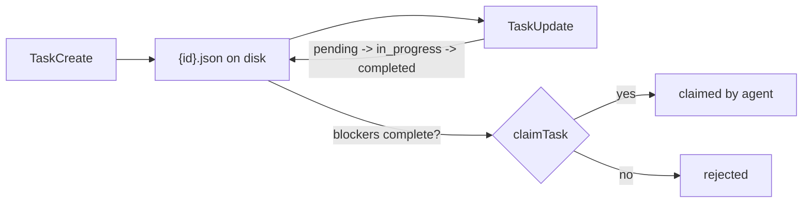

# 12 · Task system

[English](README.md) · **繁體中文** · [简体中文](README.zh-CN.md)

> 把工作以持久的 task 形式儲存，並帶有相依關係。

限定在單一 turn 內的檢查清單，會在 turn 或 process 結束時消失。它也無法強制排定順序。

task system 把工作以記錄的形式存到磁碟上。每筆記錄都可以帶有相依關係。當阻擋條件完成後，worker 才能認領 task。

task system 必須：

1. 把每個工作單元存成持久的物件。
2. 用資料來表示順序。
3. 在跨 turn、跨 session、甚至當機後都能存活。
4. 讓一個 task 只被一個 worker 認領。

少了這一層，計畫就只存在於當前的 context window 裡。

---

## 機制

一個 task 就是磁碟上的一筆 JSON 記錄。`blockedBy` 和 `blocks` 是相依關係的邊。用一把 file lock 讓認領動作序列化。



- ID 是連續的，而且永不重複使用。
- create、get、update、list 都是單純的 CRUD。
- `claim` 是那道關卡。它在指派 owner 之前，會先檢查 ownership 和阻擋條件。
- 磁碟上的圖儲存整個計畫。另一個 runtime 可以追蹤正在進行的背景執行工作。

### New：task store 與 claim 關卡

`create` 會配置一個 id 並寫入一筆 task：

```python
def create(self, subject, blocked_by=()):              # src/tasks.py
    tid = self._next_id()
    task = {"id": tid, "subject": subject, "status": "pending",
            "owner": None, "blockedBy": list(blocked_by), "blocks": []}
    self._write(task)
    ...                                                # keep the reverse `blocks` edge in sync
    return task
```

`claim` 有加鎖。這讓「先檢查再設定」在多個 worker 之間也安全：

```python
def claim(self, tid, owner):                           # src/tasks.py
    with self._lock():                                 # fcntl.flock, exclusive
        task = self.get(tid)
        if task["owner"] is not None:
            return {"ok": False, "reason": "already_claimed"}
        unmet = [b for b in task["blockedBy"]
                 if (self.get(b) or {}).get("status") != "completed"]
        if unmet:
            return {"ok": False, "reason": "blocked"}
        task["owner"], task["status"] = owner, "in_progress"
        self._write(task)
        return {"ok": True, "task": task}
```

### 如何整合

task 工具只是 store 之上的一層薄包裝：

```python
for t in task_tools(TaskStore(dir)):                   # src/demo.py
    reg.register(t)                                    # TaskCreate / TaskUpdate / TaskGet / TaskList
```

loop 沒有改變。model 就像呼叫其他任何工具一樣，呼叫 `TaskCreate`、`TaskUpdate`、`TaskGet` 和 `TaskList`。

---

## 各系統做法

持久的 task 圖如何塑形，又如何推進。

| System | Task 記錄 | 相依關係 | 持久化 | 生命週期 |
| --- | --- | --- | --- | --- |
| **Claude Code** | JSON task 檔。 | `blockedBy` 和 `blocks`。 | 每個 task 一個檔，外加一個 high-water mark。 | `pending -> in_progress -> completed`。 |

### Claude Code

- `TaskSchema` 定義 `id`、`subject`、`status`、`owner`、`blocks`、`blockedBy` 等欄位。
- 每個 task 都存在 `~/.claude/tasks/{taskListId}/{id}.json`。
- `.highwatermark` 追蹤已發出的最大 id。
- `createTask` 可以寫入被阻擋的 task。
- `claimTask` 會拒絕一個 task，直到它所有的阻擋條件都完成。
- `proper-lockfile` 讓認領動作序列化。
- `unassignTeammateTasks` 在某個 teammate 離開時清掉 ownership。
- `isTodoV2Enabled()` 決定要不要用持久 task 取代 in-memory todo。

> **取捨：** 以檔案為後盾的 task 能在當機後存活，也支援多個 worker。代價是檔案系統的讀、寫和鎖。它們也需要驗證，以避免出現壞掉的圖形狀。

---

## 失效模式

- **相依循環（Dependency cycle）。** 兩個 task 可能互相阻擋。讓圖保持無環，或加上循環檢查。
- **認領競態（Claim race）。** 兩個 agent 可能搶同一個 task。把認領路徑加鎖。
- **卡在 in_progress 的孤兒 task。** worker 可能在認領後死掉。在 worker 離開時清掉 ownership。
- **無效記錄（Invalid record）。** 手動編輯或舊版的檔案可能不符合 schema。安全地解析，並跳過壞掉的記錄。
- **持久系統被關閉。** in-memory todo 仍可能遺失。對必須存活的工作，改用以磁碟為後盾的 task。

---

## 可執行程式

[`src/`](src/) 把 11 帶了過來，並加上：

- [`tasks.py`](src/tasks.py)：一個以磁碟為後盾的 `TaskStore`、claim 關卡，以及 `Task*` 工具。
- [`test.py`](src/test.py)：檢查相依關係、認領關卡，以及一場 10-agent 的認領競態。
- [`demo.py`](src/demo.py)：把一個三個 task 的計畫持久化成 JSON 檔。

```bash
python sections/12-task-system/src/test.py         # offline checks, no key
uv run python sections/12-task-system/src/demo.py  # live demo, needs a key
```

---

## 出處

- Claude Code source：`utils/tasks.ts`、`Task.ts`，以及 `Task*Tool/` 目錄。
- learn-claude-code · s12_task_system：章節框架。
