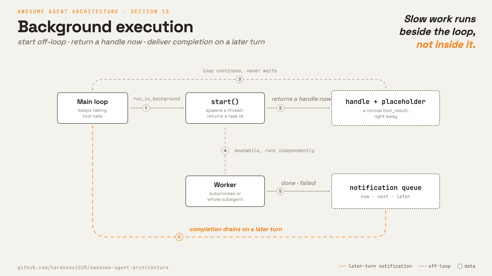

# 13 · Background execution

**English** · [繁體中文](README.zh-TW.md) · [简体中文](README.zh-CN.md)

> Start slow work off the main loop and report back later.

Some operations take a long time: installs, builds, test suites, memory consolidation, or a subagent running its own loop.

The basic agent loop waits for tool calls to finish before calling the model again.

That is fine for fast reads. It is wasteful for slow work that can run while the agent does something else.

Background execution must:

1. Decide which operations can run without blocking.
2. Start them and return a handle immediately.
3. Track running, completed, failed, and killed states.
4. Send a completion message back into the loop later.

Without this layer, one slow command can freeze the whole agent.

---

## Mechanism



There are three pieces:

1. An off-loop starter that returns a handle.
2. A runtime that tracks task state.
3. A queue that injects a completion notification on a later turn.

The loop does not wait for the slow work.

- Backgrounding is an execution option, not a special tool type.
- A backgrounded call returns a normal `tool_result` right away.
- The real completion arrives later as a separate notification.
- A whole subagent can run in the background.

### New: off-loop start and notification drain

`start` runs work on a worker thread and returns a task id:

```python
def start(self, fn):                                   # src/background.py; returns immediately
    self._next += 1
    tid = self._next
    self._state[tid] = "running"
    def work():
        try:
            self._finish(tid, "completed", str(fn()))  # enqueues a <task_notification>
        except Exception as e:
            self._finish(tid, "failed", f"{type(e).__name__}: {e}")
    threading.Thread(target=work, daemon=True).start()
    return tid
```

`drain_into` folds completed notifications into the next user turn:

```python
def drain_into(messages, runtime):                     # src/background.py
    notes = runtime.drain() if runtime else []
    if notes and messages and isinstance(messages[-1].get("content"), str):
        messages[-1]["content"] = "\n".join(notes) + "\n\n" + messages[-1]["content"]
```

`backgroundable` wraps any tool and adds `run_in_background` to its schema:

```python
def backgroundable(tool, runtime):                     # src/background.py; wraps ANY tool
    def run(a):
        if a.get("run_in_background"):
            inner = {k: v for k, v in a.items() if k != "run_in_background"}
            tid = runtime.start(lambda: tool.run(inner))
            return f"started background task {tid} ({tool.name}); ..."
        return tool.run(a)
    ...
    return replace(tool, run=run, ...)
```

### How it integrates

The loop drains pending completions at the start of a turn:

```python
background.drain_into(messages, runtime)               # src/loop.py
```

The one-tool-call-to-one-tool-result rule still holds. A late completion is not a delayed `tool_result` for the old `tool_use_id`. It is a new notification message.

---

## Per system

How each agent moves work off the loop and reports completion.

| System | Off-loop primitive | Notification | Re-entry |
| --- | --- | --- | --- |
| **Claude Code** | Background shell tasks and background agent tasks. | `<task_notification>`. | Queue drains notifications between turns. |

### Claude Code

- `BashTool` supports `run_in_background`.
- `LocalShellTask` tracks background shell commands.
- `ShellCommand.background(taskId)` lets the subprocess continue and redirects output.
- `DreamTask` runs memory consolidation in the background.
- `Task.ts` tracks background task states.
- `enqueueTaskNotification` sends completions to the shared queue.
- The queue has `now`, `next`, and `later` priorities.
- `Sleep` is a non-blocking wait and does not hold a shell process.

> **Trade-off:** Backgrounding improves throughput and avoids idle waits.
> It also means results can arrive later and out of order.
> The runtime needs task state, notifications, and cleanup.

---

## Failure modes

- **Interactive prompt stalls.** A background command waits for input. Detect prompt-like output and notify the model to kill or rerun non-interactively.
- **Lost completion.** A finished task never reaches the loop. Send completion through one shared queue and mark tasks notified.
- **Mispaired notification.** Reusing the old `tool_use_id` breaks the transcript. Use standalone notification text.
- **Too much concurrency.** Many background tasks can exhaust resources. Add kill paths and limits.
- **Process leak on exit.** Background work can outlive the session. Register cleanup.

---

## Runnable

[`src/`](src/) carries 12 forward and adds:

- [`background.py`](src/background.py): a runtime, notification queue, `drain_into`, and `backgroundable`.
- [`loop.py`](src/loop.py): drains pending notifications before the model call.
- [`test.py`](src/test.py): checks start, failure, drain, and background subagents.
- [`demo.py`](src/demo.py): launches a subagent in the background and reads its result later.

```bash
python sections/13-background-execution/src/test.py         # offline checks, no key
uv run python sections/13-background-execution/src/demo.py  # live demo, needs a key
```

---

## Sources

- Claude Code task sources: `tasks/LocalShellTask/`, `tasks/DreamTask/`.
- Claude Code tool and queue sources: `tools/BashTool/BashTool.tsx`, `tools/SleepTool/prompt.ts`, `utils/task/framework.ts`, `utils/messageQueueManager.ts`.
- learn-claude-code · s13_background_tasks: section framing.
