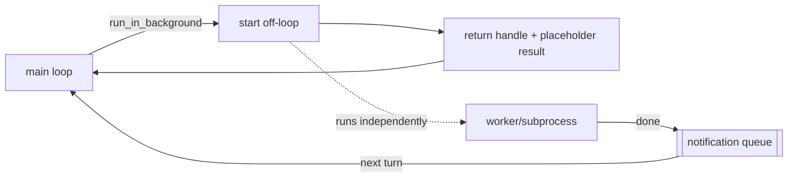

# 13 · Background execution

> Slow ops go background, the agent keeps thinking.

Some operations are slow: a build, an install, a test suite, a memory-consolidation pass, or a whole subagent (section 6) running its own loop. The agent loop (section 1) is sequential: it calls the model, runs the requested tools, and only re-invokes the model once every tool returns. A 10-minute `npm install` therefore stalls the whole loop for 10 minutes, the model idle while the meter runs and nothing else able to run. Reading a file is milliseconds, so blocking is fine; a build is minutes. So something must:

1. Decide which operations should not block.
2. Start them off the loop and return immediately with a handle.
3. Track their lifecycle (running, completed, failed, killed).
4. Re-enter the loop with the result once they finish.

Leave it out and every slow command freezes the agent: tokens burn on idle waits, and the user watches a spinner instead of progress.

---

## Mechanism

Three pieces: an off-loop primitive that returns a handle, a task registry that tracks state, and a priority queue that injects a notification on completion. The loop never `await`s the slow work.



- **Opt-in, any operation.** Backgrounding is a property of execution, not of one tool: wrap any tool so it takes a `run_in_background` flag. The heaviest case is a whole agent (section 6), an entire sub-loop running off the main loop. When set, it returns a placeholder `tool_result` immediately and the loop continues.
- **Separate completion.** The work runs on its own and does not reuse the original `tool_use_id`; it enqueues a separate `<task_notification>` the loop picks up on a later turn. One `tool_use` still gets exactly one `tool_result`.
- **Decoupled.** "Start the work" splits from "see the result," so the agent can read a file, answer a question, or start another task while the slow op runs.

### New: off-loop start and the notification drain

`start` runs the work on a worker thread and returns a task id at once; the loop never blocks. On completion the worker enqueues a notification instead of reusing the tool's `tool_use_id`:

```python
def start(self, fn):                                   # src/background.py; returns immediately
    self._next += 1
    tid = self._next
    self._state[tid] = "running"
    def work():
        try:
            self._finish(tid, "completed", str(fn()))  # enqueues a <task_notification>
        except Exception as e:                         # a failed task still reports back
            self._finish(tid, "failed", f"{type(e).__name__}: {e}")
    threading.Thread(target=work, daemon=True).start()
    return tid
```

`drain_into` folds any completed notifications into the next user turn, so one `tool_use` still gets one `tool_result` and the completion arrives as a separate event:

```python
def drain_into(messages, runtime):                     # src/background.py
    notes = runtime.drain() if runtime else []
    if notes and messages and isinstance(messages[-1].get("content"), str):
        messages[-1]["content"] = "\n".join(notes) + "\n\n" + messages[-1]["content"]
```

`backgroundable` makes the off-loop path execution-level: it wraps any tool so the model can run it with `run_in_background`. Wrap the `Agent` tool (section 6) and a whole sub-loop runs off the main loop:

```python
def backgroundable(tool, runtime):                     # src/background.py; wraps ANY tool
    def run(a):
        if a.get("run_in_background"):
            inner = {k: v for k, v in a.items() if k != "run_in_background"}
            tid = runtime.start(lambda: tool.run(inner))   # a shell cmd, a subagent, a whole agent
            return f"started background task {tid} ({tool.name}); ..."
        return tool.run(a)                             # otherwise run inline
    ...                                                # add run_in_background to the schema
    return replace(tool, run=run, ...)                 # keeps is_read_only and the rest
```

### How it integrates

The loop drains background completions at the start of a turn, before the model call; any tool wrapped with `backgroundable` gains the opt-in flag:

```python
background.drain_into(messages, runtime)               # src/loop.py · 13 · fold in completions
```

- A backgrounded call returns a handle immediately; the result surfaces as a `<task_notification>` on a later turn. The demo backgrounds a whole subagent: a full sub-loop runs off the main loop and reports back.
- The worker is a daemon thread, so "background" here means "not awaited," mirroring Claude Code's single-event-loop model.

---

## Per system

How each agent moves work off the loop and reports back. Claude Code rows are grounded in verified `cc-src` paths.

| System                | Off-loop primitive                                                                                                                   | Notification                                                                                  | Re-entry                                                                                                                  |
| --------------------- | ------------------------------------------------------------------------------------------------------------------------------------ | --------------------------------------------------------------------------------------------- | ------------------------------------------------------------------------------------------------------------------------- |
| **Claude Code** | `tasks/LocalShellTask` via `run_in_background` (`BashTool.tsx`), `ShellCommand.background()`; also `DreamTask` (section 9) | `<task_notification>` enqueued by `enqueueTaskNotification` (`utils/task/framework.ts`) | priority queue`now > next > later` (`messageQueueManager.ts`); background defaults `later`, drained on a later turn |
| *(more soon)*       |                                                                                                                                      |                                                                                               |                                                                                                                           |

### Claude Code

- **"Background" means not awaited.** Claude Code runs one Node/Bun event loop, so backgrounding is a call that is not `await`ed, not a separate OS thread. `ShellCommand.background(taskId)` redirects stdout/stderr to a file and lets the subprocess run on.
- **State registry.** `Task.ts` tracks a union of background states (`LocalShellTaskState`, `DreamTaskState`, `tasks/types.ts`), surfaced in the UI via `isBackgroundTask` and `useBackgroundTaskNavigation.ts`.
- **Inverse case.** The `Sleep` tool (`tools/SleepTool/prompt.ts`) is a deliberate non-blocking wait that "doesn't hold a shell process," so the loop stays free.

> **Trade-off:** backgrounding buys throughput and avoids idle token spend, but costs determinism: results arrive out of order, on a later turn, through a separate notification path, so the model reasons about pending work it cannot see yet, and the system needs a registry, a queue, and stall detection a blocking call never did.

---

## Failure modes

- **Stalled on an interactive prompt.** A background command blocks on a `(y/n)` no one will answer. Mitigation: `LocalShellTask`'s stall watchdog (`STALL_THRESHOLD_MS` 45s) fires a one-shot notification, when the tail matches `looksLikePrompt`, telling the model to kill and re-run non-interactively.
- **Lost completion.** If the finish event never reaches the loop, the agent waits forever for a result it already has. Mitigation: completion goes through the shared queue (`messageQueueManager.ts`), and tasks are marked `notified` atomically so it is neither dropped nor duplicated.
- **Notification mispaired with the tool call.** Reusing the original `tool_use_id` for the late result breaks the one-`tool_use`-one-`tool_result` rule (section 1). Mitigation: send completions as standalone `<task_notification>` text, not as the tool's result.
- **Runaway concurrency.** Nothing caps independent background subprocesses, so over-spawning can exhaust resources. Mitigation: explicit kill paths (`tasks/LocalShellTask/killShellTasks.ts`); foreground concurrency is bounded separately.
- **Resource leaks on exit.** A backgrounded process can outlive the session. Mitigation: cleanup registered in `utils/cleanupRegistry.js`, and the watchdog timer is `unref`'d so it never keeps the process alive on its own.

---

## Runnable

[`src/`](src/) carries 12 forward and adds:

- [`background.py`](src/background.py): a `Runtime` that starts any thunk on a worker thread and returns a handle at once, a notification queue, `drain_into`, and `backgroundable` (wrap any tool, up to a whole agent, with `run_in_background`).
- [`loop.py`](src/loop.py): drains pending `<task_notification>`s into the next user turn before the model call (the first loop change since section 11).
- [`test.py`](src/test.py): off-loop start, the notification queue, the failed-task path, the drain, and backgrounding a whole agent.
- [`demo.py`](src/demo.py): the model launches a whole subagent in the background, then reads its result on a later turn.

```bash
python sections/13-background-execution/src/test.py         # offline checks, no key
uv run python sections/13-background-execution/src/demo.py  # live demo, needs a key
```

---

## Sources

- Claude Code source: `tasks/LocalShellTask/`, `tasks/DreamTask/`, `tools/BashTool/BashTool.tsx` (`run_in_background`), `tools/SleepTool/prompt.ts`, `utils/task/framework.ts`, `utils/messageQueueManager.ts`.
- learn-claude-code · s13_background_tasks: section framing.
