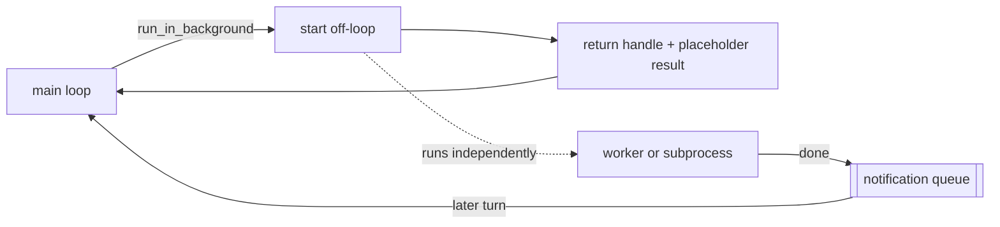

# 13 · Background execution

[English](README.md) · **繁體中文**

> 把慢工作移出主 loop 開始執行，稍後再回報。

有些操作要花很久：安裝、建置、測試套件、記憶整併，或是一個跑著自己 loop 的 subagent。

基本的 agent loop 會等工具呼叫完成後，才再次呼叫 model。

對快速的讀取來說這沒問題。但對可以邊做別的事邊跑的慢工作來說，這很浪費。

background execution 必須：

1. 決定哪些操作可以不阻塞地執行。
2. 啟動它們，並立刻回傳一個 handle。
3. 追蹤 running、completed、failed 和 killed 這些狀態。
4. 稍後把一則完成訊息送回 loop 裡。

少了這一層，一個慢指令就能凍結整個 agent。

---

## 機制

這裡有三個部件：

1. 一個把工作移出 loop 的 starter，它會回傳一個 handle。
2. 一個追蹤 task 狀態的 runtime。
3. 一個 queue，會在稍後的某個 turn 注入一則完成 notification。

loop 不會等這個慢工作。



- 背景執行是一個執行選項，而不是一種特殊的工具型別。
- 被背景化的呼叫會立刻回傳一個正常的 `tool_result`。
- 真正的完成結果稍後才會以一則獨立的 notification 抵達。
- 一整個 subagent 也可以在背景執行。

### New：移出 loop 的啟動，以及 notification 排空

`start` 在一個 worker thread 上跑工作，並回傳一個 task id：

```python
def start(self, fn):                                   # src/background.py; returns immediately
    self._next += 1
    tid = self._next
    self._state[tid] = "running"
    def work():
        try:
            self._finish(tid, "completed", str(fn()))  # enqueues a <task_notification>
        except Exception as e:
            self._finish(tid, "failed", f"{type(e).__name__}: {e}")
    threading.Thread(target=work, daemon=True).start()
    return tid
```

`drain_into` 把已完成的 notification 併入下一個 user turn：

```python
def drain_into(messages, runtime):                     # src/background.py
    notes = runtime.drain() if runtime else []
    if notes and messages and isinstance(messages[-1].get("content"), str):
        messages[-1]["content"] = "\n".join(notes) + "\n\n" + messages[-1]["content"]
```

`backgroundable` 包裝任何工具，並在它的 schema 加上 `run_in_background`：

```python
def backgroundable(tool, runtime):                     # src/background.py; wraps ANY tool
    def run(a):
        if a.get("run_in_background"):
            inner = {k: v for k, v in a.items() if k != "run_in_background"}
            tid = runtime.start(lambda: tool.run(inner))
            return f"started background task {tid} ({tool.name}); ..."
        return tool.run(a)
    ...
    return replace(tool, run=run, ...)
```

### 如何整合

loop 在一個 turn 開始時排空待處理的完成 notification：

```python
background.drain_into(messages, runtime)               # src/loop.py
```

「一個工具呼叫對一個工具結果」的規則依然成立。一則遲來的完成 notification，不是給舊 `tool_use_id` 的延遲 `tool_result`。它是一則全新的 notification 訊息。

---

## 各系統做法

各個 agent 如何把工作移出 loop，又如何回報完成。

| System | 移出 loop 的原語 | Notification | 重新進入 |
| --- | --- | --- | --- |
| **Claude Code** | 背景 shell task 和背景 agent task。 | `<task_notification>`。 | queue 在 turn 之間排空 notification。 |

### Claude Code

- `BashTool` 支援 `run_in_background`。
- `LocalShellTask` 追蹤背景 shell 指令。
- `ShellCommand.background(taskId)` 讓 subprocess 繼續執行並轉導輸出。
- `DreamTask` 在背景執行記憶整併。
- `Task.ts` 追蹤背景 task 的狀態。
- `enqueueTaskNotification` 把完成訊息送到共享 queue。
- 這個 queue 有 `now`、`next` 和 `later` 三種優先級。
- `Sleep` 是一種非阻塞的等待，不會佔住一個 shell process。

> **取捨：** 背景執行提升吞吐量，也避免閒置的等待。
> 但它也意味著結果可能較晚抵達，而且順序可能顛倒。
> runtime 需要 task 狀態、notification 和清理機制。

---

## 失效模式

- **互動式提示卡住（Interactive prompt stalls）。** 某個背景指令在等輸入。偵測像提示的輸出，並通知 model 去 kill 它，或以非互動方式重跑。
- **完成訊息遺失（Lost completion）。** 某個完成的 task 從沒抵達 loop。讓完成訊息走同一個共享 queue，並把 task 標記為已通知。
- **配對錯誤的 notification（Mispaired notification）。** 重用舊的 `tool_use_id` 會弄壞 transcript。改用獨立的 notification 文字。
- **並行太多（Too much concurrency）。** 太多背景 task 會耗盡資源。加上 kill 路徑和上限。
- **離場時的 process 洩漏（Process leak on exit）。** 背景工作可能活得比 session 還久。註冊清理機制。

---

## 可執行程式

[`src/`](src/) 把 12 帶了過來，並加上：

- [`background.py`](src/background.py)：一個 runtime、notification queue、`drain_into`，以及 `backgroundable`。
- [`loop.py`](src/loop.py)：在呼叫 model 前排空待處理的 notification。
- [`test.py`](src/test.py)：檢查 start、failure、drain，以及背景 subagent。
- [`demo.py`](src/demo.py)：在背景啟動一個 subagent，稍後再讀取它的結果。

```bash
python sections/13-background-execution/src/test.py         # offline checks, no key
uv run python sections/13-background-execution/src/demo.py  # live demo, needs a key
```

---

## 出處

- Claude Code task sources：`tasks/LocalShellTask/`、`tasks/DreamTask/`。
- Claude Code tool and queue sources：`tools/BashTool/BashTool.tsx`、`tools/SleepTool/prompt.ts`、`utils/task/framework.ts`、`utils/messageQueueManager.ts`。
- learn-claude-code · s13_background_tasks：章節框架。
