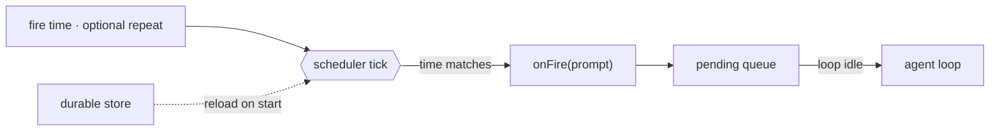

# 14 · Scheduling

> Start agent turns from a clock, not only from user input.

Background work still needs someone or something to start it. Many tasks should run later or repeat: a report, a reminder, or a polling task.

Scheduling stores a future trigger. When it fires, it enqueues a prompt. The normal loop handles that prompt as a new turn.

Scheduling must:

1. Store a schedule outside one turn.
2. Watch time independently of the loop.
3. Enqueue a prompt when the schedule fires.
4. Optionally persist schedules across restarts.

Without this layer, the agent can only react to user input.

---

## Mechanism

Separate the clock from the loop. The scheduler watches time. It does not call the model directly.

At fire time, it enqueues a prompt. The queue processor drains that prompt into the normal loop when the loop is ready.



- A schedule is data: a fire time and optional repeat interval.
- A one-shot fires once and then deletes itself.
- A recurring schedule re-arms to the next interval.
- A durable schedule survives restart, but it does not fire while the host is off.

### New: the scheduler and fire queue

`tick` checks due tasks. Firing means enqueueing a prompt:

```python
def tick(self):                                       # src/scheduler.py; called by a daemon thread
    now = self._clock()
    for tid, t in list(self._tasks.items()):
        if now >= t["due"]:
            self._pending.put(t["prompt"])            # enqueue, do not run the model here
            if t["every"]:
                t["due"] = now + t["every"]
            else:
                self._tasks.pop(tid, None)
    self._save()                                      # durable tasks only
```

- The clock is injectable, so tests use a fake clock.
- `run()` calls `tick` on a daemon thread.
- `_save` persists durable tasks to JSON.
- A new `Scheduler` on the same path reloads durable tasks and resumes ids.

### How it integrates

Scheduling starts turns from outside the loop:

```python
for prompt in sched.drain():                          # src/demo.py · between turns
    messages = [{"role": "user", "content": prompt}]
    run_turn(messages, model, reg, session)
```

A fired prompt becomes a new user-style turn. It uses the same loop, permissions, hooks, memory, context management, and recovery paths.

---

## Per system

How each agent decides when to run scheduled work.

| System | Trigger | Durability | Wakeup |
| --- | --- | --- | --- |
| **Claude Code** | Cron, sleep, and remote triggers. | Session or durable local schedules. | Fired prompts enter the queue. |

### Claude Code

- `CronCreate`, `CronList`, and `CronDelete` manage cron entries.
- A cron entry stores `id`, `cron`, `prompt`, `recurring`, and `durable`.
- `cronScheduler.ts` ticks on an interval and calls `onFire(prompt)`.
- `useScheduledTasks.ts` enqueues fired prompts at `priority: 'later'`.
- The queue drains when no turn is in flight.
- `durable: true` writes `.claude/scheduled_tasks.json`.
- A lock prevents multiple open sessions from firing the same file-backed schedule.
- `RemoteTriggerTool` uses a hosted trigger so work can fire without a local process.

> **Trade-off:** Local schedules are simple and private, but they only tick while the process runs. Remote triggers can fire unattended, but they require a hosted service and auth.

---

## Failure modes

- **Double fire.** A fast tick can match the same cron minute more than once. Track the last fired minute.
- **Many schedules fire together.** Add deterministic jitter to recurring tasks.
- **Durable means always-on.** Local durable schedules only survive restart. Use remote triggers or an OS timer for offline firing.
- **Bad cron expression.** Validate on create and skip invalid loaded entries.
- **Loop is busy.** Enqueue the prompt and drain it between turns.

---

## Runnable

[`src/`](src/) carries 13 forward and adds:

- [`scheduler.py`](src/scheduler.py): a scheduler, fire queue, recurring re-arm, one-shot delete, and durable JSON store.
- [`test.py`](src/test.py): uses a fake clock to test one-shot, recurring, and reload behavior.
- [`demo.py`](src/demo.py): schedules a prompt one second out and runs it as a new turn.

The loop is unchanged. Scheduling starts turns from outside it.

```bash
python sections/14-scheduling/src/test.py         # offline checks, no key
uv run python sections/14-scheduling/src/demo.py  # live demo, needs a key
```

---

## Sources

- Claude Code source: `tools/ScheduleCronTool/`, `tools/RemoteTriggerTool/`, `tools/SleepTool/`, `utils/cronScheduler.ts`, `hooks/useScheduledTasks.ts`, `utils/queueProcessor.ts`.
- learn-claude-code · s14_cron_scheduler: section framing.
