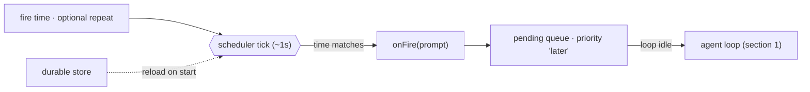

# 14 · Scheduling

> An alarm clock for the agent. It fires the loop on a schedule, with no human pressing enter.

Background work (section 13) still waits for a human to start it, and so does every other section: the user types, the loop turns. But many real tasks are periodic or deferred: a nightly report, a poll every five minutes, a one-shot reminder. Requiring a person to press enter at the exact moment defeats the point. Scheduling cuts that last string, a clock decides when the loop runs, so something must:

1. Hold a schedule (a cron expression or a future instant) separate from any one turn.
2. Watch a clock independently of whether the loop is currently running.
3. At fire time, inject a prompt into the loop (section 1) as if a user had typed it.
4. Optionally survive a restart, so a schedule set today still fires tomorrow.

Leave it out and the agent can only ever react. It cannot act on time, so anything recurring or deferred falls back to a human babysitting a clock.

---

## Mechanism

Split the clock from the loop. A scheduler ticks on its own timer, and at fire time it does not run the model directly. It enqueues a prompt that the normal queue processor drains into the loop between turns. Producer (clock), queue, and consumer (loop) stay decoupled.



- **Clock, not keyboard.** A schedule is stored data (a fire time, optionally a repeat interval), watched by a timer that ticks independent of whether the loop is running.
- **Fire enqueues, never runs.** At fire time the scheduler does not call the model: it enqueues a prompt that the queue processor drains into the loop between turns, so a fired prompt arrives as a new user-style turn and never races an in-flight one.
- **One-shot vs recurring.** A one-shot fires once then auto-deletes; a recurring task re-arms to its next interval, so a 1s tick fires it once per period, not once per tick.
- **Durable vs in-memory.** A durable schedule persists to disk and re-arms on restart (section 12); an in-memory one is lost on exit. Durable means the definition survives, not that it fires while the host is offline. For that you need a server-side trigger or an OS timer.

### New: the scheduler and its fire queue

`tick` is the whole clock: it fires every task whose due time has passed, then re-arms a recurring task or drops a one-shot. Firing means enqueue, not call the model:

```python
def tick(self):                                       # src/scheduler.py; called ~1s by a daemon thread
    now = self._clock()
    for tid, t in list(self._tasks.items()):
        if now >= t["due"]:
            self._pending.put(t["prompt"])            # onFire: enqueue, never run the model here
            if t["every"]:
                t["due"] = now + t["every"]           # recurring: re-arm past now
            else:
                self._tasks.pop(tid, None)            # one-shot: auto-delete after firing
    self._save()                                      # durable tasks only
```

- The `clock` is injectable, so tests advance a fake clock instead of sleeping; `run()` wraps `tick` in a daemon thread that waits `CHECK_INTERVAL` between ticks.
- `_save` persists only durable tasks to JSON; a fresh `Scheduler` on the same path reloads them and resumes the id counter (section 12), so a schedule re-arms after a restart.

### How it integrates

The loop is unchanged: scheduling sits around it and *starts* turns rather than running inside one (section 12 added tools, this adds a clock). The driver drains fired prompts between turns:

```python
for prompt in sched.drain():                          # src/demo.py · the queue processor, between turns
    messages = [{"role": "user", "content": prompt}]
    run_turn(messages, model, reg, session)           # a fired prompt is a new user-style turn
```

- The scheduler ticks on a daemon thread, so the clock runs whether or not a turn is in flight; fired prompts wait in the queue until the driver is idle.
- One fired prompt becomes one new turn, so a scheduled run reuses the entire loop (permissions, hooks, memory, retry) with no special path.

---

## Per system

How each agent decides what time it is and whose clock it trusts.

| System                | Trigger                                                                                            | Durability                                                                                                    | Wakeup                                                                                                                       |
| --------------------- | -------------------------------------------------------------------------------------------------- | ------------------------------------------------------------------------------------------------------------- | ---------------------------------------------------------------------------------------------------------------------------- |
| **Claude Code** | `CronCreate` (5-field cron, local time) · one-shot `Sleep` · `RemoteTrigger` (server-side) | `durable: true` to `.claude/scheduled_tasks.json`, reloaded on start; else in-memory `sessionCronTasks` | `cronScheduler.ts` 1s tick calls `onFire` then `enqueuePendingNotification` at `'later'`; queue drains into the loop |
| *(more soon)*       |                                                                                                    |                                                                                                               |                                                                                                                              |

### Claude Code

- **Schedule is data.** Each entry is a `CronTask` (`id`, `cron`, `prompt`, `recurring`, `durable`); `cronScheduler.ts` runs a `CHECK_INTERVAL_MS = 1000` timer and calls `onFire(prompt)` on a match.
- **Fire enqueues at `'later'`.** `useScheduledTasks.ts` wires `onFire` to `enqueuePendingNotification(...)` at `priority: 'later'`; the queue processor (`queueProcessor.ts`, driven by `useQueueProcessor.ts`) drains it into the loop when no turn is in flight, so the model just sees a prompt arrive on time.
- **Three tools.** `CronCreate` / `CronList` / `CronDelete` (`tools/ScheduleCronTool/`) manage cron entries, gated by `feature('AGENT_TRIGGERS')` and the `tengu_kairos_cron` switch, capped at `MAX_JOBS = 50`; `SleepTool` is a plain delayed wakeup; `RemoteTriggerTool` posts to the claude.ai CCR API (`/v1/code/triggers`) so a trigger fires server-side with no local process awake.
- **Durable vs session.** `durable: true` writes `.claude/scheduled_tasks.json` and reloads on start; else in-memory `sessionCronTasks`, lost on exit. A `.claude/scheduled_tasks.lock` lease lets only the owning session fire file-backed tasks (section 16), so multiple open sessions do not double-fire.

> **Trade-off:** a local clock (`CronCreate`) is simple and private, but it only ticks while the process is alive. Durability there means "the definition survives restart and re-arms next launch", not "it fires while you are offline". A server-side `RemoteTrigger` fires regardless of any local process, at the cost of a hosted service, auth, and giving up local-only privacy. Pick local for in-session loops, remote for true unattended runs.

---

## Failure modes

- **Double fire within a minute.** A 1s tick matches the same minute many times. Mitigation: a per-minute marker per task fires a match once per minute, and the `.claude/scheduled_tasks.lock` lease (section 16) stops cross-session double fire.
- **Thundering herd.** Every schedule pinned to `:00` wakes at once and stampedes the API. Mitigation: deterministic per-task jitter (`cronJitterConfig.ts`) smears recurring fires off the exact wall-clock boundary.
- **"Durable" misread as "always on".** A local cron fires only while the process runs, not while the host sleeps. Mitigation: read `durable: true` as "definition survives restart and re-arms" (section 12); for offline firing use `RemoteTrigger` or an OS timer (systemd, crontab).
- **Bad expression kills scheduling.** One malformed cron string throws on every tick and stalls the whole scheduler. Mitigation: `CronCreate` validates with `parseCronExpression` and rejects expressions matching no date in the next year; loaders skip invalid entries.
- **Fires while the loop is busy, then drops.** A tick that lands mid-turn must not run the model concurrently. Mitigation: enqueue at `priority: 'later'` and let the queue processor drain between turns (section 1).

---

## Runnable

[`src/`](src/) carries 13 forward and adds:

- [`scheduler.py`](src/scheduler.py): a `Scheduler` that ticks a clock on a daemon thread, fires due prompts into a queue (recurring re-arms, one-shots auto-delete), and persists durable tasks to JSON.
- [`test.py`](src/test.py): a fake clock fires a one-shot and a recurring task, checks re-arm and auto-delete, and reloads durable tasks after a restart.
- [`demo.py`](src/demo.py): the model schedules a one-shot prompt a second out; the clock fires it and the loop runs it as a new turn, with no human input.

The loop is unchanged: scheduling starts turns from outside it (section 12 added tools, not a loop change either).

```bash
python sections/14-scheduling/src/test.py         # offline checks, no key
uv run python sections/14-scheduling/src/demo.py  # live demo, needs a key
```

---

## Sources

- Claude Code source: `tools/ScheduleCronTool/`, `tools/RemoteTriggerTool/`, `tools/SleepTool/`, `utils/cronScheduler.ts` (1s tick), `hooks/useScheduledTasks.ts` (onFire), `utils/queueProcessor.ts` (drain).
- learn-claude-code · s14_cron_scheduler: section framing.
