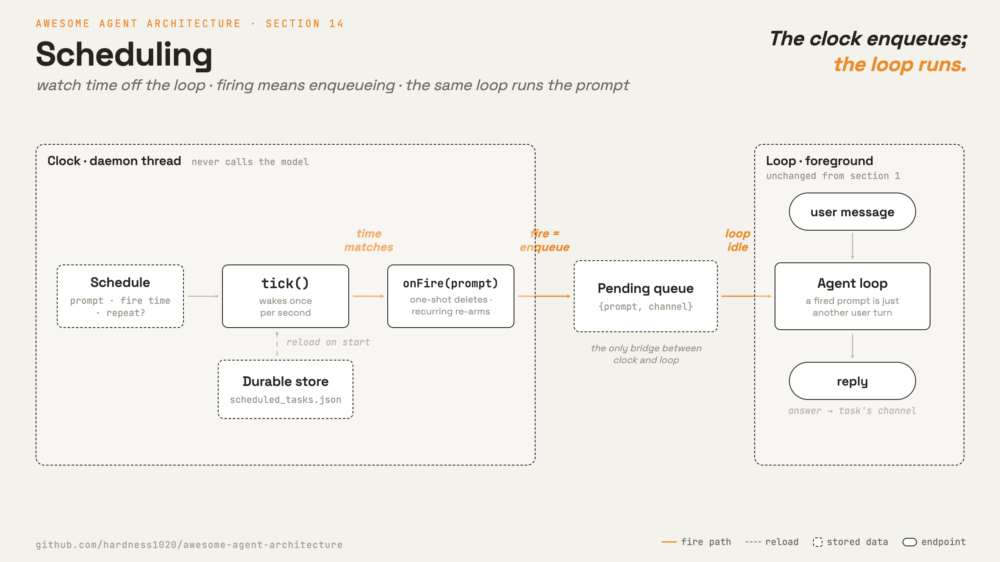

# 14 · Scheduling

[English](README.md) · [繁體中文](README.zh-TW.md) · **简体中文**

> 让 agent 的 turn 由时钟启动，而不只是由 user 输入启动。

后台工作仍然需要有人或有东西来启动它。很多 task 应该稍后才跑或重复跑：一份报告、一则提醒，或一个轮询 task。

调度存储一个未来的触发。当它 fire 时，就把一个 prompt 放进 queue。正常的 loop 会把那个 prompt 当成一个新的 turn 来处理。

调度必须：

1. 把 schedule 存储在单个 turn 之外。
2. 独立于 loop 之外地监视时间。
3. 当 schedule fire 时把一个 prompt 放进 queue。
4. 可选地让 schedule 跨重启后仍存活。

少了这一层，agent 就只能对 user 输入做出反应。

---

## 机制



把时钟和 loop 分开。scheduler 监视时间。它不会直接调用 model。

在 fire 的时刻，scheduler 只把一个 prompt 放进 queue。driver 会等到没有 turn 正在跑的时候（也就是两个 turn 之间）才排空 queue，把每个 prompt 交给处理 user 输入的同一个 agent loop，当成新的一轮跑。

- 一个 schedule 就是数据：要跑的 prompt、一个 fire 时间，以及可选的重复间隔。scheduler 把每一条存成一个 task。
- 一次性（one-shot）的 schedule fire 一次后就把自己删掉。
- 周期性（recurring）的 schedule 会重新装填到下一个间隔。
- 一个 durable 的 schedule 能在重启后存活，但在 host 关机时它不会 fire。

### New：scheduler 与 fire queue

`tick` 检查哪些 task 已经到了预定时间。fire 就是把一个 prompt 放进 queue：

```python
def tick(self):                                       # src/scheduler.py; called by a daemon thread
    now = self._clock()
    for tid, t in list(self._tasks.items()):
        if now >= t["due"]:
            self._pending.put({"prompt": t["prompt"], "channel": t.get("channel")})
            if t["every"]:                            # enqueue, do not run the model here
                t["due"] = now + t["every"]
            else:
                self._tasks.pop(tid, None)
    self._save()                                      # durable tasks only
```

- 时钟是可注入的，所以测试会用一个假时钟。
- `run()` 在一个 daemon thread 上调用 `tick`。
- `_save` 把 durable task 持久化成 JSON。
- 在相同路径上创建一个新的 `Scheduler`，会重新加载 durable task 并接续 id。

### New：投递答案

调度触发的 turn 跑起来时，屏幕前没有用户，跑完的答案不主动送出去就没人看到。所以每个 task 可以指定一个 channel。
channel 就存在 task 里，是那条调度数据的一个字段：`create(..., channel="console")` 存进去，`tick` fire 时再把它和 prompt 一起放进 queue。
所以 driver 排空 queue 时，拿到的每个条目已经是 `{"prompt": ..., "channel": ...}`，不用再去别处查这个答案要送哪。

`deliver` 负责把这个 turn 的答案送到 channel（Hermes 会把 cron 输出投递到该 job 的聊天平台）：

```python
SILENT = "[SILENT]"                              # a fired run may decide nothing is worth sending

def deliver(channels, fired, text) -> bool:      # src/scheduler.py
    if not fired.get("channel") or text.lstrip().startswith(SILENT):
        return False
    channels[fired["channel"]](text)
    return True
```

- `channels` 把 channel 名称对应到一个送信的 callable（这里是 print；真正的 adapter 是第 19 章的事）。
  task 指定 channel；driver 拥有这张对照表。两边互不知道对方的细节。
- 答案以 `[SILENT]` 开头时，`deliver` 直接跳过，不把它送进 channel。这是给调度任务的约定：模型跑完发现没有新东西值得通知用户（例如巡检一切正常），就用这个开头。driver 手上仍有完整文本，要存档照样可以。
- 没有 channel 表示答案留在本地，也就是加入投递之前的行为。
- `bool` 返回值让 driver 可以改走别条路（demo 会打印出未投递的答案），而不是悄悄丢掉答案。

### 如何整合

调度分成两半。`tick` 在自己的 daemon thread 上跑（第 13 章的后台执行），它不碰 model，fire 时只把 prompt 放进 queue：

```python
def run(self):                                        # src/scheduler.py; started by sched.run()
    def loop():
        while not self._stop.wait(self.CHECK_INTERVAL):   # wakes once per second
            self.tick()
    threading.Thread(target=loop, daemon=True).start()    # daemon: never keeps the process alive
```

真正执行 turn 的是前台的 driver：它在两个 turn 之间排空 queue，为每个 fire 出来的 task 调用一次 `run_turn`：

```python
for task in sched.drain():                            # src/demo.py · between turns
    messages = [{"role": "user", "content": task["prompt"]}]
    deliver(channels, task, run_turn(messages, model, reg, session))
```

一个 fire 出来的 prompt 会变成一个新的、类似 user 的 turn。它用的是同一套 loop、权限、hook、记忆、context 管理和恢复路径。它的答案会送到该 task 的 channel。

---

## 各系统做法

各个 agent 如何决定何时执行调度工作。

| System | 触发 | 持久性 | 唤醒 |
| --- | --- | --- | --- |
| **Claude Code** | Cron、sleep，以及 remote trigger。 | session 或 durable 的本地 schedule。 | fire 出来的 prompt 进入 queue。 |
| **Hermes Agent** | gateway tick 上的 cron 表达式。 | 带跨 process 锁的 JSON job store。 | job 输出投递到聊天平台。 |

### Claude Code

- `CronCreate`、`CronList` 和 `CronDelete` 管理 cron 条目。
- 一个 cron 条目存储 `id`、`cron`、`prompt`、`recurring` 和 `durable`。
- `cronScheduler.ts` 以固定间隔 tick，并调用 `onFire(prompt)`。
- `useScheduledTasks.ts` 以 `priority: 'later'` 把 fire 出来的 prompt 放进 queue。
- 当没有 turn 正在进行时，queue 就排空。
- `durable: true` 会写入 `.claude/scheduled_tasks.json`。
- 一把锁避免多个打开中的 session 对同一个以文件为后盾的 schedule 重复 fire。
- `RemoteTriggerTool` 使用一个托管的 trigger，让工作不需本地 process 就能 fire。

### Hermes Agent

- gateway 是一个 server process，所以 durable schedule 能在无人看管下 fire，不需要托管 trigger。
- `cron/scheduler.py` 的 `tick()` 在一个 gateway thread 上执行。到了预定时间的 job 会在并行的 thread 上启动 agent 执行。
- job 持久化在 `~/.hermes/cron/jobs.json`。`_jobs_lock()` 结合 thread 锁与 fcntl 或 msvcrt 文件锁，让 CLI 和 gateway 不会互相覆盖。
- `claim_dispatch` 原子性地认领到了预定时间的 job，避免跨 process 重复 fire。
- cron 执行使用受限的 toolset：`_resolve_cron_disabled_toolsets` 一律禁用 `cronjob`、`messaging` 和 `clarify`，再叠上用户配置。
- 输出存到 `~/.hermes/cron/output/<job_id>/`，并投递到该 job 指定的平台与 channel。
- 输出里的 `[SILENT]` token 会抑制聊天投递。输出文件照样保存。
- heartbeat 与 last-success 文件让 `hermes cron status` 分得出 ticker 是死了，还是活着但一直失败。
- `hermes_time.now()` 解析配置好的 IANA 时区，所以 schedule 跟着用户的时钟走，而不是服务器的。

> **取舍：** 本地 schedule 简单又私密，但它们只在 process 运行时才会 tick。remote trigger 可以在无人看管下 fire，但它们需要一个托管服务和 auth。

---

## 失效模式

- **重复 fire（Double fire）：**一次很快的 tick 可能在同一个 cron 分钟内匹配到不止一次。追踪上一次 fire 的分钟。
- **许多 schedule 一起 fire：**对周期性 task 加上具确定性的 jitter。
- **durable 不等于永远开机：**本地 durable schedule 只能在重启后存活。要离线 fire，改用 remote trigger 或 OS timer。
- **cron 表达式有误（Bad cron expression）：**在 create 时验证，并跳过无效的已加载条目。
- **loop 正忙：**把 prompt 放进 queue，并在 turn 之间排空它。

---

## 可执行程序

[`src/`](src/) 把 13 带了过来，并加上：

- [`scheduler.py`](src/scheduler.py)：一个 scheduler、fire queue、周期性重新装填、一次性删除、durable 的 JSON store，以及 channel 投递（`deliver`、`SILENT`）。
- [`test.py`](src/test.py)：用一个假时钟测试一次性、周期性、重新加载和投递的行为。
- [`demo.py`](src/demo.py)：把一个 prompt 排在一秒后、以一个新 turn 执行它，并把答案投递到 console channel。

loop 没有改变。调度从 loop 之外启动 turn。

```bash
python sections/14-scheduling/src/test.py         # offline checks, no key
uv run python sections/14-scheduling/src/demo.py  # live demo, needs a key
```

---

## 出处

- Claude Code source：`tools/ScheduleCronTool/`、`tools/RemoteTriggerTool/`、`tools/SleepTool/`、`utils/cronScheduler.ts`、`hooks/useScheduledTasks.ts`、`utils/queueProcessor.ts`。
- Hermes Agent 源码：`cron/scheduler.py`（`tick`、`_resolve_cron_disabled_toolsets`）、`cron/jobs.py`（`_jobs_lock`、`claim_dispatch`）、`hermes_time.py`。
- learn-claude-code · s14_cron_scheduler：章节框架。
